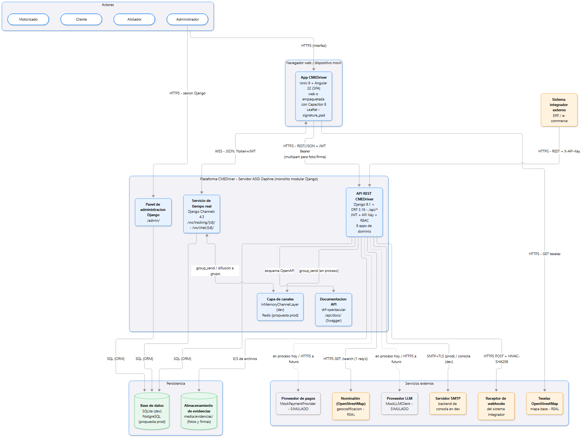

# CMEDriver

Prototipo funcional temprano de una plataforma web y móvil, orientada a API, para la gestión de servicios de mensajería de última milla (**entregas** y **recolecciones**), con Logytech Mobile (Colombia, segundo semestre de 2026) como organización de aplicación. Responde a un problema concreto: no existe una plataforma que integre en un solo sistema la operación logística, la trazabilidad y la autogestión del cliente. Sin ella, la operación se reparte por teléfono o mensajería instantánea, el cliente no sabe dónde está su pedido, las recolecciones no dejan evidencia y un e-commerce no puede integrarse (problemática, pregunta y objetivos en [docs/entrega/01-requerimientos.md](docs/entrega/01-requerimientos.md#1-problema-o-necesidad-identificada)). CMEDriver centraliza la creación, asignación, ejecución y seguimiento de cada servicio en un solo sistema con cuatro roles: Administrador, Alistador, Motorizado y Cliente. Incluye tracking GPS y chat en tiempo real entre el cliente y el motorizado, evidencia digital (foto y firma), matriz de cobertura con *leadtime*, planificación de recolecciones por el propio cliente, sugerencia de orden de ruta y una API abierta a integradores (API Keys y webhooks firmados).

| | |
|---|---|
| **Integrante** | Javier Esteban Mora Osorio (único integrante) |
| **Institución / curso** | UNINPAHU — Ingeniería de Software (proyecto universitario) |
| **Repositorio** | <https://github.com/javier5254/CEMDriver> (rama `main`) |

> **Nota sobre el nombre:** el repositorio se llama **CEMDriver**, pero el producto es **CMEDriver**. Ambos nombres se refieren al mismo proyecto.

> **Alcance (cambio del 2026-10-09):** el autor retiró del prototipo el **inventario, los pagos y el chatbot** para centrarlo en el ciclo operativo de mensajería. El chat solo sirve para que el cliente y el motorizado se comuniquen dentro de un servicio. El detalle del cambio está en [docs/entrega/01-requerimientos.md](docs/entrega/01-requerimientos.md#24-cambios-de-alcance). Los documentos numerados 01 a 17 de la raíz de `docs/` y `docs/v1/` son históricos y **no** reflejan este alcance; prevalece [docs/entrega/](docs/entrega/00-guia-de-entrega.md).

---

## Tecnologías utilizadas

| Capa | Tecnología |
|---|---|
| Frontend | Ionic 9 + Angular 22 (SPA, tema iOS), Leaflet (mapas), signature_pad (firma), Capacitor 8 (Android) |
| Backend | Python 3.12 + Django 6.1 + Django REST Framework 3.18 (monolito modular de 6 apps) |
| Tiempo real | Django Channels 4.3 + Daphne 4.2 (ASGI, WebSocket) |
| Base de datos | SQLite en desarrollo; PostgreSQL propuesto para producción |
| Autenticación | JWT (SimpleJWT) para personas y API Key propia para integradores |
| Documentación de la API | drf-spectacular (OpenAPI 3 + Swagger UI) |
| Servicios externos | Nominatim y teselas de OpenStreetMap (reales). Correo SMTP configurable por variable de entorno: en desarrollo se imprime en la consola (único servicio simulado; ver [limitaciones](docs/entrega/08-limitaciones-y-mejoras.md#83-servicios-simulados-limitación-de-alcance)) |
| Pruebas | Django test framework + DRF `APITestCase` + `channels.testing` (69 pruebas en el backend) |

El detalle, la justificación y las alternativas descartadas están en [docs/entrega/02-stack-tecnologico.md](docs/entrega/02-stack-tecnologico.md).

---

## Arquitectura general

CMEDriver es un **cliente-servidor** formado por una **SPA** (Ionic + Angular) que consume una **API REST** en Django. El backend es un **monolito modular** de 6 apps de dominio: `accounts`, `coverage`, `services`, `tracking`, `optimization` e `integrations`. Toda regla de negocio vive en el servidor y se aplica igual para la app y para los integradores. El tiempo real (tracking y chat cliente-motorizado) usa WebSocket con Django Channels en el mismo proceso ASGI (Daphne) y pasa a consultas periódicas (polling) si el socket falla. El único servicio simulado es el correo: en desarrollo se imprime en la consola y en producción se configura un SMTP por variable de entorno. Los integradores se autentican con API Key y reciben webhooks firmados con HMAC-SHA256.



Más detalle en [docs/entrega/03-arquitectura.md](docs/entrega/03-arquitectura.md) y en el modelo C4 de [docs/entrega/06-c4.md](docs/entrega/06-c4.md).

---

## Estructura del repositorio

```
CEMDriver/                       (producto: CMEDriver)
├── README.md                    este archivo
├── backend/                     API REST + tiempo real (Django)
│   ├── cmedriver/               configuración del proyecto (settings, urls, asgi)
│   ├── accounts/                usuarios, roles, login JWT, reset de contraseña, seed_data
│   ├── coverage/                matriz de cobertura y agenda disponible
│   ├── services/                rutas, servicios, evidencias, novedades, chat cliente-motorizado
│   ├── tracking/                posiciones GPS, destino y ETA
│   ├── optimization/            geocodificación (Nominatim) y orden sugerido de ruta
│   ├── integrations/            API Keys y webhooks
│   ├── requirements.txt         dependencias con versiones fijas
│   ├── .env.example             plantilla de variables de entorno
│   └── run_tests.ps1 / .sh      scripts para correr las pruebas
├── frontend/                    app Ionic + Angular (login + áreas por rol)
│   ├── src/app/                 core (servicios, guards, interceptores), features por rol, shared
│   ├── src/environments/        URL de la API (dev / prod)
│   └── android/                 proyecto nativo Capacitor
├── docs/                        documentación (índice en docs/README.md)
│   ├── entrega/                 entregables finales 00..08 (00 = guía de la entrega); vigentes
│   ├── 01-…17-*.md              documentos históricos, anteriores al cambio de alcance del 2026-10-09
│   ├── diagrams/                fuentes (src/) e imágenes (img/) de los diagramas
│   ├── mockups/                 mockups editables (históricos)
│   └── v1/                      snapshot histórico del MVP v1
└── paper/                       artículo del proyecto
```

---

## Instalación y ejecución (entorno local de desarrollo)

**Requisitos:** Python 3.12, Node.js (se probó con la versión 24) y npm, y Git. El geocodificador y el mapa necesitan conexión a Internet.

### 1. Backend (Django)

**Windows (PowerShell o Git Bash):**

```bash
cd backend
py -m venv .venv
./.venv/Scripts/python.exe -m pip install -r requirements.txt
./.venv/Scripts/python.exe manage.py migrate
./.venv/Scripts/python.exe manage.py seed_data        # datos de demostración (opcional)
./.venv/Scripts/python.exe manage.py runserver 0.0.0.0:8000
```

**Linux / macOS:**

```bash
cd backend
python3 -m venv .venv
.venv/bin/python -m pip install -r requirements.txt
.venv/bin/python manage.py migrate
.venv/bin/python manage.py seed_data                  # datos de demostración (opcional)
.venv/bin/python manage.py runserver 0.0.0.0:8000
```

Como `daphne` es la primera app de `INSTALLED_APPS`, `runserver` sirve tanto HTTP como WebSocket (`ws://localhost:8000/ws/...`).

| Recurso | URL |
|---|---|
| API REST | <http://localhost:8000/api/> |
| Documentación interactiva (Swagger UI) | <http://localhost:8000/api/docs/> |
| Esquema OpenAPI 3 | <http://localhost:8000/api/schema/> |
| Panel de administración de Django | <http://localhost:8000/admin/> (entrar con el usuario `admin` de la semilla o crear uno con `manage.py createsuperuser`) |

`seed_data` crea los 4 usuarios de prueba (ver más abajo), 2 zonas de cobertura (`Bogota - Chapinero` y `Bogota - Suba`), una ruta para `motorizado1` con fecha de mañana y 3 servicios de ejemplo del `cliente1` (2 entregas y 1 recolección, en estados `CREADO` y `ASIGNADO`), para probar la interfaz sin partir de cero. Es idempotente: no duplica lo que ya existe.

### 2. Frontend (Ionic + Angular) — igual en Windows, Linux y macOS

```bash
cd frontend
npm install
npm start          # ng serve -> http://localhost:4200
```

Requiere el backend corriendo. Se validó de punta a punta en los 4 roles: login, dashboards, ciclo de vida completo de los servicios, tracking con Leaflet, chat cliente-motorizado y captura de foto y firma.

Para generar un build estático: `npm run build` (genera `www/`). El empaquetado Android con Capacitor está en [docs/11-manual-distribucion.md](docs/11-manual-distribucion.md) §4 (manual de distribución, con el contenido operativo actualizado al alcance vigente).

### 3. Pruebas automatizadas

```bash
# Windows
cd backend
./run_tests.ps1                     # todas las pruebas (verboso)
./run_tests.ps1 services            # solo una app
./.venv/Scripts/python.exe manage.py test

# Linux / macOS
cd backend
./run_tests.sh
./run_tests.sh services.tests.NovedadTests
.venv/bin/python manage.py test
```

Resultado esperado: **69 pruebas, OK** (eran 96 antes del cambio de alcance del 2026-10-09, que retiró las pruebas de inventario, pagos y chatbot). Corren en una base de datos aislada y no requieren Internet porque Nominatim y los webhooks se simulan con `mock`. La prueba que verifica cada requerimiento vigente está en [docs/entrega/01-requerimientos.md](docs/entrega/01-requerimientos.md#4-requerimientos-funcionales-rf) §4 y en la [matriz de trazabilidad](docs/entrega/07-trazabilidad.md). El plan [docs/16-plan-pruebas.md](docs/16-plan-pruebas.md) es histórico: cuenta 93 pruebas y conserva casos de funciones retiradas. El frontend no tiene pruebas automatizadas (ver LIM-29).

---

## Variables de entorno

### Backend

El backend lee su configuración sensible de **variables de entorno del proceso**. La plantilla es [backend/.env.example](backend/.env.example). En desarrollo local todas son opcionales.

> **Importante:** `settings.py` **no** carga automáticamente un archivo `backend/.env`. Hay que exportar las variables en la terminal o en el servicio que ejecute el servidor (ver LIM-23).

| Variable | Obligatoria | Valor por defecto en desarrollo | Descripción |
|---|---|---|---|
| `DJANGO_SECRET_KEY` | **Sí, cuando `DJANGO_DEBUG=False`** (el servidor no arranca sin ella) | Clave insegura fija, solo para uso local | Clave para firmar sesiones y tokens. Se genera con `python -c "from django.core.management.utils import get_random_secret_key as k; print(k())"`. Nunca se versiona. |
| `DJANGO_DEBUG` | No | `True` | Modo depuración. En producción debe valer `False`. |
| `DJANGO_ALLOWED_HOSTS` | Sí en producción | vacío (con `DEBUG=True` Django acepta `localhost`) | Hosts permitidos, separados por comas (ej. `api.midominio.com`). |
| `CORS_ALLOWED_ORIGINS` | Sí en producción | `http://localhost:8100,http://localhost:4200,http://127.0.0.1:8100,http://127.0.0.1:4200` | Orígenes del frontend autorizados. Con `DEBUG=True` se permite cualquier origen. |
| `FRONTEND_URL` | Sí en producción | `http://localhost:4200` | URL del frontend con la que se arma el enlace del correo de restablecimiento de contraseña. |
| `EMAIL_BACKEND` | No | `django.core.mail.backends.console.EmailBackend` | Backend de correo. En desarrollo imprime los correos en la consola; en producción se usa un SMTP real. |
| `DEFAULT_FROM_EMAIL` | No | `CMEDriver <noreply@cmedriver.local>` | Remitente de los correos. |

Ejemplo para levantar el backend en modo producción local:

```bash
# Linux / macOS / Git Bash
export DJANGO_DEBUG=False DJANGO_SECRET_KEY='<clave-generada>' DJANGO_ALLOWED_HOSTS=localhost
# PowerShell
$env:DJANGO_DEBUG='False'; $env:DJANGO_SECRET_KEY='<clave-generada>'; $env:DJANGO_ALLOWED_HOSTS='localhost'
```

La base de datos (SQLite) y la capa de canales (en memoria) **no** se configuran por entorno: están fijas en `settings.py` (ver LIM-19 y LIM-20).

### Frontend: URL de la API

La URL de la API se define en `frontend/src/environments/`:

- `environment.ts` (desarrollo, `npm start`): `apiUrl: 'http://localhost:8000/api'`
- `environment.prod.ts` (build de producción, `npm run build`): **hoy también apunta a `localhost`** (ver LIM-22). Hay que cambiarla por la URL real (ej. `https://api.midominio.com/api`) antes de un build para otro servidor o para el APK.

La URL del WebSocket se deriva automáticamente de `apiUrl` (`http` → `ws`, `https` → `wss`).

---

## Usuarios de prueba

> **Solo para desarrollo local.** Estos usuarios son **datos semilla** creados por `manage.py seed_data`, con contraseñas públicas. **No deben existir en ningún entorno de producción** ni en una base de datos con datos reales. No ejecute `seed_data` en producción y cree usuarios nuevos con contraseñas seguras.

| Usuario | Contraseña | Rol |
|---|---|---|
| admin | admin1234 | ADMIN |
| alistador1 | alistador1234 | ALISTADOR |
| motorizado1 | motorizado1234 | MOTORIZADO |
| cliente1 | cliente1234 | CLIENTE |

El inicio de sesión acepta el nombre de usuario o el correo.

---

## Despliegue

**El sistema no tiene despliegue público:** solo se ejecuta en local, en modo desarrollo. No hay CI ni artefactos de despliegue (Docker) en el repositorio.

Lo siguiente es una **propuesta** de despliegue de producción, no algo implementado. El detalle está en [docs/entrega/03-arquitectura.md](docs/entrega/03-arquitectura.md) §7.2 y en [docs/11-manual-distribucion.md](docs/11-manual-distribucion.md) §6.

- Una VM Linux (Ubuntu 24.04) con **Docker Compose**.
- **Nginx** con TLS (Let's Encrypt): sirve el build del frontend y reenvía `/api/`, `/admin/` y `/ws/` a Daphne.
- **Daphne** (servidor ASGI, necesario por los WebSocket; no gunicorn/WSGI) con 2 procesos.
- **PostgreSQL 16** como base de datos.
- **Redis 7** con `channels-redis` como capa de canales.
- Un volumen persistente o un bucket S3 para las evidencias.
- Configuración por variables de entorno con `DJANGO_DEBUG=False`.
- GitHub Actions para ejecutar las pruebas en cada push.

Antes de concretarla hay que hacer cambios de código: leer `DATABASES` y `CHANNEL_LAYERS` del entorno, añadir `psycopg` y `channels-redis`, definir `STATIC_ROOT` y poner la URL real en `environment.prod.ts`. Están descritos en [docs/entrega/08-limitaciones-y-mejoras.md](docs/entrega/08-limitaciones-y-mejoras.md).

---

## Índice de entregables

| # | Entregable | Punto de la consigna que cubre |
|---|---|---|
| 00 | [Guía de la entrega](docs/entrega/00-guia-de-entrega.md) | Mapa de cada punto de la consigna al documento y la sección donde se cumple; recorrido para la sustentación |
| 01 | [Requerimientos](docs/entrega/01-requerimientos.md) | Problema, objetivos, actores, requerimientos funcionales y no funcionales, reglas de negocio y restricciones; incluye el cambio de alcance del 2026-10-09 (§2.4) |
| 02 | [Stack tecnológico](docs/entrega/02-stack-tecnologico.md) | Tecnologías (frontend, backend, BD, servicios externos, nube, despliegue, control de versiones) con su justificación |
| 03 | [Arquitectura](docs/entrega/03-arquitectura.md) | Arquitectura propuesta: estilo, diagrama general, componentes, seguridad y vista de despliegue |
| 04 | [Modelo entidad-relación](docs/entrega/04-mer.md) | MER, diccionario de datos, relaciones y restricciones |
| 05 | [BPMN](docs/entrega/05-bpmn.md) | Modelado de los procesos de negocio |
| 06 | [Modelo C4](docs/entrega/06-c4.md) | Diagramas C4: contexto, contenedores, componentes y código |
| 07 | [Matriz de trazabilidad](docs/entrega/07-trazabilidad.md) | Trazabilidad entre requerimientos, reglas, diseño, código y pruebas |
| 08 | [Limitaciones y mejoras](docs/entrega/08-limitaciones-y-mejoras.md) | Limitaciones conocidas (34 vigentes y 4 resueltas por reducción de alcance), servicios simulados y hoja de ruta de mejoras |

El resto de la documentación (charter, API, cronograma, diagrama de clases, casos de uso, mockups, plan de pruebas, manual de herramientas, roadmap) está indexado en [docs/README.md](docs/README.md). Es **histórica**: se redactó antes del cambio de alcance del 2026-10-09 y no lo refleja; en caso de diferencia prevalece `docs/entrega/`.

---

## Limitaciones conocidas

CMEDriver es un **MVP académico**. Hay 38 limitaciones registradas: **34 vigentes**, documentadas deliberadamente y sin corregir en esta entrega, y 4 resueltas por la reducción de alcance del 2026-10-09 (existían solo por el inventario, los pagos y el chatbot). Las 7 vigentes de prioridad alta son:

- El RBAC permite a clientes y motorizados editar o borrar servicios por `PUT/PATCH/DELETE`.
- En la app, un servicio en `NOVEDAD` (reintentar) queda detenido porque se ocultan sus acciones.
- Las evidencias de `/media/` se sirven sin autenticación.
- La creación manual de servicios no valida cobertura ni *leadtime*.
- No hay cumplimiento de la Ley 1581 de 2012 (protección de datos personales).
- La configuración de base de datos y de `environment.prod.ts` no está lista para producción.

El único servicio simulado es el correo (SIM-03: en desarrollo se imprime en la consola). El frontend no tiene pruebas automatizadas y no hay CI. La lista completa, con evidencia, prioridad y mejora propuesta, está en [docs/entrega/08-limitaciones-y-mejoras.md](docs/entrega/08-limitaciones-y-mejoras.md), junto con la [hoja de ruta de mejoras](docs/entrega/08-limitaciones-y-mejoras.md#84-hoja-de-ruta-de-mejoras-priorizada). El roadmap histórico [docs/07-roadmap-futuro.md](docs/07-roadmap-futuro.md) es anterior al cambio de alcance y todavía lista como pendientes el chatbot con LLM real, los pagos y el inventario.

---

## Declaración de uso de inteligencia artificial

<!-- El autor debe revisar y ajustar esta declaración según la guía de UNINPAHU -->

En este proyecto se usaron asistentes de inteligencia artificial (Claude, de Anthropic) como **apoyo** en la redacción y verificación de la documentación, en la elaboración de diagramas (Mermaid, SVG, BPMN) y en tareas de revisión del código frente a la documentación. Todo el contenido generado con apoyo de IA fue revisado, ajustado y validado por el autor, que asume la responsabilidad del resultado final. Las decisiones de alcance, arquitectura y priorización son del autor.
