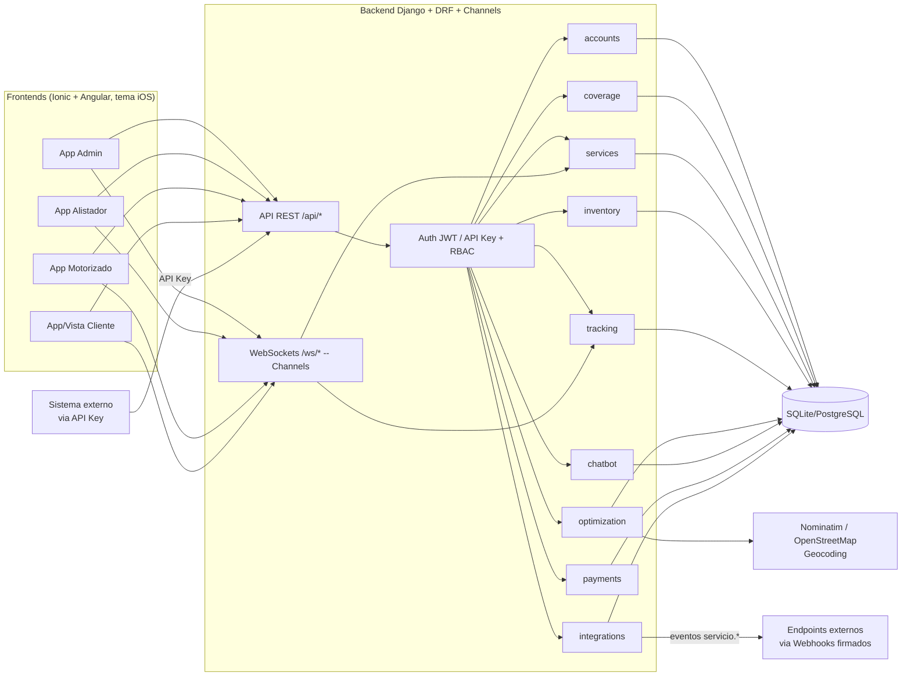

# Arquitectura — CMEDriver (v2)

> **Nota (2026-10-09):** este documento es **histórico**: se redactó antes de la reducción de alcance que retiró el inventario, los pagos y el chatbot (el chat quedó solo como canal entre el cliente y el motorizado) y **no refleja el alcance vigente**. Describe 9 apps (`inventory`, `chatbot` y `payments` ya no existen), el chatbot con modelo de lenguaje simulado y los pagos simulados; la arquitectura vigente, de 6 apps, está en [entrega/03-arquitectura.md](entrega/03-arquitectura.md). Prevalece la documentación de [entrega/](entrega/00-guia-de-entrega.md), en particular [entrega/01-requerimientos.md §2.4](entrega/01-requerimientos.md#24-cambios-de-alcance).

## 1. Vista general

## 2. Stack técnico

| Capa | Tecnología | Motivo |
|---|---|---|
| Backend | Python 3.12 + Django + Django REST Framework | Velocidad de desarrollo, ORM + admin gratis para demo, auth robusta |
| Auth | djangorestframework-simplejwt + API Key propia (`integrations`) | JWT para humanos, API Key para integraciones sin login |
| Correo | `django.core.mail` (backend de consola en dev) | Envío de enlaces de restablecimiento de contraseña sin depender de una cuenta SMTP real |
| Tiempo real | Django Channels + Daphne (capa de canales en memoria) | WebSockets para tracking GPS y chat en vivo, sin depender de Redis en desarrollo |
| Base de datos | SQLite (MVP) → PostgreSQL (producción) | SQLite no requiere instalación para correr el demo en horas |
| Frontend | Angular + Ionic, `mode: 'ios'` (modo web, sin compilar a nativo por defecto) | Un solo código, componentes UI listos; tema visual iOS en vez de Material Design |
| Empaquetado nativo | Capacitor (Android configurado) | Permite compilar la misma app como APK/IPA — ver [11-manual-distribucion.md](11-manual-distribucion.md) para el estado real de esto en este entorno |
| Mapas/GPS | Leaflet + OpenStreetMap (visualización) | Sin API key ni costo |
| Geocoding | Nominatim (OpenStreetMap) | Servicio público gratuito, usado para la optimización de rutas — sin necesidad de cuenta ni API key |
| Firma digital | librería signature_pad (canvas) | Ligera, sin dependencias nativas |
| Foto evidencia | `<input type="file" capture="environment">` | Funciona en navegador móvil sin plugin nativo |
| Chat cliente-motorizado | WebSocket (Channels) + fallback a REST/polling | Tiempo real real, con degradación elegante si el socket falla (RNF-10) |
| Tracking GPS | REST (motorizado reporta) + WebSocket (difusión en vivo) | El motorizado sigue posteando por REST; el broadcast a quien mira el mapa es push, no polling |
| Chatbot | Arquitectura real de tool-calling con modelo **simulado** (`MockLLMClient`) | Sin API key de un LLM real disponible; el patrón de integración es real y queda listo para conectar un modelo real cambiando un archivo |
| Pagos | `PaymentProvider` con implementación **simulada** (`MockPaymentProvider`) | Sin credenciales de una pasarela real (Wompi/PayU); mismo patrón de intercambiabilidad que el chatbot |
| Optimización de rutas | Heurística de vecino más cercano (haversine) sobre coordenadas reales geocodificadas | Sin motor de ruteo comercial; algoritmo simple pero real, no simulado |

## 3. Organización del backend (apps Django)

- **accounts**: usuario custom con rol (ADMIN, ALISTADOR, MOTORIZADO, CLIENTE), correo único, autenticación JWT (usuario o correo) y restablecimiento de contraseña.
- **coverage**: matriz de cobertura (zona, leadtime, agenda disponible) y cálculo de fechas válidas.
- **inventory**: catálogo de productos, stock por centro de mensajería, flag de disponibilidad en chatbot.
- **services**: núcleo del dominio — Servicio, Ruta, Novedad, MensajeChat, ServicioProducto (líneas multi-producto), transiciones de estado, consumers de WebSocket para chat.
- **tracking**: posiciones GPS reportadas por el motorizado, consulta de última posición, consumer de WebSocket para difusión en vivo.
- **optimization**: geocoding con caché (`PuntoGeocodificado`) y heurística de orden de ruta sugerido.
- **chatbot**: conversaciones y mensajes del asistente, cliente de "LLM" simulado con tool-calling real sobre el resto de las apps.
- **payments**: pagos generados por compras del chatbot, proveedor de pago simulado.
- **integrations**: API keys y webhooks salientes para sistemas externos.

Cada app expone sus propios `serializers.py`, `views.py` (ViewSets/APIViews DRF), `permissions.py` cuando aplica, y `tests.py` — separación pensada para poder extraerlas como microservicios más adelante sin rediseñar el dominio. Las 4 apps nuevas de v2 (`optimization`, `chatbot`, `payments`, `integrations`) se construyeron sin modificar los modelos existentes de `services`/`tracking` (solo los leen), salvo el hook explícito de `disparar_webhook()`/`group_send()` en las transiciones de `services/views.py`.

## 4. Seguridad y permisos (RBAC + API Key)
- Cada endpoint declara qué rol(es) pueden usarlo mediante clases de permisos DRF (`IsAdmin`, `IsAlistador`, `IsMotorizado`, `IsCliente`, o combinaciones).
- El JWT incluye el rol del usuario en el payload para que el frontend enrute a la vista correcta tras el login.
- El cliente final se autentica igual que los demás roles (usuario con rol CLIENTE), pero solo ve sus propios servicios (filtrado por `cliente = request.user`).
- **API Key** (`integrations.authentication.ApiKeyAuthentication`): un sistema externo manda el header `X-API-Key`; el backend lo resuelve a un usuario ALISTADOR existente (`ApiKey.actua_como`) y de ahí en adelante los permisos normales de ALISTADOR aplican sin cambios. La clave se guarda solo como hash SHA-256; el valor crudo se muestra una única vez, al crearla.
- Los **WebSockets** se autentican con el mismo JWT, pasado como query param (`?token=`) porque el navegador no puede mandar headers al abrir un socket; cada consumer valida además que el usuario tenga acceso a ese servicio concreto (mismo criterio que el endpoint REST equivalente) antes de aceptar la conexión.

## 5. Decisiones de diseño (ADR resumido)
| Decisión | Alternativa considerada | Por qué se eligió así |
|---|---|---|
| WebSockets (Django Channels, capa en memoria) para GPS/chat | Seguir con polling | El MVP inicial usaba polling por velocidad; en v2 se reemplazó por push real porque ya no era el cuello de botella y mejora sustancialmente la percepción de "tiempo real" — se mantiene un fallback a polling si el socket falla (RNF-10) |
| SQLite en vez de PostgreSQL | PostgreSQL desde el inicio | Cero configuración, corre con `manage.py runserver` de inmediato |
| Chatbot con arquitectura real de tool-calling pero modelo simulado | Backend de chatbot con máquina de estados sin LLM | Se buscó demostrar el patrón de integración real (historial, function-calling contra los mismos endpoints) sin depender de una API key de pago |
| Leaflet/OSM en vez de Google Maps | Google Maps Platform | Evita API keys, cuentas de facturación y límites de cuota durante el desarrollo/sustentación |
| Nominatim para geocoding en vez de un proveedor de pago | Google Geocoding API | Gratuito, sin API key; a cambio hay que respetar su límite de 1 req/seg, aceptable para el volumen de un MVP |
| API Key propia en vez de OAuth2 completo para integraciones | OAuth2 client-credentials | Mucho más simple de implementar y de explicar en un MVP académico; documentado como evolución futura si se necesita revocación granular por scope |
| `ServicioProducto` como tabla adicional en vez de reemplazar el campo `producto` existente | Migrar todo a multi-producto y romper compatibilidad | Se mantiene el campo simple para no romper el chatbot ni los tests existentes; el multi-producto es una capacidad opcional adicional |
