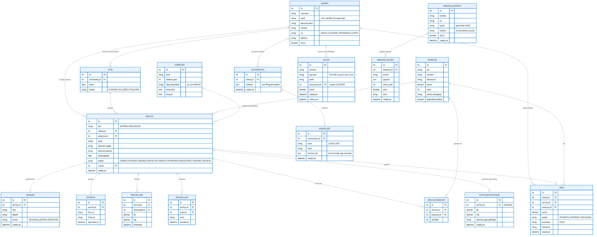

# Modelo de datos — CMEDriver (v2)

> **Nota (2026-10-09):** este documento es **histórico**: se redactó antes de la reducción de alcance que retiró el inventario, los pagos y el chatbot (el chat quedó solo como canal entre el cliente y el motorizado) y **no refleja el alcance vigente**. Muestra 17 entidades; ya no existen `PRODUCTO`, `SERVICIO_PRODUCTO`, `CONVERSACION`, `MENSAJE_BOT` ni `PAGO`. El modelo vigente, de 12 entidades, está en [entrega/04-mer.md](entrega/04-mer.md). Prevalece la documentación de [entrega/](entrega/00-guia-de-entrega.md), en particular [entrega/01-requerimientos.md §2.4](entrega/01-requerimientos.md#24-cambios-de-alcance).

Fuente editable (Mermaid): [diagrams/src/er.mmd](diagrams/src/er.mmd). El diagrama creció de 9 a 17 entidades en v2 — el layout automático de Mermaid lo deja denso; recomendado verlo en el navegador con zoom.

```mermaid
erDiagram
    USUARIO {
        int id PK
        string username
        string email "unico, tambien sirve para login"
        string password_hash
        string nombre
        string rol "ADMIN | ALISTADOR | MOTORIZADO | CLIENTE"
        string telefono
        boolean activo
    }

    COBERTURA {
        int id PK
        string zona
        int leadtime_dias
        string dias_disponibles "ej: LUN,MAR,MIE"
        time hora_inicio
        time hora_fin
    }

    PRODUCTO {
        int id PK
        string sku
        string nombre
        string descripcion
        decimal precio
        int stock
        string centro_mensajeria
        boolean disponible_chatbot
    }

    RUTA {
        int id PK
        int motorizado_id FK
        date fecha
        string estado "PLANEADA | EN_CURSO | FINALIZADA"
    }

    SERVICIO {
        int id PK
        string tipo "ENTREGA | RECOLECCION"
        int cliente_id FK
        int producto_id FK
        string zona
        string direccion_origen
        string direccion_destino
        date fecha_agenda
        string estado "CREADO | ASIGNADO | RECIBIDO_CENTRO | EN_TRANSITO | ENTREGADO | RECOLECTADO | NOVEDAD | DEVUELTO"
        int ruta_id FK
        datetime creado_en
    }

    SERVICIO_PRODUCTO {
        int id PK
        int servicio_id FK
        int producto_id FK
        int cantidad
    }

    NOVEDAD {
        int id PK
        int servicio_id FK
        string tipo
        string detalle
        string accion "DEVOLVER_A_CENTRO | REINTENTAR"
        datetime creado_en
    }

    EVIDENCIA {
        int id PK
        int servicio_id FK
        string foto_url
        string firma_url
        datetime capturado_en
    }

    POSICION_GPS {
        int id PK
        int servicio_id FK
        int motorizado_id FK
        decimal lat
        decimal lng
        datetime timestamp
    }

    MENSAJE_CHAT {
        int id PK
        int servicio_id FK
        int autor_id FK
        string texto
        datetime enviado_en
    }

    PUNTO_GEOCODIFICADO {
        int id PK
        int servicio_id FK "OneToOne"
        decimal lat
        decimal lng
        string direccion_geocodificada
        datetime creado_en
    }

    CONVERSACION {
        int id PK
        int cliente_id FK
        json contexto "slot-filling del chatbot"
        datetime creado_en
    }

    MENSAJE_BOT {
        int id PK
        int conversacion_id FK
        string autor "CLIENTE | BOT"
        string texto
        json function_call "tool invocada, args, resultado"
        datetime creado_en
    }

    PAGO {
        int id PK
        int cliente_id FK
        int servicio_id FK
        int producto_id FK
        decimal monto
        string estado "PENDIENTE | APROBADO | RECHAZADO"
        string proveedor "MOCK"
        string referencia
        datetime creado_en
    }

    API_KEY {
        int id PK
        string nombre
        string key_hash "SHA-256, nunca el valor crudo"
        string prefix
        int actua_como_id FK "usuario ALISTADOR"
        boolean activa
        datetime creado_en
        datetime ultimo_uso
    }

    WEBHOOK_ENDPOINT {
        int id PK
        string nombre
        string url
        string secret "para firmar HMAC"
        string eventos "csv de eventos suscritos"
        boolean activo
        datetime creado_en
    }

    WEBHOOK_DELIVERY {
        int id PK
        int endpoint_id FK
        string evento
        json payload
        int status_code
        boolean exito
        string error
        datetime creado_en
    }

    USUARIO ||--o{ RUTA : "conduce (motorizado)"
    USUARIO ||--o{ SERVICIO : "solicita (cliente)"
    RUTA ||--o{ SERVICIO : "agrupa"
    SERVICIO ||--o| NOVEDAD : "puede tener"
    SERVICIO ||--o| EVIDENCIA : "genera"
    SERVICIO ||--o{ POSICION_GPS : "trackea"
    SERVICIO ||--o{ MENSAJE_CHAT : "conversa"
    SERVICIO ||--o{ SERVICIO_PRODUCTO : "lineas de"
    SERVICIO ||--o| PUNTO_GEOCODIFICADO : "cache de geocoding"
    PRODUCTO ||--o{ SERVICIO : "referencia"
    PRODUCTO ||--o{ SERVICIO_PRODUCTO : "aparece en"
    COBERTURA ||--o{ SERVICIO : "valida zona/leadtime"
    USUARIO ||--o{ CONVERSACION : "conversa (cliente)"
    CONVERSACION ||--o{ MENSAJE_BOT : "contiene"
    USUARIO ||--o{ PAGO : "paga (cliente)"
    SERVICIO ||--o| PAGO : "genera"
    PRODUCTO ||--o{ PAGO : "de"
    USUARIO ||--o{ API_KEY : "actua_como (alistador)"
    WEBHOOK_ENDPOINT ||--o{ WEBHOOK_DELIVERY : "registra intentos"
```

Ver código Mermaid

## Notas
- `SERVICIO.producto_id` se mantiene como referencia simple (1 producto) por compatibilidad con el chatbot y el flujo original del alistador; `SERVICIO_PRODUCTO` es la capa **adicional** para multi-producto (RF-26) — un servicio puede tener ambos, ninguno, o solo líneas en `SERVICIO_PRODUCTO`.
- `EVIDENCIA` solo es obligatoria cuando `SERVICIO.tipo = RECOLECCION`.
- `COBERTURA` se usa tanto para validar la fecha de agenda que asigna el administrador como para calcular las fechas disponibles que ve el cliente al planificar su propia recolección o al conversar con el chatbot (misma lógica reutilizada, no duplicada).
- `PUNTO_GEOCODIFICADO` es una relación 1-a-1 opcional: solo existe si alguna vez se pidió "optimizar ruta" para el servicio; funciona como caché para no volver a golpear el servicio de geocoding.
- `CONVERSACION.contexto` guarda el estado de slot-filling del chatbot (qué falta por preguntar) entre mensajes — se limpia al completar o abandonar un flujo.
- `PAGO` no depende de que `SERVICIO` exista primero en todos los casos posibles del dominio, pero en el flujo actual (compra por chatbot) siempre se crea junto con el servicio, en la misma operación.
- `API_KEY.actua_como_id` siempre apunta a un usuario con `rol=ALISTADOR` — es la forma en que una integración externa "hereda" los mismos permisos que un alistador humano, sin crear un concepto de permisos paralelo.
