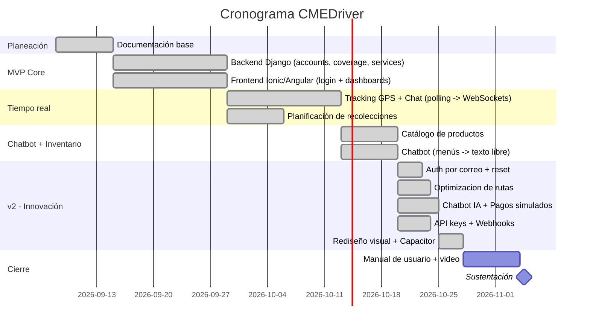

# Cronograma — CMEDriver (v2)

> Cronograma propuesto para el desarrollo académico del proyecto (curso/trabajo de grado). El código y la documentación se generaron de forma acelerada como punto de partida; este plan es el que se sustenta ante el docente/jurado como plan de trabajo formal, con las fases ya completadas marcadas como tal.

## Fases y semanas

| Fase | Semanas | Entregables | Estado |
|---|---|---|---|
| **Fase 0 — Planeación** | 1-2 | Project charter, requisitos, arquitectura, modelo de datos, diseño de API, cronograma | ✅ Completado |
| **Fase 1 — MVP core** | 3-6 | Login 3 roles, CRUD usuarios, matriz de cobertura, creación/asignación de servicios, flujo motorizado (entrega/recolección), evidencia foto+firma, novedades | ✅ Completado y probado (93 pruebas automatizadas) |
| **Fase 2 — Tiempo real y autogestión** | 7-9 | Tracking GPS, chat cliente-motorizado, planificación de recolecciones por el cliente | ✅ Completado — evolucionó de polling a WebSockets en v2 |
| **Fase 3 — Chatbot e inventario** | 10-11 | Chatbot guiado conectado a inventario, catálogo parametrizable | ✅ Completado — evolucionó de menús fijos a texto libre en v2 |
| **Fase 4 — v2: innovación** | 12-14 | Auth por correo, optimización de rutas, chatbot con IA (simulado), pagos (simulado), API keys/webhooks, inventario multi-producto, rediseño visual, Capacitor | ✅ Completado (ver [13-rf-rnf-completos.md](13-rf-rnf-completos.md) sección V2) |
| **Fase 5 — Pruebas y documentación final** | 15-16 | Pruebas funcionales por rol, manual de usuario, video demo, informe final | 🔶 Documentación completa; manual de usuario y video pendientes |
| **Fase 6 — Sustentación** | 17 | Presentación, defensa ante jurado | ⬜ Pendiente |

## Diagrama (Gantt simplificado)

## Hitos de entrega
1. **Hito 1:** Documentación de planeación aprobada por el docente. ✅
2. **Hito 2:** Demo del flujo core (crear servicio → asignar → ejecutar → cerrar) funcionando de punta a punta. ✅
3. **Hito 3:** Demo de tracking + chat + planificación de recolección por el cliente. ✅ (ahora en tiempo real)
4. **Hito 4:** Demo del chatbot + inventario integrados. ✅ (ahora conversacional + multi-producto)
5. **Hito 5:** Demo de innovación v2 (optimización de rutas, API keys/webhooks, pagos). ✅
6. **Hito 6:** Entrega final con manual de usuario, informe y sustentación. ⬜
