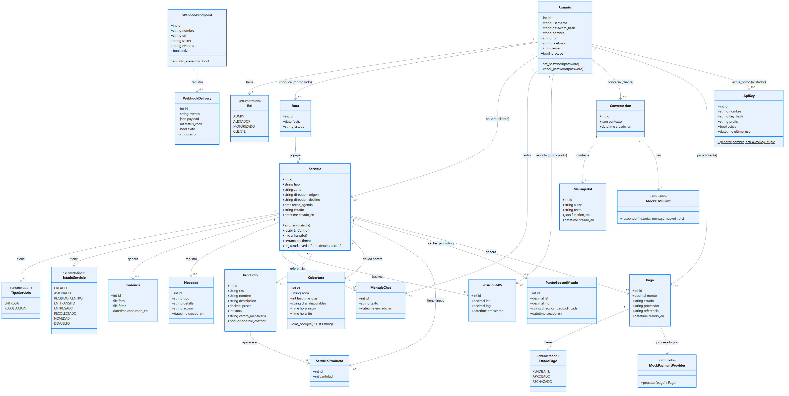
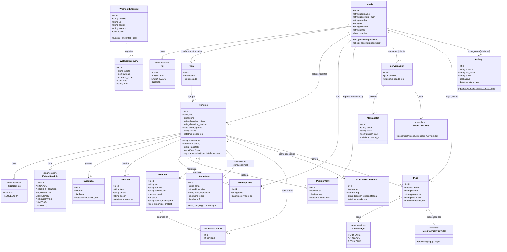

# Diagrama de clases — CMEDriver (v2)

> Derivado directamente de los modelos Django implementados en `backend/` (accounts, coverage, inventory, services, tracking, optimization, chatbot, payments, integrations), para que el diagrama quede consistente con el código real.

Fuente editable (Mermaid): [diagrams/src/clases.mmd](diagrams/src/clases.mmd)

Ver código Mermaid

## Notas de diseño
- `Rol`, `TipoServicio`, `EstadoServicio` y `EstadoPago` están modelados como enumeraciones (`TextChoices` en Django) más que como clases independientes — se muestran aquí para documentar los valores válidos de cada campo.
- Los métodos de `Servicio` (`asignarRuta`, `recibirEnCentro`, `iniciarTransito`, `cerrar`, `registrarNovedad`) están implementados como *actions* del `ServicioViewSet` en `backend/services/views.py`, no como métodos de instancia del modelo — se documentan a nivel de clase porque representan el comportamiento/ciclo de vida del servicio, que es lo relevante para el diagrama UML.
- La relación `Servicio -> Cobertura` es una validación de negocio (zona + leadtime), no una foreign key física en la base de datos — se modela como asociación porque es una regla de negocio central (RN-03).
- `MockLLMClient` y `MockPaymentProvider` llevan el estereotipo `<<simulado>>`: son implementaciones intercambiables (RNF-13) sin credenciales externas — el diagrama documenta honestamente que no son integraciones reales todavía.
- `ApiKey.actua_como` es una asociación a `Usuario` (rol ALISTADOR), no una clase de "usuario de sistema" separada — así los permisos existentes de ALISTADOR aplican sin duplicar lógica de autorización.
