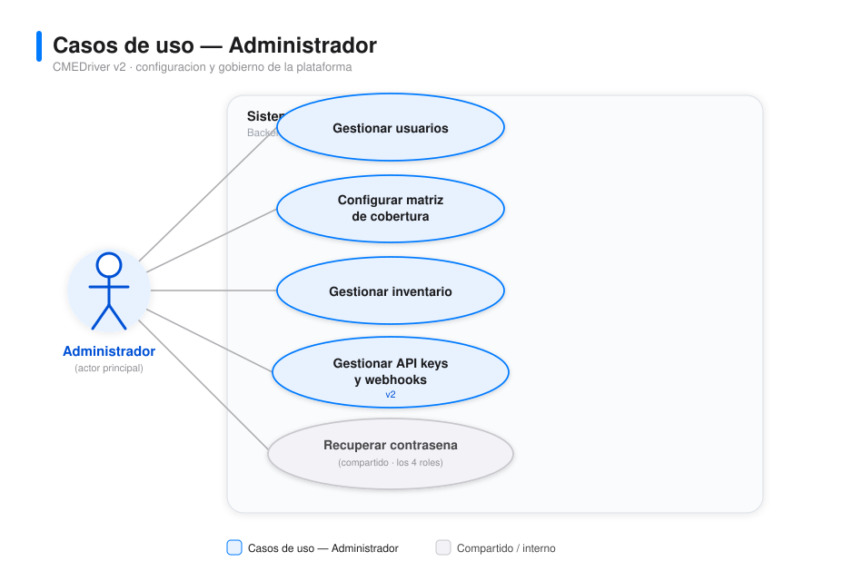
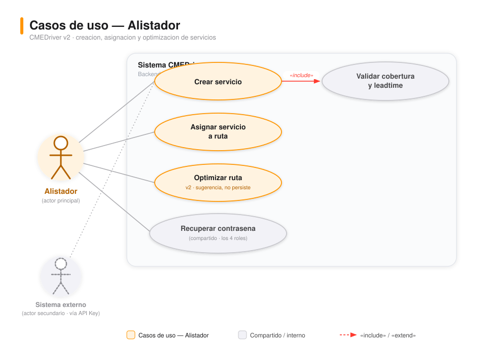
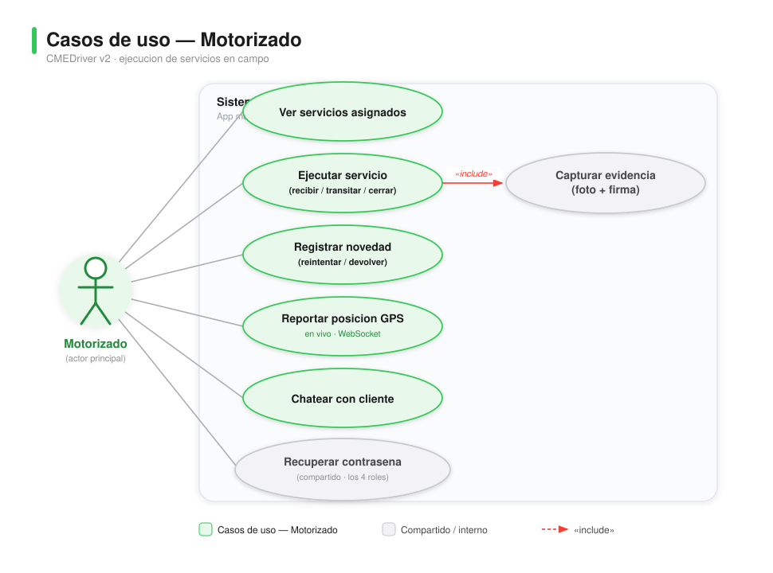
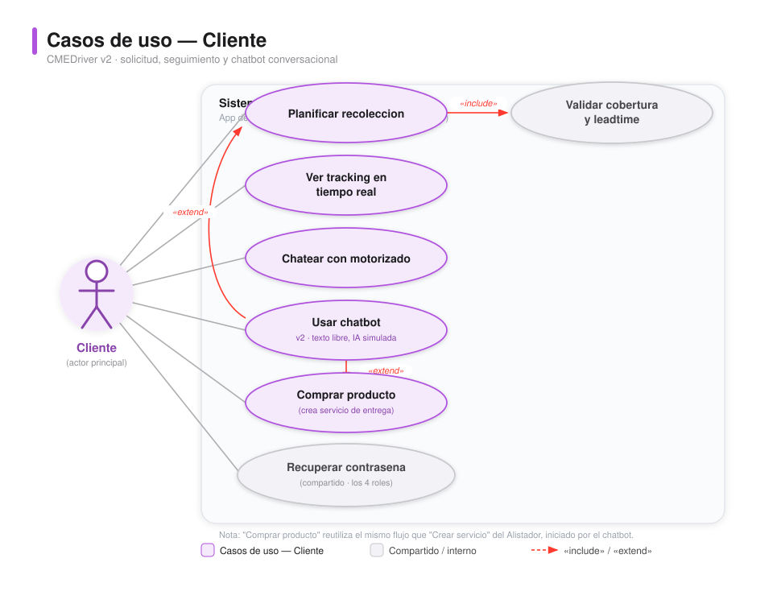

# Diagrama de casos de uso — CMEDriver (v2)

> **Nota (2026-10-09):** este documento es **histórico**: se redactó antes de la reducción de alcance que retiró el inventario, los pagos y el chatbot (el chat quedó solo como canal entre el cliente y el motorizado) y **no refleja el alcance vigente**. Incluye los casos de uso «Gestionar inventario», «Usar chatbot» y «Comprar producto», retirados. Prevalece la documentación de [entrega/](entrega/00-guia-de-entrega.md), en particular [entrega/01-requerimientos.md §2.4](entrega/01-requerimientos.md#24-cambios-de-alcance).

Un diagrama por actor (más legible que un único diagrama combinado), con estilo visual iOS consistente con los [mockups](12-mockups.md).

| Actor | Diagrama |
|---|---|
| Administrador |  |
| Alistador |  |
| Motorizado |  |
| Cliente |  |

Fuentes: [diagrams/casos-uso-administrador.svg](diagrams/casos-uso-administrador.svg), [diagrams/casos-uso-alistador.svg](diagrams/casos-uso-alistador.svg), [diagrams/casos-uso-motorizado.svg](diagrams/casos-uso-motorizado.svg), [diagrams/casos-uso-cliente.svg](diagrams/casos-uso-cliente.svg).

## Actores
| Actor | Tipo | Descripción |
|---|---|---|
| Administrador | Principal | Configura el sistema: usuarios, cobertura, inventario, API keys, webhooks |
| Alistador | Principal | Crea y asigna servicios de mensajería, pide optimización de ruta |
| Motorizado | Principal | Ejecuta los servicios en campo |
| Cliente | Principal | Solicita/recibe servicios, hace seguimiento, usa el chatbot |
| Sistema externo | Secundario | Crea servicios vía API Key (integraciones de terceros) — aparece en el diagrama del Alistador |

## Casos de uso y relaciones clave
| Caso de uso | Diagrama(s) | Relación |
|---|---|---|
| Gestionar usuarios | Administrador | — |
| Configurar matriz de cobertura | Administrador | — |
| Gestionar inventario | Administrador | — |
| **Gestionar API keys y webhooks** *(v2)* | Administrador | Emite claves para integraciones y configura notificaciones salientes |
| Crear servicio | Alistador | «include» Validar cobertura y leadtime; también creado por Sistema externo vía API |
| Asignar servicio a ruta | Alistador | — |
| **Optimizar ruta** *(v2)* | Alistador | Geocodifica y sugiere un orden de visita; no persiste el orden |
| Ver servicios asignados | Motorizado | — |
| Ejecutar servicio (recibir/transitar/cerrar) | Motorizado | «include» Capturar evidencia (solo si tipo=Recolección) |
| Registrar novedad | Motorizado | Resultado: Reintentar o Devolver a centro |
| Reportar posición GPS | Motorizado | Se difunde en vivo por WebSocket a quien mira el tracking |
| Chatear con cliente / Chatear con motorizado | Motorizado y Cliente | Mismo hilo de mensajes, dibujado desde ambos lados — WebSocket con respaldo de polling |
| Planificar recolección | Cliente | «include» Validar cobertura y leadtime |
| Ver tracking en tiempo real | Cliente | Vía WebSocket, con respaldo de polling; incluye marcador de destino y ETA |
| Usar chatbot (texto libre) | Cliente | «extend» Comprar producto / «extend» Planificar recolección |
| Comprar producto | Cliente | Reutiliza el mismo flujo que "Crear servicio" del Alistador (tipo Entrega), iniciado conversacionalmente |
| **Recuperar contraseña** *(v2)* | Los 4 diagramas | Aplica igual a los 4 roles; se dibuja completo en cada diagrama para no perder claridad |
| Validar cobertura y leadtime | (interno, gris) | Incluido por "Crear servicio" y "Planificar recolección" |
| Capturar evidencia (foto + firma) | (interno, gris) | Incluido por "Ejecutar servicio" |

## Notas
- El chatbot no es un caso de uso independiente a nivel de reglas de negocio: reutiliza los mismos flujos de compra (crear servicio) y recolección (planificar recolección), ahora conversando en texto libre en vez de solo menús — ver decisión de diseño en [03-arquitectura.md](03-arquitectura.md).
- "Sistema externo" es un actor secundario que representa integraciones (ej. un e-commerce) creando servicios vía API Key, sin pasar por la interfaz del alistador ni requerir un usuario humano logueado — se dibuja en el diagrama del Alistador, que es el caso de uso que comparte.
- "Recuperar contraseña" es, estrictamente, un caso de uso de un actor abstracto "Usuario" del que los 4 roles heredan. Al separar los diagramas por actor ya no hace falta simplificarlo hacia un solo rol: se dibuja completo en los 4.
- Antes de esta versión existía un único diagrama combinado con los 4 actores; se reemplazó por estos 4 diagramas independientes para reducir el cruce de líneas y facilitar la lectura de cada rol por separado.
