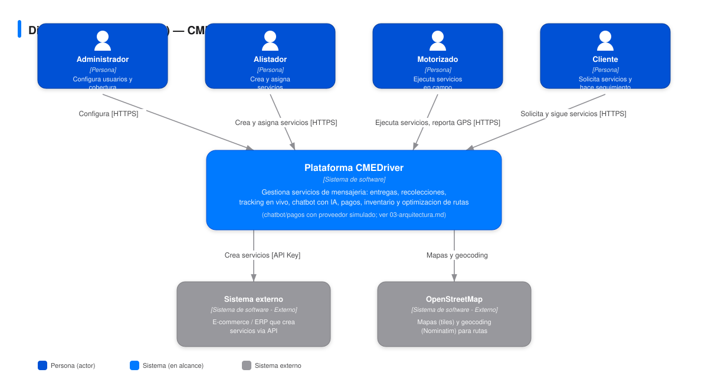
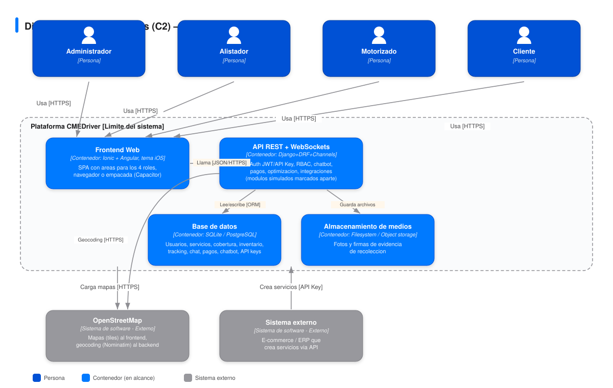

# Diagrama C4 — CMEDriver

Modelo C4 (Contexto + Contenedores), dibujado a mano en SVG (sin auto-layout) para un resultado limpio y listo para imprimir/pegar en el informe. Fuentes editables: [diagrams/c4-contexto.svg](diagrams/c4-contexto.svg) y [diagrams/c4-contenedores.svg](diagrams/c4-contenedores.svg).

## Nivel 1 — Contexto (C1)

Muestra los 4 roles de usuario, la plataforma CMEDriver como una caja única, y los dos sistemas externos con los que interactúa: un sistema externo (e-commerce/ERP) que puede crear servicios vía API, y OpenStreetMap como proveedor de mapas para el tracking.

## Nivel 2 — Contenedores (C2)

Descompone la plataforma en sus 4 contenedores técnicos:
- **Frontend Web** (Ionic + Angular): SPA que corre en el navegador, con áreas separadas por rol.
- **API REST** (Django + DRF): concentra la lógica de negocio, autenticación JWT y autorización por rol (RBAC).
- **Base de datos** (SQLite en desarrollo, PostgreSQL sugerido en producción): persiste todo el dominio (usuarios, servicios, cobertura, inventario, tracking, chat).
- **Almacenamiento de medios**: guarda las fotos y firmas capturadas como evidencia en las recolecciones.

## Notas
- No se incluye un nivel C3 (Componentes) por alcance de tiempo del MVP — los 5 apps Django (`accounts`, `coverage`, `inventory`, `services`, `tracking`) documentados en [03-arquitectura.md](03-arquitectura.md) cumplen ese rol de descomposición interna de la API REST.
- El inventario (contenido dentro de la Base de datos y expuesto por la API REST) es administrado exclusivamente por el rol Administrador — ver [13-rf-rnf-completos.md](13-rf-rnf-completos.md) RF-04.
