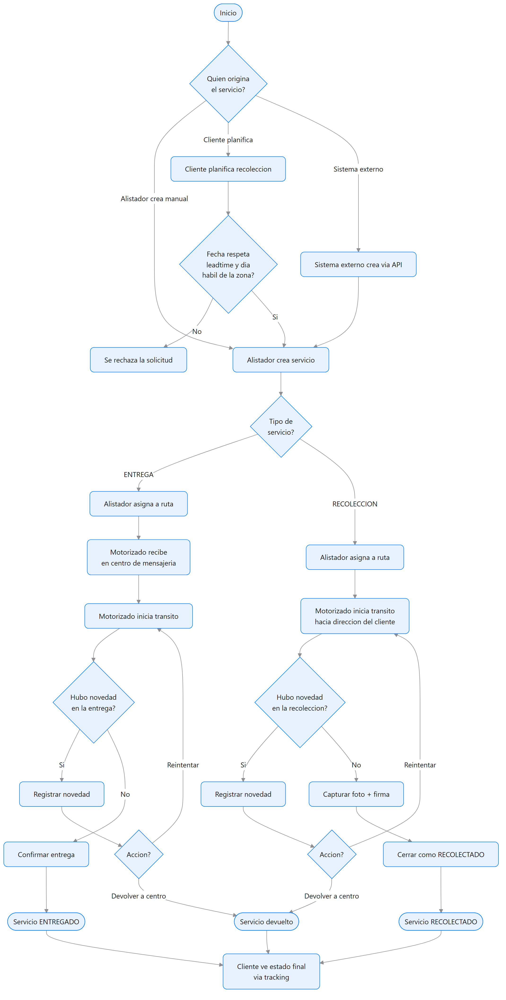

# Diagrama de flujo del proceso — CMEDriver

Flujo end-to-end de un servicio, desde su origen (alistador, cliente o sistema externo) hasta su cierre, incluyendo las bifurcaciones por tipo de servicio y por novedad. Fuente editable: [diagrams/src/flujo-proceso.mmd](diagrams/src/flujo-proceso.mmd).

## Lectura del flujo
1. Un servicio puede originarse de 3 formas: creación manual del alistador, planificación propia del cliente (recolección), o vía API de un sistema externo.
2. Si lo planifica el cliente, primero se valida que la fecha respete el leadtime y el día habilitado de la zona (RN-03) — si no, se rechaza.
3. Una vez creado, el alistador lo asigna a una ruta/motorizado.
4. El camino de ejecución se bifurca por tipo:
   - **Entrega**: pasa primero por "recibido en centro" antes de iniciar tránsito (RN-01).
   - **Recolección**: el motorizado inicia tránsito directo hacia la dirección del cliente.
5. En cualquiera de los dos caminos, si ocurre una novedad, el motorizado decide entre **reintentar** (vuelve a intentar el tránsito) o **devolver a centro** (cierra el servicio como devuelto).
6. Sin novedad: la Entrega se confirma y cierra como `ENTREGADO`; la Recolección exige capturar foto + firma antes de cerrar como `RECOLECTADO` (RN-02).
7. En todo momento, el cliente puede ver el estado final del servicio a través del tracking.
