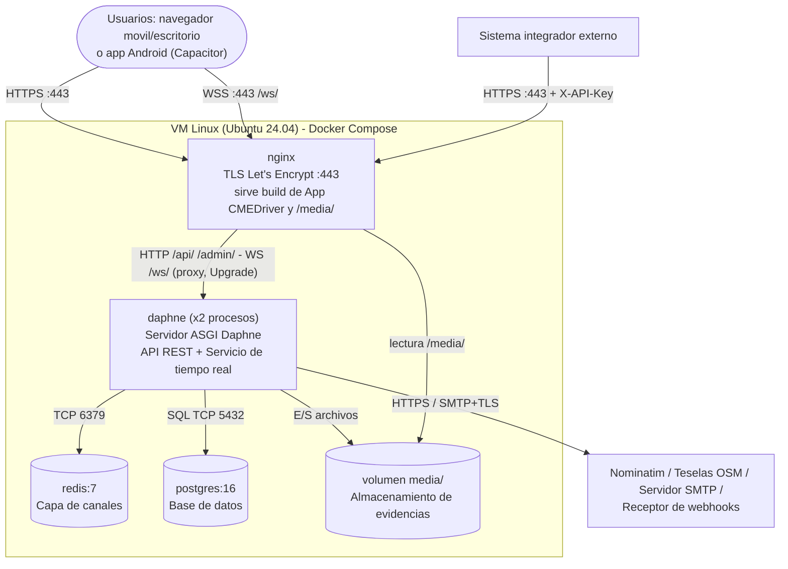

# Fase 2 — Arquitectura propuesta

**Proyecto:** CMEDriver — plataforma de gestión de mensajería (entregas y recolecciones).
**Relacionado:** [02-stack-tecnologico.md](02-stack-tecnologico.md) · [../03-arquitectura.md](../03-arquitectura.md) · [../14-diagrama-c4.md](../14-diagrama-c4.md) · [../11-manual-distribucion.md](../11-manual-distribucion.md)

Este documento describe la arquitectura **tal como está implementada** en el repositorio y, por separado y marcada como tal, la **propuesta de despliegue** para producción. Los nombres de contenedores y componentes definidos aquí son **canónicos**: el modelo C4 (Fase 5) los reutiliza exactamente (ver §9).

---

## 1. Estilo arquitectónico

CMEDriver combina cuatro estilos complementarios:

| Estilo | Cómo se materializa en CMEDriver |
|---|---|
| **Cliente-servidor** | La **App CMEDriver** (cliente) no tiene lógica de negocio ni acceso a datos: toda regla (leadtime, transiciones de estado, evidencias obligatorias) vive en el servidor y se aplica igual para la app, para el chatbot y para los integradores externos. |
| **SPA + API REST** | La app es una Single Page Application (Ionic + Angular) que consume la **API REST CMEDriver** (`/api/*`, JSON sobre HTTPS, autenticada con JWT). El mismo contrato REST, documentado con OpenAPI en `/api/docs/`, sirve a la app y a los sistemas integradores (RF-06, RNF-03). |
| **Monolito modular** | Un único proyecto Django desplegado como una sola unidad, dividido en **9 apps de dominio** (`accounts`, `coverage`, `inventory`, `services`, `tracking`, `optimization`, `chatbot`, `payments`, `integrations`), cada una con sus propios modelos, serializers, vistas y URLs (RNF-08). |
| **Comunicación en tiempo real (publicar/suscribir sobre WebSocket)** | El **Servicio de tiempo real** (Django Channels) mantiene conexiones WebSocket por servicio (`/ws/tracking/{id}/`, `/ws/chat/{id}/`). Cuando llega una posición GPS o un mensaje, se publica en el grupo del servicio (`tracking_<id>`, `chat_<id>`) a través de la **Capa de canales** y se difunde a todos los suscritos. Si el socket falla, la app cae a polling REST (RNF-10). |

Patrones de apoyo: **máquina de estados** para el ciclo de vida del `Servicio`, **RBAC** por rol, **Strategy/adaptador** para los proveedores simulados (`MockLLMClient`, `MockPaymentProvider`, RNF-13) y **webhooks firmados** para notificar a terceros (RF-25).

### 1.1 Por qué este estilo responde al problema

| Característica del problema | Decisión arquitectónica que la atiende |
|---|---|
| **Operación con varios roles** (Administrador, Alistador, Motorizado, Cliente) que ven y modifican el mismo servicio | Un único backend con **RBAC** centralizado: cada endpoint declara qué rol lo usa (`IsAdmin`, `IsAlistador`, `IsMotorizado`, `IsCliente`) y filtra datos por usuario (el cliente solo ve sus servicios; el motorizado solo los de sus rutas). Una sola SPA con áreas por rol, enrutadas según el rol del JWT. |
| **Tracking en tiempo real** del motorizado y **chat** cliente–motorizado | WebSocket con Channels en el mismo proceso ASGI que la API: el motorizado reporta por REST (`POST /api/tracking/posicion/`) y esa vista publica en el grupo; el cliente recibe la posición por push en menos de 1 s (RF-27), con fallback a polling (RNF-10). |
| **Evidencia** obligatoria de recolección (foto + firma) | Envío `multipart/form-data` a la API, validación en servidor (RN-02: sin ambos archivos responde 400) y almacenamiento en el **Almacenamiento de evidencias** separado de la base de datos (la BD guarda solo la ruta del archivo). |
| **Integraciones con terceros** (ERP/e-commerce que crean servicios y quieren enterarse de los cambios) | La misma API REST, autenticada con **API Key** (que actúa como un ALISTADOR, RN-08), y **webhooks salientes** firmados con HMAC-SHA256 para cada evento `servicio.*` (RF-24, RF-25, RNF-11). |
| **Dependencias externas no disponibles** (LLM, pasarela de pagos) | Interfaces intercambiables (`MockLLMClient.responder`, `PaymentProvider.procesar`) que aíslan el proveedor: conectar uno real cambia un solo archivo (RNF-13). |
| **Un único desarrollador y plazo académico** | Monolito modular en lugar de microservicios: un solo despliegue, una sola base de datos, transacciones locales, y aun así fronteras de dominio claras por app que permiten extraer módulos más adelante. |

---

## 2. Diagrama general

Fuente editable: [`docs/diagrams/src/arquitectura-general.mmd`](../diagrams/src/arquitectura-general.mmd) · Imagen renderizada: [`docs/diagrams/img/arquitectura-general.png`](../diagrams/img/arquitectura-general.png)

Leyenda: azul = contenedores propios · verde = almacenamiento · naranja = sistemas externos reales · gris punteado = proveedores **simulados** (hoy son código dentro del proceso; la flecha punteada indica la integración HTTPS futura).

```mermaid
flowchart TB
    %% Arquitectura general de CMEDriver (Fase 2 - docs/entrega/03-arquitectura.md)
    %% Nombres de nodos = nombres canonicos reutilizados por el C4 (Fase 5).

    %% ---------- Actores ----------
    subgraph Actores["Actores"]
        direction LR
        ADM(["Administrador"])
        ALI(["Alistador"])
        MOT(["Motorizado"])
        CLI(["Cliente"])
    end

    INT["<b>Sistema integrador externo</b><br/>ERP / e-commerce"]

    %% ---------- Cliente ----------
    subgraph Dispositivo["Navegador web / dispositivo movil"]
        APP["<b>App CMEDriver</b><br/>Ionic 9 + Angular 22 (SPA)<br/>web o empaquetada con Capacitor 8<br/>Leaflet - signature_pad"]
    end

    %% ---------- Plataforma ----------
    subgraph Plataforma["Plataforma CMEDriver - Servidor ASGI Daphne (monolito modular Django)"]
        direction LR
        ADMINP["<b>Panel de administracion Django</b><br/>/admin/"]
        API["<b>API REST CMEDriver</b><br/>Django 6.1 + DRF 3.18 - /api/*<br/>JWT + API Key + RBAC<br/>9 apps de dominio"]
        DOCS["<b>Documentacion API</b><br/>drf-spectacular<br/>/api/docs/ (Swagger)"]
        CL["<b>Capa de canales</b><br/>InMemoryChannelLayer (dev)<br/>Redis (propuesta prod)"]
        RT["<b>Servicio de tiempo real</b><br/>Django Channels 4.3<br/>/ws/tracking/{id}/ - /ws/chat/{id}/"]
    end

    %% ---------- Persistencia ----------
    subgraph Persistencia["Persistencia"]
        direction LR
        DB[("<b>Base de datos</b><br/>SQLite (dev)<br/>PostgreSQL (propuesta prod)")]
        MEDIA[("<b>Almacenamiento de evidencias</b><br/>media/evidencias/ (fotos y firmas)")]
    end

    %% ---------- Sistemas externos ----------
    subgraph Externos["Servicios externos"]
        direction LR
        OSM["<b>Teselas OpenStreetMap</b><br/>mapa base - REAL"]
        NOM["<b>Nominatim (OpenStreetMap)</b><br/>geocodificacion - REAL"]
        SMTP["<b>Servidor SMTP</b><br/>backend de consola en dev"]
        WH["<b>Receptor de webhooks</b><br/>del sistema integrador"]
        PAY["<b>Proveedor de pagos</b><br/>MockPaymentProvider - SIMULADO"]
        LLM["<b>Proveedor LLM</b><br/>MockLLMClient - SIMULADO"]
    end

    %% ---------- Flujos ----------
    Actores -->|"HTTPS (interfaz)"| APP
    ADM -->|"HTTPS - sesion Django"| ADMINP
    INT -->|"HTTPS - REST + X-API-Key"| API

    APP -->|"HTTPS - REST/JSON + JWT Bearer<br/>(multipart para foto/firma)"| API
    APP <-->|"WSS - JSON, ?token=JWT"| RT
    APP -->|"HTTPS - GET teselas"| OSM

    API -.->|"esquema OpenAPI"| DOCS
    API -->|"group_send (en proceso)"| CL
    RT <-->|"group_send / difusion a grupo"| CL

    API -->|"SQL (ORM)"| DB
    RT -->|"SQL (ORM)"| DB
    ADMINP -->|"SQL (ORM)"| DB
    API -->|"E/S de archivos"| MEDIA

    API -->|"HTTPS GET /search (1 req/s)"| NOM
    API -->|"SMTP+TLS (prod) / consola (dev)"| SMTP
    API -->|"HTTPS POST + HMAC-SHA256"| WH
    API -.->|"en proceso hoy / HTTPS a futuro"| PAY
    API -.->|"en proceso hoy / HTTPS a futuro"| LLM

    classDef ext fill:#FFF3E0,stroke:#FF9500,color:#1C1C1E;
    classDef sim fill:#F2F2F7,stroke:#8E8E93,stroke-dasharray:5 3,color:#1C1C1E;
    classDef store fill:#E8F7EE,stroke:#34C759,color:#1C1C1E;
    classDef actor fill:#FFFFFF,stroke:#007AFF,color:#1C1C1E;
    class NOM,OSM,SMTP,INT,WH ext;
    class PAY,LLM sim;
    class DB,MEDIA store;
    class ADM,ALI,MOT,CLI actor;
```

Notas de lectura:

- La **API REST CMEDriver**, el **Servicio de tiempo real**, la **Documentación API** y el **Panel de administración Django** corren hoy **en el mismo proceso** del **Servidor ASGI Daphne** (`ProtocolTypeRouter` en `cmedriver/asgi.py` enruta `http` a Django y `websocket` a Channels). Se dibujan separados porque tienen responsabilidades, protocolos y rutas distintas.
- En desarrollo los protocolos son `http://` y `ws://` en `localhost:8000`; las etiquetas HTTPS/WSS corresponden al despliegue propuesto (§7). La app convierte automáticamente `https` en `wss` al construir la URL del socket (`wsUrl()` en `frontend/src/app/core/utils.ts`).
- El motorizado **reporta** su posición por REST; el WebSocket de tracking es **de solo lectura** para el cliente. El chat sí acepta mensajes por WebSocket (el consumer los persiste y los difunde) y también por REST.

---

## 3. Componentes del sistema

| Componente | Responsabilidad | Tecnología | Se comunica con |
|---|---|---|---|
| **App CMEDriver** | Interfaz de los 4 roles: dashboard e inventario (Administrador), creación y asignación de servicios y rutas (Alistador), ejecución de servicios, evidencia y GPS (Motorizado), planificación, tracking, chat y chatbot (Cliente). Guarda el JWT y lo adjunta con un interceptor HTTP | Ionic 9 + Angular 22 + TypeScript; Leaflet; signature_pad; WebSocket nativo; Capacitor 8 para Android/iOS | API REST CMEDriver (HTTPS/REST + JWT), Servicio de tiempo real (WSS), Teselas OpenStreetMap (HTTPS) |
| **API REST CMEDriver** | Lógica de negocio, validaciones (RN-01..RN-19), máquina de estados del servicio, autenticación (JWT y API Key) y autorización RBAC; publica en la Capa de canales las posiciones GPS (`tracking`) y los mensajes de chat (`services`) y dispara webhooks | Django 6.1 + DRF 3.18 + SimpleJWT 5.5 | App CMEDriver, Sistema integrador externo, Capa de canales, Base de datos, Almacenamiento de evidencias, Nominatim, Servidor SMTP, Receptor de webhooks, Proveedor de pagos, Proveedor LLM |
| **Servicio de tiempo real** | Aceptar conexiones WebSocket autenticadas por JWT, verificar acceso al servicio concreto y difundir posiciones (`TrackingConsumer`) y mensajes de chat (`ChatConsumer`) | Django Channels 4.3 (`AsyncWebsocketConsumer`) + `JWTAuthMiddleware` | App CMEDriver (WSS), Capa de canales, Base de datos |
| **Capa de canales** | Bus publicar/suscribir entre la API y los consumers: grupos `tracking_<id>` y `chat_<id>` | `InMemoryChannelLayer` (dev, un solo proceso); propuesta `channels-redis` + Redis 7 (prod, varios procesos) | API REST CMEDriver, Servicio de tiempo real |
| **Servidor ASGI Daphne** | Proceso servidor que aloja la API, el tiempo real, la documentación y el admin; enruta por protocolo (`http` / `websocket`) | Daphne 4.2 + `ProtocolTypeRouter` | App CMEDriver, Sistema integrador externo (y Nginx en la propuesta de despliegue) |
| **Base de datos** | Persistencia de todo el dominio: usuarios, cobertura, inventario, servicios, rutas, novedades, evidencias (metadatos), posiciones GPS, chat, conversaciones del chatbot, pagos, API keys (hash), webhooks y entregas | SQLite (dev) → PostgreSQL 16 (propuesta prod), vía ORM de Django | API REST CMEDriver, Servicio de tiempo real, Panel de administración Django |
| **Almacenamiento de evidencias** | Archivos de foto (`evidencias/fotos/`) y firma (`evidencias/firmas/`) de las recolecciones | Sistema de archivos local `backend/media/` (dev); propuesta volumen persistente o bucket S3 con `django-storages` | API REST CMEDriver (escritura/lectura); App CMEDriver los descarga por URL `/media/...` |
| **Documentación API** | Esquema OpenAPI 3 (`/api/schema/`) y Swagger UI (`/api/docs/`) generados desde el código | drf-spectacular 0.30 | API REST CMEDriver (introspección); consultada por desarrolladores e integradores |
| **Panel de administración Django** | Gestión directa de datos para soporte y demo (`/admin/`) | `django.contrib.admin` | Base de datos; usado por el Administrador (técnico) |
| **Nominatim (OpenStreetMap)** | Geocodificar direcciones para sugerir el orden de una ruta (RF-21) y ubicar el destino en el mapa (RF-28) | API pública HTTP, cliente `urllib` con caché `PuntoGeocodificado` y 1 req/s | API REST CMEDriver (app `optimization`, y `tracking` a través de `DestinoView` para el destino en el mapa, RF-28) |
| **Teselas OpenStreetMap** | Imágenes del mapa base para el tracking | `tile.openstreetmap.org` vía Leaflet | App CMEDriver |
| **Servidor SMTP** | Entregar el correo de restablecimiento de contraseña (RF-20) | `django.core.mail`; backend de consola en dev, SMTP real por `EMAIL_BACKEND` en prod | API REST CMEDriver (app `accounts`) |
| **Proveedor de pagos** (simulado) | Aprobar o rechazar el pago de una compra hecha por el chatbot (RF-23) | `PaymentProvider` / `MockPaymentProvider` (en proceso) | API REST CMEDriver (apps `chatbot`, `payments`) |
| **Proveedor LLM** (simulado) | Interpretar el texto libre del cliente y decidir qué tool invocar (RF-22) | `MockLLMClient` (reglas de palabras clave, en proceso) | API REST CMEDriver (app `chatbot`) |
| **Sistema integrador externo** | ERP/e-commerce que crea y consulta servicios sin login humano (RF-06) | Cualquier cliente HTTP con header `X-API-Key` | API REST CMEDriver |
| **Receptor de webhooks** | URL del integrador que recibe los eventos `servicio.*` firmados (RF-25) | Endpoint HTTP(S) del tercero; verifica `X-CMEDriver-Signature` | API REST CMEDriver (app `integrations`) |

---

## 4. Apps del backend (módulos de la API REST CMEDriver)

| App Django | Responsabilidad | Rutas principales | Requisitos |
|---|---|---|---|
| **accounts** | Usuario personalizado `Usuario` con rol (ADMIN, ALISTADOR, MOTORIZADO, CLIENTE) y correo único; login JWT por usuario o correo; refresh; perfil; restablecimiento de contraseña por correo; clases de permiso RBAC (`permissions.py`); comando `seed_data` | `/api/auth/login/`, `/api/auth/refresh/`, `/api/auth/me/`, `/api/auth/password-reset/`, `/api/auth/password-reset/confirm/`, `/api/usuarios/` | RF-01, RF-19, RF-20, RNF-01, RNF-02, RNF-07, RNF-09 |
| **coverage** | Matriz de cobertura por zona (leadtime, días/horas de agenda) y cálculo de fechas válidas | `/api/cobertura/`, `/api/cobertura/agenda-disponible/` | RF-02, RN-03 |
| **inventory** | Catálogo de productos, stock por centro de mensajería y flag de disponibilidad en chatbot | `/api/productos/`, `/api/productos/disponibles-chatbot/` | RF-04, RN-04 |
| **services** | Núcleo del dominio: `Servicio`, `Ruta`, `Novedad`, `Evidencia`, `MensajeChat`, `ServicioProducto`; transiciones de estado (asignar, recibir en centro, iniciar tránsito, cerrar, novedad), planificación por el cliente, chat; `ChatConsumer`; dispara webhooks y publica en tiempo real **solo** los mensajes de chat (las posiciones GPS las publica `tracking`) | `/api/servicios/` (+ acciones), `/api/rutas/`, `/ws/chat/{id}/` | RF-03, RF-05..RF-13, RF-16, RF-17, RF-26, RN-01, RN-02, RN-05, RN-06 |
| **tracking** | Posiciones GPS reportadas por el motorizado, última posición, destino; `TrackingConsumer` para difusión en vivo | `/api/tracking/posicion/`, `/api/tracking/ultima-posicion/`, `/api/tracking/destino/`, `/ws/tracking/{id}/` | RF-14, RF-15, RF-27, RNF-06, RNF-10 |
| **optimization** | Geocodificación con caché (`PuntoGeocodificado`) vía Nominatim y heurística de vecino más cercano (haversine) para sugerir el orden de una ruta | `/api/optimizacion/rutas/{ruta_id}/` | RF-21 |
| **chatbot** | Conversaciones y mensajes del asistente; `MockLLMClient` con tool-calling real sobre inventario, cobertura, servicios y pagos; estado de conversación (slot-filling) | `/api/chatbot/mensaje/`, `/api/chatbot/conversaciones/{id}/mensajes/` | RF-18, RF-22 |
| **payments** | Pagos de las compras del chatbot; interfaz `PaymentProvider` con implementación simulada | `/api/pagos/{id}/` | RF-23, RNF-13 |
| **integrations** | API keys (hash SHA-256) y `ApiKeyAuthentication`; webhooks salientes (`WebhookEndpoint`), envío firmado HMAC y registro de entregas (`WebhookDelivery`) | `/api/integraciones/api-keys/`, `/api/integraciones/webhooks/`, `/api/integraciones/webhooks/{id}/entregas/` | RF-06, RF-24, RF-25, RN-07, RN-08, RNF-11, RNF-12 |

Paquete de configuración **`cmedriver`**: `settings.py` (configuración por variables de entorno), `urls.py` (monta las 9 apps bajo `/api/`, más `/admin/`, `/api/schema/`, `/api/docs/`), `asgi.py` (enrutamiento HTTP/WebSocket), `routing.py` (rutas WebSocket) y `ws_auth.py` (`JWTAuthMiddleware`).

---

## 5. Seguridad

| Mecanismo | Implementación | Requisito |
|---|---|---|
| **Autenticación de personas: JWT** | `rest_framework_simplejwt.authentication.JWTAuthentication` (primera clase en `DEFAULT_AUTHENTICATION_CLASSES`). Access token de 8 h, refresh de 1 día. Login acepta usuario o correo. El token viaja en `Authorization: Bearer <access>` | RNF-01, RF-19 |
| **Autenticación de sistemas: API Key** | `integrations.authentication.ApiKeyAuthentication` lee el header `X-API-Key`. Si no viene, cede a la siguiente clase; si viene y es inválida o inactiva, responde 401. La clave se almacena solo como hash SHA-256 y se muestra en claro una única vez al crearla. Resuelve a `ApiKey.actua_como` (un usuario ALISTADOR), por lo que aplica el mismo RBAC sin código adicional; registra `ultimo_uso` | RF-24, RNF-12, RN-08 |
| **Autorización: RBAC por rol** | Política por defecto `IsAuthenticated`; cada vista declara además `IsAdmin`, `IsAlistador`, `IsMotorizado` o `IsCliente` (`accounts/permissions.py`). Filtrado por propiedad: el cliente solo ve sus servicios (`cliente = request.user`) y el motorizado solo los de sus rutas | RNF-02 |
| **Autenticación del WebSocket** | Los navegadores no permiten cabeceras al abrir un WebSocket, así que el access token viaja en la query string (`?token=`). `JWTAuthMiddleware` lo valida y coloca el usuario en `scope['user']` (o `AnonymousUser`). Cada consumer verifica además el acceso al servicio concreto (cliente dueño, motorizado de la ruta, o ADMIN/ALISTADOR) y cierra con código **4403** si no está autorizado | RF-27, RNF-02 |
| **Webhooks firmados** | Cada envío lleva `X-CMEDriver-Signature` = HMAC-SHA256 del cuerpo con el secreto del endpoint; envío *best-effort* que nunca propaga errores a la petición original | RNF-11, RN-07 |
| **Contraseñas y reset** | Hash PBKDF2 de Django (`set_password`), validadores de contraseña; token de restablecimiento de un solo uso (`PasswordResetTokenGenerator`) que no revela si el correo existe | RNF-07, RNF-09 |
| **Configuración sensible** | `DJANGO_SECRET_KEY`, `DJANGO_DEBUG`, `DJANGO_ALLOWED_HOSTS`, `CORS_ALLOWED_ORIGINS`, `EMAIL_BACKEND`, etc. desde variables de entorno (`backend/.env.example`); el arranque falla si falta la clave con `DEBUG=False`; `.env` excluido del repositorio | — |
| **CORS** | Orígenes permitidos desde `CORS_ALLOWED_ORIGINS`; `CORS_ALLOW_ALL_ORIGINS` solo con `DEBUG=True` | — |

Riesgos conocidos y mitigación propuesta: el token en la query string del WebSocket puede quedar en logs de proxies → usar siempre WSS y no registrar query strings en Nginx; el access token de 8 h es largo → reducirlo y usar refresh en producción; `/media/` se sirve sin control de acceso → en producción servir evidencias con URLs firmadas o a través de una vista autenticada.

---

## 6. Flujos representativos

1. **Motorizado reporta posición** → App `POST /api/tracking/posicion/` (HTTPS + JWT) → API valida que el servicio sea de una ruta suya y guarda en BD → `group_send('tracking_<id>')` a la Capa de canales → `TrackingConsumer` envía la posición por WSS a cada cliente/alistador conectado → Leaflet mueve el marcador.
2. **Cierre de recolección con evidencia** → App `POST /api/servicios/{id}/cerrar/` (multipart con foto y firma) → API exige ambos archivos (RN-02), los guarda en el Almacenamiento de evidencias y crea `Evidencia` en BD → estado `RECOLECTADO` → `disparar_webhook('servicio.recolectado')` a los Receptores de webhooks suscritos.
3. **Integrador crea un servicio** → `POST /api/servicios/` con `X-API-Key` → `ApiKeyAuthentication` resuelve al ALISTADOR asociado → mismas validaciones que la app → webhook `servicio.creado`.
4. **Cliente compra por chatbot** → `POST /api/chatbot/mensaje/` → `MockLLMClient` invoca tools (listar productos → consultar agenda → crear compra) → `MockPaymentProvider.procesar(pago)` → respuesta con estado del pago.

---

## 7. Vista de despliegue

### 7.1 Despliegue actual (desarrollo)

| Nodo | Qué corre | Puerto |
|---|---|---|
| Máquina del desarrollador | `manage.py runserver` → **Servidor ASGI Daphne** (API REST + tiempo real + admin + docs), Capa de canales en memoria | `:8000` (`http://`, `ws://`) |
| Máquina del desarrollador | `ng serve` / `ionic serve` → **App CMEDriver** | `:4200` / `:8100` |
| Máquina del desarrollador | `backend/db.sqlite3` y `backend/media/` | — |
| Internet | Nominatim y teselas OSM | HTTPS |

No existe despliegue público ni pipeline de CI en el repositorio.

### 7.2 Despliegue propuesto (producción) — **PROPUESTA**

| Elemento | Propuesta | Motivo |
|---|---|---|
| Infraestructura | Una VM Linux en un proveedor IaaS (p. ej. AWS EC2 `t3.small` o Droplet de 2 GB) con Docker Compose | Volumen de una mensajería pequeña/mediana; WebSockets de larga duración y disco persistente para evidencias |
| Proxy de entrada | **nginx** con TLS (Let's Encrypt): sirve el build estático de la App CMEDriver (`npm run build` → `www/`) y `/media/`; reenvía `/api/`, `/admin/` y `/ws/` (con `Upgrade`/`Connection`) a Daphne | HTTPS/WSS obligatorio (cámara y GPS en móvil); Django con `DEBUG=False` no sirve `/media/` |
| Aplicación | Contenedor **daphne** con `cmedriver.asgi:application`, 2 procesos | ASGI necesario para WebSocket (no gunicorn/WSGI) |
| Capa de canales | **redis:7** + `channels-redis` | Con más de un proceso Daphne, la capa en memoria no comparte grupos entre procesos |
| Base de datos | **postgres:16** (o PostgreSQL gestionado tipo RDS); `pg_dump` diario | Concurrencia de escrituras GPS/estados; backups |
| Evidencias | Volumen Docker persistente respaldado junto con la BD; evolución a bucket S3 (`django-storages`) | Las evidencias son prueba de servicio (RN-02) |
| App móvil | APK generado con Capacitor apuntando a `https://<dominio>/api` | Mismo backend para web y nativa |
| Configuración | Variables de entorno (`DJANGO_DEBUG=False`, `DJANGO_SECRET_KEY`, `DJANGO_ALLOWED_HOSTS`, `CORS_ALLOWED_ORIGINS`, `EMAIL_BACKEND` SMTP, `FRONTEND_URL`) | Ya soportado por `settings.py` |
| CI | GitHub Actions: `manage.py test` + `ng build` en cada push | Detectar regresiones antes de desplegar |

Cambios de código necesarios para concretar la propuesta (no implementados): añadir `psycopg` y `channels-redis` a `requirements.txt`; leer `DATABASES` y `CHANNEL_LAYERS` desde variables de entorno; definir `STATIC_ROOT` y ejecutar `collectstatic` (estáticos de `/admin/` y Swagger); `environment.prod.ts` con la URL real de la API (hoy apunta a `http://localhost:8000/api`); `Dockerfile`s y `docker-compose.yml`.

---

## 8. Decisiones de arquitectura (resumen)

| Decisión | Alternativa | Motivo |
|---|---|---|
| Monolito modular (9 apps Django) | Microservicios | Un solo despliegue y BD, manejable por un único desarrollador; fronteras de dominio preparadas para extraer módulos (RNF-08) |
| WebSocket con Channels en el mismo proceso ASGI | Polling REST / servidor Node aparte | Tiempo real real reutilizando modelos y autorización de Django; polling solo como respaldo (RNF-10) |
| API REST única para app e integradores | API separada para terceros | Mismas validaciones y un solo contrato documentado (RF-06, RNF-03) |
| JWT + API Key | Sesiones de cookie / OAuth2 | JWT sirve a SPA, app nativa y WebSocket; API Key es simple para integradores |
| Proveedores simulados detrás de interfaces | Integrar proveedores reales o no tener la funcionalidad | Demuestra el patrón real de integración sin credenciales (RNF-13) |
| SQLite (dev) → PostgreSQL (prod) | PostgreSQL desde el inicio | Arranque inmediato en desarrollo; el ORM hace el cambio transparente |

---

## 9. Nombres canónicos de contenedores y componentes

Usar **exactamente** estos nombres en el modelo C4 (Fase 5) y en cualquier diagrama posterior.

**Personas (actores)**
- Administrador
- Alistador
- Motorizado
- Cliente

**Sistema (C1)**
- Plataforma CMEDriver

**Contenedores (C2) — propios**
- App CMEDriver — Ionic 9 + Angular 22 (SPA web / app Capacitor)
- API REST CMEDriver — Django 6.1 + DRF 3.18
- Servicio de tiempo real — Django Channels 4.3
- Capa de canales — InMemoryChannelLayer (dev) / Redis (propuesta)
- Base de datos — SQLite (dev) / PostgreSQL (propuesta)
- Almacenamiento de evidencias — `media/evidencias/`
- Documentación API — drf-spectacular / Swagger UI
- Panel de administración Django — `/admin/`

**Nodo de ejecución (despliegue)**
- Servidor ASGI Daphne — aloja API REST CMEDriver, Servicio de tiempo real, Documentación API y Panel de administración Django

**Sistemas externos**
- Sistema integrador externo (ERP / e-commerce)
- Receptor de webhooks
- Nominatim (OpenStreetMap)
- Teselas OpenStreetMap
- Servidor SMTP
- Proveedor de pagos (simulado — `MockPaymentProvider`)
- Proveedor LLM (simulado — `MockLLMClient`)

**Componentes (C3) de la API REST CMEDriver** — apps Django
- accounts · coverage · inventory · services · tracking · optimization · chatbot · payments · integrations

**Componentes transversales**
- Autenticación JWT (`JWTAuthentication`, SimpleJWT)
- Autenticación por API Key (`ApiKeyAuthentication`)
- Permisos RBAC (`IsAdmin`, `IsAlistador`, `IsMotorizado`, `IsCliente`)
- Middleware JWT de WebSocket (`JWTAuthMiddleware`)
- TrackingConsumer · ChatConsumer (componentes del Servicio de tiempo real)
- Cliente de geocodificación (`optimization/geocoding.py`)
- Despachador de webhooks (`integrations/services.disparar_webhook`)
