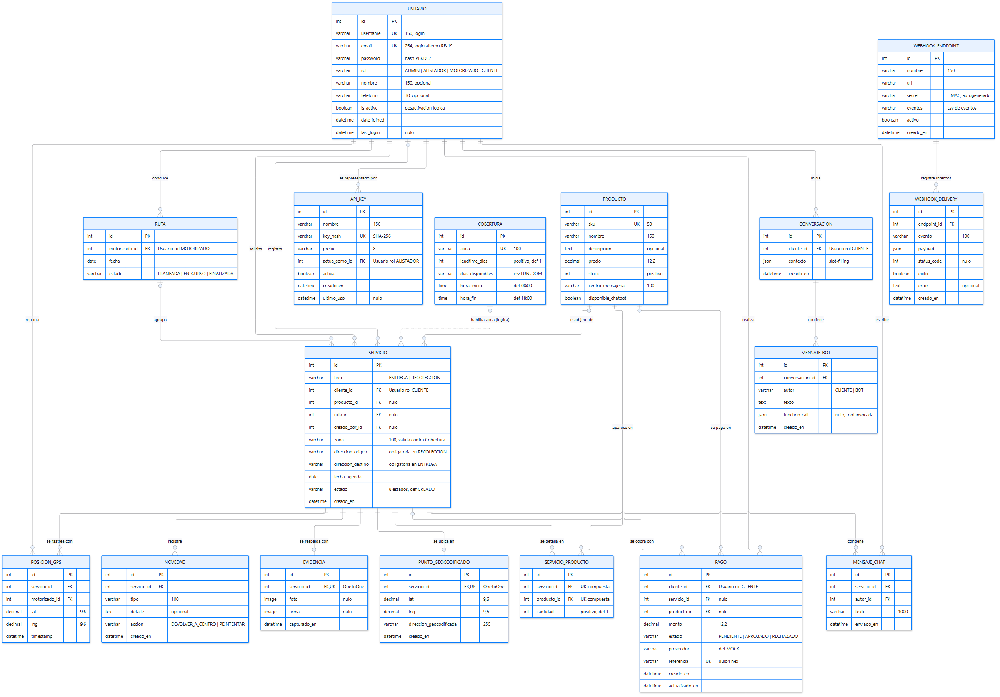
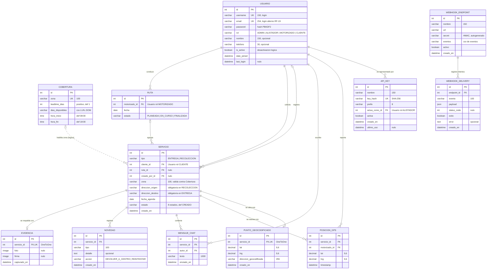

# 4. Modelo Entidad-Relación (MER)

> **Fuente de verdad:** los `models.py` de las 6 apps del backend (`accounts`, `coverage`, `services`, `tracking`, `optimization`, `integrations`) y sus migraciones (`0001_initial` de cada app, más `accounts/0002_alter_usuario_email`). El diagrama y el diccionario reflejan el estado actual del código, no el diseño inicial. Se comprobó (2026-10-09) que `makemigrations --check` no detecta diferencias entre los modelos y las migraciones.
>
> **Alcance:** el MER tiene **12 entidades**. El 2026-10-09 el autor retiró del proyecto el inventario, los pagos y el chatbot (5 entidades y 3 apps); el chat queda solo para la comunicación cliente-motorizado. Ver [§4.5](#45-cambios-de-alcance).
>
> **Referencias de requerimientos:** los IDs RF-xx / RNF-xx / RN-xx usados aquí son los de [01-requerimientos.md](01-requerimientos.md), que conserva sin renumerar los de [docs/13-rf-rnf-completos.md](../13-rf-rnf-completos.md) (RF-01…RF-27, RNF-01…RNF-13, RN-01…RN-08) y añade los nuevos al final (RF-28, RF-29, RNF-14…RNF-20, RN-09…RN-19). Los IDs retirados por el cambio de alcance (RF-04, RF-18, RF-22, RF-23, RF-26, RN-04, RN-06 y RN-16) ya no justifican ninguna entidad. La relación entidad ↔ RF completa está en [07-trazabilidad.md](07-trazabilidad.md) §c (12/12 entidades usadas por al menos un RF).

## 4.1 Diagrama



Fuente: [`docs/diagrams/src/mer-entrega.mmd`](../diagrams/src/mer-entrega.mmd)

**Convenciones:** `PK` clave primaria, `FK` clave foránea, `UK` valor único. `||` = exactamente uno, `|o` = cero o uno, `o{` = cero o muchos. Línea continua = FK real en la base de datos; línea punteada = relación lógica validada por código (sin FK).



### Entidades por módulo

| Módulo (app Django) | Entidades | Tabla física |
|---|---|---|
| accounts | USUARIO | `accounts_usuario` |
| coverage | COBERTURA | `coverage_cobertura` |
| services | RUTA, SERVICIO, EVIDENCIA, NOVEDAD, MENSAJE_CHAT | `services_*` |
| tracking | POSICION_GPS | `tracking_posiciongps` |
| optimization | PUNTO_GEOCODIFICADO | `optimization_puntogeocodificado` |
| integrations | API_KEY, WEBHOOK_ENDPOINT, WEBHOOK_DELIVERY | `integrations_*` |

Total: 6 apps y 12 entidades (USUARIO, COBERTURA, RUTA, SERVICIO, EVIDENCIA, NOVEDAD, MENSAJE_CHAT, POSICION_GPS, PUNTO_GEOCODIFICADO, API_KEY, WEBHOOK_ENDPOINT, WEBHOOK_DELIVERY).

Se excluyen las tablas internas de Django (`auth_group`, `auth_permission`, `django_session`, `django_content_type`, `django_admin_log`, tablas M2M `usuario_groups` / `usuario_user_permissions`) porque el dominio no las usa: la autorización se resuelve con el campo `Usuario.rol` (RBAC propio), no con grupos ni permisos de Django.

## 4.2 Diccionario de datos

Todas las entidades tienen `id` como PK autoincremental (`BigAutoField`). Columna **Nulo**: "Sí" = admite `NULL` en BD; "Vacío" = `blank=True` sobre texto (admite cadena vacía, no `NULL`); "No" = obligatorio.

### USUARIO (`accounts.Usuario`, hereda de `AbstractUser`)

**Requerimiento que la justifica:** RF-01 (gestionar usuarios y roles), RF-19 (login con correo), RF-20 (restablecer contraseña), RNF-02 (RBAC), RNF-07 (contraseñas con hash).

| Atributo | Tipo | PK/FK/UK | Nulo | Descripción |
|---|---|---|---|---|
| id | bigint | PK | No | Identificador |
| username | varchar(150) | UK | No | Nombre de usuario (heredado) para iniciar sesión |
| email | varchar(254) | UK | No | Correo; obligatorio y único porque también sirve para iniciar sesión (redefinido sobre `AbstractUser`) |
| password | varchar(128) | | No | Hash de la contraseña (`set_password`, PBKDF2); nunca texto plano |
| rol | varchar(20) | | No | `ADMIN`, `ALISTADOR`, `MOTORIZADO`, `CLIENTE`; por defecto `CLIENTE` |
| nombre | varchar(150) | | Vacío | Nombre para mostrar |
| telefono | varchar(30) | | Vacío | Teléfono de contacto |
| is_active | boolean | | No | Permite desactivar el usuario sin borrarlo (heredado) |
| date_joined | datetime | | No | Fecha de alta (heredado) |
| last_login | datetime | | Sí | Último inicio de sesión (heredado) |

*Campos heredados no usados por el dominio:* `first_name`, `last_name`, `is_staff`, `is_superuser` (este último solo para el admin de Django). Se omiten del diagrama.

### COBERTURA (`coverage.Cobertura`)

**Requerimiento que la justifica:** RF-02 (matriz de cobertura), RF-17 (validación de leadtime y día al planificar), RN-03, RN-15.

| Atributo | Tipo | PK/FK/UK | Nulo | Descripción |
|---|---|---|---|---|
| id | bigint | PK | No | Identificador |
| zona | varchar(100) | UK | No | Nombre de la zona; clave natural con la que se valida `Servicio.zona` |
| leadtime_dias | int positivo | | No | Días mínimos de anticipación para agendar (def. 1) |
| dias_disponibles | varchar(40) | | No | Códigos de día separados por coma (`LUN,MAR,...,DOM`), def. `LUN,MAR,MIE,JUE,VIE` |
| hora_inicio | time | | No | Inicio de la franja de atención (def. 08:00) |
| hora_fin | time | | No | Fin de la franja de atención (def. 18:00) |

### RUTA (`services.Ruta`)

**Requerimiento que la justifica:** RF-07 (asignar a ruta), RF-09 (servicios asignados al motorizado), RF-21 (optimización de ruta).

| Atributo | Tipo | PK/FK/UK | Nulo | Descripción |
|---|---|---|---|---|
| id | bigint | PK | No | Identificador |
| motorizado_id | bigint | FK → USUARIO | No | Motorizado que conduce la ruta (`limit_choices_to rol=MOTORIZADO`) |
| fecha | date | | No | Día de ejecución de la ruta |
| estado | varchar(20) | | No | `PLANEADA` (def.), `EN_CURSO`, `FINALIZADA` |

### SERVICIO (`services.Servicio`) — entidad central

**Requerimiento que la justifica:** RF-03, RF-05, RF-06, RF-07, RF-08, RF-09, RF-10, RF-11, RF-12, RF-13, RF-17; reglas RN-01, RN-09, RN-10, RN-13.

| Atributo | Tipo | PK/FK/UK | Nulo | Descripción |
|---|---|---|---|---|
| id | bigint | PK | No | Identificador |
| tipo | varchar(20) | | No | `ENTREGA` o `RECOLECCION` |
| cliente_id | bigint | FK → USUARIO | No | Cliente dueño del servicio (`rol=CLIENTE`) |
| ruta_id | bigint | FK → RUTA | Sí | Ruta asignada; nulo hasta `asignar-ruta` |
| creado_por_id | bigint | FK → USUARIO | Sí | Usuario que lo registró (alistador o el usuario de la API key); nulo si lo crea el propio cliente con `planificar` |
| zona | varchar(100) | | No | Zona del servicio; debe existir en COBERTURA al planificar |
| direccion_origen | varchar(255) | | Vacío | Dirección de recogida (obligatoria si `RECOLECCION` al crear con `POST /servicios/`; ver 4.4.6) |
| direccion_destino | varchar(255) | | Vacío | Dirección de entrega (obligatoria si `ENTREGA`) |
| fecha_agenda | date | | No | Fecha programada |
| estado | varchar(20) | | No | Ver máquina de estados en 4.4.2 (def. `CREADO`) |
| creado_en | datetime | | No | `auto_now_add`; orden por defecto descendente |

### EVIDENCIA (`services.Evidencia`)

**Requerimiento que la justifica:** RF-11 (foto y firma en recolección), RN-02, RN-17.

| Atributo | Tipo | PK/FK/UK | Nulo | Descripción |
|---|---|---|---|---|
| id | bigint | PK | No | Identificador |
| servicio_id | bigint | FK → SERVICIO, UK | No | Relación uno a uno con el servicio |
| foto | image (ruta) | | Sí | Foto del producto (`media/evidencias/fotos/`) |
| firma | image (ruta) | | Sí | Firma del cliente (`media/evidencias/firmas/`) |
| capturado_en | datetime | | No | `auto_now_add` |

### NOVEDAD (`services.Novedad`)

**Requerimiento que la justifica:** RF-13 (registrar novedad), RF-08 (historial), RNF-04 (auditoría), RN-05.

| Atributo | Tipo | PK/FK/UK | Nulo | Descripción |
|---|---|---|---|---|
| id | bigint | PK | No | Identificador |
| servicio_id | bigint | FK → SERVICIO | No | Servicio afectado |
| tipo | varchar(100) | | No | Tipo de novedad (texto libre, p. ej. "cliente ausente") |
| detalle | text | | Vacío | Descripción |
| accion | varchar(20) | | No | `DEVOLVER_A_CENTRO` o `REINTENTAR` (obligatoria) |
| creado_en | datetime | | No | `auto_now_add` |

### MENSAJE_CHAT (`services.MensajeChat`)

**Requerimiento que la justifica:** RF-16 (chat cliente-motorizado), RF-27 (tiempo real). Es la única mensajería del sistema: el chat siempre pertenece a un servicio y sirve para que el cliente y el motorizado se comuniquen; no hay conversaciones con un asistente automático.

| Atributo | Tipo | PK/FK/UK | Nulo | Descripción |
|---|---|---|---|---|
| id | bigint | PK | No | Identificador |
| servicio_id | bigint | FK → SERVICIO | No | Servicio al que pertenece la conversación |
| autor_id | bigint | FK → USUARIO | No | Quién escribe: el cliente dueño o el motorizado asignado (el código no admite a ADMIN ni a ALISTADOR: reciben 403 por REST y no pueden conectarse al WebSocket) |
| texto | varchar(1000) | | No | Contenido |
| enviado_en | datetime | | No | `auto_now_add`; orden ascendente |

### POSICION_GPS (`tracking.PosicionGPS`)

**Requerimiento que la justifica:** RF-14 (reportar posición), RF-15 (tracking del cliente), RF-27, RNF-06.

| Atributo | Tipo | PK/FK/UK | Nulo | Descripción |
|---|---|---|---|---|
| id | bigint | PK | No | Identificador |
| servicio_id | bigint | FK → SERVICIO | No | Servicio rastreado |
| motorizado_id | bigint | FK → USUARIO | No | Motorizado que reporta |
| lat | decimal(9,6) | | No | Latitud |
| lng | decimal(9,6) | | No | Longitud |
| timestamp | datetime | | No | `auto_now_add`; orden descendente (la primera es la última posición) |

### PUNTO_GEOCODIFICADO (`optimization.PuntoGeocodificado`)

**Requerimiento que la justifica:** RF-21 (sugerir orden de ruta) y RF-28 (destino y ETA en el mapa de tracking). Es una caché que evita repetir llamadas a Nominatim.

| Atributo | Tipo | PK/FK/UK | Nulo | Descripción |
|---|---|---|---|---|
| id | bigint | PK | No | Identificador |
| servicio_id | bigint | FK → SERVICIO, UK | No | Uno a uno con el servicio |
| lat | decimal(9,6) | | No | Latitud geocodificada |
| lng | decimal(9,6) | | No | Longitud geocodificada |
| direccion_geocodificada | varchar(255) | | No | Dirección consultada |
| creado_en | datetime | | No | `auto_now_add` |

### API_KEY (`integrations.ApiKey`)

**Requerimiento que la justifica:** RF-24 (API keys), RF-06 (creación de servicios por sistemas externos), RNF-12 (solo hash), RN-08.

| Atributo | Tipo | PK/FK/UK | Nulo | Descripción |
|---|---|---|---|---|
| id | bigint | PK | No | Identificador |
| nombre | varchar(150) | | No | Nombre descriptivo (p. ej. "Tienda e-commerce") |
| key_hash | varchar(64) | UK | No | SHA-256 de la llave; el valor crudo nunca se guarda (no editable) |
| prefix | varchar(8) | | No | Primeros 8 caracteres de la llave, para identificarla visualmente (no editable) |
| actua_como_id | bigint | FK → USUARIO | No | Usuario ALISTADOR cuyos permisos asume la llave |
| activa | boolean | | No | Revocación lógica (def. `true`) |
| creado_en | datetime | | No | `auto_now_add` |
| ultimo_uso | datetime | | Sí | Última autenticación con la llave |

### WEBHOOK_ENDPOINT (`integrations.WebhookEndpoint`)

**Requerimiento que la justifica:** RF-25 (configurar webhooks), RNF-11 (firma HMAC), RN-07.

| Atributo | Tipo | PK/FK/UK | Nulo | Descripción |
|---|---|---|---|---|
| id | bigint | PK | No | Identificador |
| nombre | varchar(150) | | No | Nombre del sistema receptor |
| url | varchar(200) (URL) | | No | URL que recibe el POST |
| secret | varchar(100) | | Vacío → autogenerado | Secreto para firmar HMAC-SHA256; `save()` lo genera si viene vacío |
| eventos | varchar(300) | | No | Lista CSV de eventos suscritos (ver 4.4) |
| activo | boolean | | No | Def. `true` |
| creado_en | datetime | | No | `auto_now_add` |

### WEBHOOK_DELIVERY (`integrations.WebhookDelivery`)

**Requerimiento que la justifica:** RF-25, RF-29 (consultar bitácora de webhooks), RNF-11 (bitácora de entregas best-effort).

| Atributo | Tipo | PK/FK/UK | Nulo | Descripción |
|---|---|---|---|---|
| id | bigint | PK | No | Identificador |
| endpoint_id | bigint | FK → WEBHOOK_ENDPOINT | No | Destino del intento |
| evento | varchar(100) | | No | Evento enviado (p. ej. `servicio.entregado`) |
| payload | json | | No | Cuerpo enviado (servicio serializado) |
| status_code | int | | Sí | Código HTTP de respuesta (nulo si no hubo respuesta) |
| exito | boolean | | No | Si el receptor respondió 2xx (def. `false`) |
| error | text | | Vacío | Mensaje de error si falló |
| creado_en | datetime | | No | `auto_now_add` |

## 4.3 Relaciones

| Entidad A | Relación | Entidad B | Cardinalidad (A : B) | FK | on_delete | Justificación |
|---|---|---|---|---|---|---|
| USUARIO (motorizado) | conduce | RUTA | 1 : 0..N | `ruta.motorizado_id` | PROTECT | Un motorizado tiene varias rutas en el tiempo; no se puede borrar un motorizado con rutas históricas (se desactiva con `is_active`) |
| USUARIO (cliente) | solicita | SERVICIO | 1 : 0..N | `servicio.cliente_id` | PROTECT | Todo servicio pertenece a un cliente; se protege el historial de servicios |
| USUARIO | registra | SERVICIO | 0..1 : 0..N | `servicio.creado_por_id` | SET_NULL | Trazabilidad de quién creó el servicio; opcional (el cliente que usa `planificar` no lo llena) y no debe bloquear el borrado del usuario |
| RUTA | agrupa | SERVICIO | 0..1 : 0..N | `servicio.ruta_id` | SET_NULL | Un servicio se asigna como máximo a una ruta; si la ruta se elimina el servicio queda sin asignar |
| COBERTURA | habilita zona (lógica) | SERVICIO | 0..1 : 0..N | — (sin FK; `Servicio.zona` = `Cobertura.zona`) | — | La coherencia se valida en `/servicios/planificar/`; no hay FK para no romper servicios si se reconfigura la matriz |
| SERVICIO | se respalda con | EVIDENCIA | 1 : 0..1 | `evidencia.servicio_id` (OneToOne) | CASCADE | Una sola evidencia (foto + firma) por servicio de recolección; `update_or_create` la reemplaza |
| SERVICIO | registra | NOVEDAD | 1 : 0..N | `novedad.servicio_id` | CASCADE | Un servicio puede tener varias novedades (reintentos) a lo largo de su vida |
| SERVICIO | contiene | MENSAJE_CHAT | 1 : 0..N | `mensajechat.servicio_id` | CASCADE | El chat está acotado al servicio |
| USUARIO | escribe | MENSAJE_CHAT | 1 : 0..N | `mensajechat.autor_id` | CASCADE | Cada mensaje tiene un autor |
| SERVICIO | se rastrea con | POSICION_GPS | 1 : 0..N | `posiciongps.servicio_id` | CASCADE | Serie temporal de posiciones del servicio |
| USUARIO (motorizado) | reporta | POSICION_GPS | 1 : 0..N | `posiciongps.motorizado_id` | CASCADE | Quién generó la posición |
| SERVICIO | se ubica en | PUNTO_GEOCODIFICADO | 1 : 0..1 | `puntogeocodificado.servicio_id` (OneToOne) | CASCADE | Caché de una coordenada por servicio |
| USUARIO (alistador) | es representado por | API_KEY | 1 : 0..N | `apikey.actua_como_id` | CASCADE | La llave hereda los permisos del alistador; sin él la llave no tiene sentido |
| WEBHOOK_ENDPOINT | registra intentos | WEBHOOK_DELIVERY | 1 : 0..N | `webhookdelivery.endpoint_id` | CASCADE | Bitácora de cada intento de envío al endpoint |

Son 14 relaciones: 13 con FK real y 1 lógica (COBERTURA ↔ SERVICIO).

## 4.4 Restricciones del modelo

### 4.4.1 Unicidad

| Entidad | Restricción | Origen |
|---|---|---|
| USUARIO | `username` único | `AbstractUser` |
| USUARIO | `email` único y obligatorio | `accounts/models.py` + migración `0002_alter_usuario_email` |
| COBERTURA | `zona` única | `coverage/models.py` |
| EVIDENCIA | `servicio` único (OneToOne) | `services/models.py` |
| PUNTO_GEOCODIFICADO | `servicio` único (OneToOne) | `optimization/models.py` |
| API_KEY | `key_hash` único | `integrations/models.py` |

No hay `CheckConstraint`, `unique_together` ni `Meta.constraints` declarados; las reglas de negocio restantes se validan en serializers y vistas.

### 4.4.2 Estados del servicio y transiciones válidas

`EstadoServicio` (`services/models.py`): `CREADO`, `ASIGNADO`, `RECIBIDO_CENTRO`, `EN_TRANSITO`, `ENTREGADO`, `RECOLECTADO`, `NOVEDAD`, `DEVUELTO`. El campo `estado` es de solo lectura en el serializer: solo cambia a través de las acciones de `ServicioViewSet` (`services/views.py`):

| Acción (endpoint) | Rol | Tipo | Estado origen | Estado destino | Validación |
|---|---|---|---|---|---|
| `POST /servicios/` | Alistador (o API Key) | ambos | — | `CREADO` | Se fuerza `estado=CREADO` al crear |
| `POST /servicios/planificar/` | Cliente | solo RECOLECCION | — | `CREADO` | Zona con cobertura, leadtime y día disponible; se fuerza `estado=CREADO` |
| `asignar-ruta` | Alistador | ambos | `CREADO` | `ASIGNADO` | Error si el estado no es `CREADO`; asigna `ruta_id` |
| `recibir-en-centro` | Motorizado asignado | solo ENTREGA | `ASIGNADO` | `RECIBIDO_CENTRO` | Rechaza RECOLECCION y cualquier otro estado |
| `iniciar-transito` | Motorizado asignado | ENTREGA | `RECIBIDO_CENTRO` o `NOVEDAD` | `EN_TRANSITO` | |
| `iniciar-transito` | Motorizado asignado | RECOLECCION | `ASIGNADO` o `NOVEDAD` | `EN_TRANSITO` | |
| `cerrar` | Motorizado asignado | ENTREGA | `EN_TRANSITO` | `ENTREGADO` (final) | |
| `cerrar` | Motorizado asignado | RECOLECCION | `EN_TRANSITO` | `RECOLECTADO` (final) | Exige `foto` y `firma`; crea/actualiza EVIDENCIA |
| `novedad` con `accion=REINTENTAR` | Motorizado asignado | ambos | cualquier estado no final con ruta asignada (`ASIGNADO`, `RECIBIDO_CENTRO`, `EN_TRANSITO`, `NOVEDAD`) | `NOVEDAD` | Crea NOVEDAD; luego se puede volver a `iniciar-transito` |
| `novedad` con `accion=DEVOLVER_A_CENTRO` | Motorizado asignado | ambos | ídem | `DEVUELTO` (final) | Crea NOVEDAD |

Estados finales: `ENTREGADO`, `RECOLECTADO`, `DEVUELTO` (no admiten novedades ni más transiciones). Disparan webhook la creación (`servicio.creado`, tanto en `POST /servicios/` como en `planificar`), la asignación (`servicio.asignado`), el cierre (`servicio.entregado` / `servicio.recolectado`) y la novedad (`servicio.novedad` y, si se devuelve, también `servicio.devuelto`). `recibir-en-centro` e `iniciar-transito` **no** disparan evento (H-09, LIM-12).

```
ENTREGA:     CREADO → ASIGNADO → RECIBIDO_CENTRO → EN_TRANSITO → ENTREGADO
RECOLECCION: CREADO → ASIGNADO → EN_TRANSITO → RECOLECTADO
Novedad:     (cualquier no final) → NOVEDAD → EN_TRANSITO   |   (cualquier no final) → DEVUELTO
```

### 4.4.3 Otros dominios enumerados

| Entidad.campo | Valores | Observación |
|---|---|---|
| USUARIO.rol | ADMIN, ALISTADOR, MOTORIZADO, CLIENTE | Base del RBAC (RNF-02) |
| SERVICIO.tipo | ENTREGA, RECOLECCION | Determina dirección obligatoria y flujo de estados |
| RUTA.estado | PLANEADA, EN_CURSO, FINALIZADA | Solo se usa el valor por defecto `PLANEADA`; el código actual no implementa transiciones de ruta |
| NOVEDAD.accion | DEVOLVER_A_CENTRO, REINTENTAR | Obligatoria; decide el estado resultante del servicio |
| COBERTURA.dias_disponibles | LUN, MAR, MIE, JUE, VIE, SAB, DOM (CSV) | Se compara con el día de la semana de `fecha_agenda` |
| WEBHOOK_ENDPOINT.eventos | `servicio.creado`, `.asignado`, `.entregado`, `.recolectado`, `.novedad`, `.devuelto` (CSV) | Validado contra `EVENTOS_WEBHOOK` |

### 4.4.4 Restricciones de integridad referencial por rol

Django `limit_choices_to` (aplicado en formularios/admin) y validaciones de serializer restringen el rol del usuario referenciado:

- `Ruta.motorizado` → `rol=MOTORIZADO`
- `Servicio.cliente` → `rol=CLIENTE`
- `ApiKey.actua_como` → `rol=ALISTADOR` (además lo valida `ApiKeyCreateSerializer.validate_actua_como`)

### 4.4.5 Validaciones en serializers, vistas y modelos

| Regla | Dónde | Requerimiento |
|---|---|---|
| Servicio ENTREGA exige `direccion_destino`; RECOLECCION exige `direccion_origen` (solo al crear con `POST /servicios/`; `planificar` no la exige, ver 4.4.6 y H-13) | `ServicioCreateSerializer.validate` | RF-05, RN-13 |
| Al planificar: la zona debe existir en COBERTURA; `fecha_agenda ≥ hoy + leadtime_dias`; el día de la semana debe estar en `dias_disponibles` | `ServicioViewSet.planificar` | RF-17, RN-03, RN-15 |
| Cerrar una RECOLECCION exige foto y firma | `CerrarServicioSerializer.validate` | RF-11, RN-02 |
| Acciones del motorizado solo si el servicio pertenece a una ruta suya | `ServicioViewSet._motorizado_autorizado` | RNF-02, RN-11 |
| Solo leen y escriben en el chat de un servicio su cliente dueño y el motorizado de su ruta (ADMIN y ALISTADOR reciben 403 por REST y no pueden conectarse al WebSocket; un cliente ajeno o un motorizado no asignado reciben 404 por REST); el texto admite hasta 1000 caracteres (validado solo por REST, ver 4.4.6) | `ServicioViewSet.mensajes`, `ChatConsumer._usuario_autorizado` | RF-16, RN-14 |
| Contraseña validada con los validadores de Django y guardada con `set_password` | `UsuarioSerializer` | RNF-07 |
| Token de restablecimiento de un solo uso | `PasswordResetConfirmSerializer` | RF-20, RNF-09 |
| Eventos de webhook: al menos uno y todos en la lista válida; se normaliza el CSV | `WebhookEndpointDetailSerializer.validate_eventos` | RF-25 |
| `secret` de webhook autogenerado si viene vacío | `WebhookEndpoint.save()` | RNF-11 |
| La API key cruda solo existe al generarla; se persiste `key_hash` + `prefix` | `ApiKey.generar()` | RF-24, RNF-12 |
| `servicio_id` obligatorio al reportar/consultar posición; el cliente solo ve su servicio | `tracking/views.py` | RF-14, RF-15 |
| `leadtime_dias` (`PositiveIntegerField`) no admite negativos | `coverage/models.py` | RF-02 |

### 4.4.6 Observaciones de integridad detectadas

- **Cobertura ↔ Servicio no tiene FK:** la relación es lógica por el texto `zona` (LIM-18). Además, la creación manual (`POST /servicios/`) no valida la zona ni la fecha contra COBERTURA; solo lo hace `planificar` (H-04, LIM-08).
- **`planificar` no exige `direccion_origen`:** `PlanificarRecoleccionSerializer` es un `ModelSerializer` sobre `Servicio.direccion_origen` (`blank=True`), por lo que el serializer no la exige, y `ServicioViewSet.planificar` luego lee `data['direccion_origen']`. Comprobado en una base de datos de pruebas aislada: una solicitud con solo `zona` y `fecha_agenda` **no es válida en la práctica, porque falla con 500** (`KeyError`), y con `direccion_origen: ""` responde 201 y crea una RECOLECCION con el origen vacío. La regla de dirección obligatoria (RN-13) solo existe en `ServicioCreateSerializer`. Registrado como H-13 (01 §8) y LIM-39 (08).
- **RUTA.estado** no tiene transiciones implementadas (siempre `PLANEADA`) (LIM-14).
- **La máquina de estados admite `ASIGNADO → NOVEDAD → EN_TRANSITO` en una ENTREGA:** se salta `RECIBIDO_CENTRO` (H-02, LIM-09).
- **No existe una entidad de historial de transiciones:** el MER solo conserva las novedades, la evidencia y `Servicio.creado_por`; no se puede reconstruir quién cambió el estado ni cuándo (H-06, LIM-17).
- **Chat, longitud del texto (abierto):** el texto de `MensajeChat` (`max_length=1000`) se valida en el serializer REST, pero `ChatConsumer._guardar_mensaje` lo guarda por el ORM sin revisar la longitud (SQLite no impone el límite de `varchar`). La app envía el chat solo por REST, así que únicamente lo alcanza un cliente WebSocket directo. No tiene ID de hallazgo propio: figura como hueco de trazabilidad en 07 §g.2 y como caso sin prueba en LIM-31.
- **Chat, participantes (resuelto el 2026-10-09):** antes el código también dejaba leer y escribir en el chat a ADMIN y ALISTADOR, aunque RF-16 solo describe el intercambio cliente-motorizado. Ahora `ServicioViewSet.mensajes` responde 403 a ambos roles y `ChatConsumer` rechaza su conexión (cierre 4403); lo verifican tres pruebas nuevas (01 §2.4).

## 4.5 Cambios de alcance

El 2026-10-09 el autor retiró del proyecto el inventario, los pagos y el chatbot. El sistema se centra en la operación logística (servicios, rutas, tracking, evidencia, novedades, optimización e integraciones) y el chat queda solo para que el cliente y el motorizado se comuniquen dentro de un servicio. Con ello el MER pasó de **17 a 12 entidades** y el backend de 9 a **6 apps** (se eliminaron `inventory`, `payments` y `chatbot`).

| Entidad retirada | Tabla que tenía | Para qué servía | Requerimientos retirados |
|---|---|---|---|
| PRODUCTO | `inventory_producto` | Catálogo con SKU, precio, stock y bandera `disponible_chatbot` | RF-04, RN-04 |
| SERVICIO_PRODUCTO | `services_servicioproducto` | Líneas de producto con cantidad por servicio (N:M entre SERVICIO y PRODUCTO) | RF-26, RN-06 |
| CONVERSACION | `chatbot_conversacion` | Estado de *slot-filling* del chatbot por cliente | RF-18, RF-22 |
| MENSAJE_BOT | `chatbot_mensajebot` | Turnos cliente/bot y herramienta invocada (`function_call`) | RF-22 |
| PAGO | `payments_pago` | Cobro simulado de la compra por chatbot | RF-23, RN-16 |

**Por qué:** las cinco entidades existían solo para sostener la compra de productos por el chatbot (catálogo, líneas, conversación, mensajes del bot y pago). Al salir esas funciones del alcance, ya ningún requerimiento vigente las justifica, y mantenerlas habría dejado en el MER tablas sin uso.

**Qué más cambió en el modelo:**

- Se eliminó la FK `Servicio.producto` (único vínculo de una entidad conservada con las retiradas), por lo que no quedan FK huérfanas.
- Se retiraron 8 de las 22 relaciones del MER anterior (las de PRODUCTO, SERVICIO_PRODUCTO, CONVERSACION, MENSAJE_BOT y PAGO); quedan 14.
- `MENSAJE_CHAT` se conserva sin cambios en el esquema: es el chat cliente-motorizado por servicio (RF-16, RF-27). Un cambio de código posterior limitó quién puede leerlo y escribirlo al cliente dueño y al motorizado asignado (4.4.5). No debe confundirse con `MENSAJE_BOT`, que pertenecía al chatbot y sí se retiró.
- Las migraciones del repositorio quedaron en `0001_initial` por app (ya no existe `services/0002_servicioproducto`). Una base de desarrollo recreada con ellas contiene exactamente las 12 tablas de dominio de 4.1, además de las internas de Django.

**Observaciones del MER anterior que desaparecen por la reducción de alcance** (no son correcciones, sino consecuencias de quitar las entidades): el stock nunca se descuenta (H-09 en su parte de stock, LIM-10), la compra por chatbot no se revierte si el pago es rechazado (H-12, LIM-36), el producto principal convive sin regla con las líneas multi-producto (LIM-18, parte b), la discrepancia del plan de pruebas sobre quién crea productos (H-03) y el estado de `Pago`.

## 4.6 Diferencias con el diagrama ER anterior (`docs/diagrams/src/er.mmd`)

El ER anterior (`docs/04-modelo-datos.md`, `er.mmd`, `er.png`) es un documento histórico y **no se actualizó con el cambio de alcance**: sigue mostrando las 17 entidades, incluidas las 5 retiradas (ver 4.5). Se conserva solo como referencia; el MER vigente es el de este documento. Las diferencias que siguen corrigen errores del ER anterior que subsisten en las 12 entidades vigentes:

| # | Diferencia | Corrección en este MER |
|---|---|---|
| 1 | Faltaba `Servicio.creado_por` (FK a USUARIO, SET_NULL) | Agregado atributo y relación "registra" |
| 2 | `SERVICIO ||--o| NOVEDAD` (0..1) | Es FK simple: 1 : 0..N (`related_name='novedades'`) |
| 3 | `RUTA ||--o{ SERVICIO` con lado "exactamente uno" | `ruta` es nullable: lado RUTA es 0..1 |
| 4 | `COBERTURA ||--o{ SERVICIO` dibujada como FK | No existe FK; se dibuja punteada como relación lógica por `zona` |
| 5 | No se dibujaban las FK `MensajeChat.autor` ni `PosicionGPS.motorizado` hacia USUARIO | Agregadas ("escribe", "reporta") |
| 6 | No se marcaban los únicos (`email`, `username`, `zona`, `key_hash`, OneToOne de EVIDENCIA) | Marcados con `UK` |
| 7 | `EVIDENCIA.foto_url` / `firma_url` | En el código son `foto` / `firma` (`ImageField`, nulos) |
| 8 | `USUARIO.password_hash`, `activo` | En el código son `password` e `is_active` (heredados de `AbstractUser`); se agregan `date_joined` y `last_login` |
| 9 | `EVIDENCIA` y `PUNTO_GEOCODIFICADO` sin marcar FK única | Marcadas `FK,UK` (OneToOne) |

Las diferencias del ER anterior que afectaban solo a las entidades retiradas (`Pago.actualizado_en`, la cardinalidad de `SERVICIO`–`PAGO`, la nulabilidad de `PRODUCTO`→`SERVICIO`/`PAGO` y los únicos `sku`, `referencia` y la UK compuesta de SERVICIO_PRODUCTO) dejaron de aplicar y se omiten.
