# 4. Modelo Entidad-Relación (MER)

> **Fuente de verdad:** los `models.py` de las 9 apps del backend (`accounts`, `coverage`, `inventory`, `services`, `tracking`, `optimization`, `chatbot`, `payments`, `integrations`) y sus migraciones (`0001_initial` de cada app, más `accounts/0002_alter_usuario_email` y `services/0002_servicioproducto`). El diagrama y el diccionario reflejan el estado actual del código, no el diseño inicial.
>
> **Referencias de requerimientos:** los IDs RF-xx / RNF-xx / RN-xx usados aquí son los de [01-requerimientos.md](01-requerimientos.md), que conserva sin renumerar los de [docs/13-rf-rnf-completos.md](../13-rf-rnf-completos.md) (RF-01…RF-27, RNF-01…RNF-13, RN-01…RN-08) y añade los nuevos al final (RF-28, RF-29, RNF-14…RNF-20, RN-09…RN-19). La relación entidad ↔ RF completa está en [07-trazabilidad.md](07-trazabilidad.md) §c (17/17 entidades usadas por al menos un RF).

## 4.1 Diagrama


Fuente: [`docs/diagrams/src/mer-entrega.mmd`](../diagrams/src/mer-entrega.mmd)

**Convenciones:** `PK` clave primaria, `FK` clave foránea, `UK` valor único. `||` = exactamente uno, `|o` = cero o uno, `o{` = cero o muchos. Línea continua = FK real en la base de datos; línea punteada = relación lógica validada por código (sin FK).

```mermaid
erDiagram
    USUARIO {
        int id PK
        varchar username UK "150, login"
        varchar email UK "254, login alterno RF-19"
        varchar password "hash PBKDF2"
        varchar rol "ADMIN | ALISTADOR | MOTORIZADO | CLIENTE"
        varchar nombre "150, opcional"
        varchar telefono "30, opcional"
        boolean is_active "desactivacion logica"
        datetime date_joined
        datetime last_login "nulo"
    }

    COBERTURA {
        int id PK
        varchar zona UK "100"
        int leadtime_dias "positivo, def 1"
        varchar dias_disponibles "csv LUN..DOM"
        time hora_inicio "def 08:00"
        time hora_fin "def 18:00"
    }

    PRODUCTO {
        int id PK
        varchar sku UK "50"
        varchar nombre "150"
        text descripcion "opcional"
        decimal precio "12,2"
        int stock "positivo"
        varchar centro_mensajeria "100"
        boolean disponible_chatbot
    }

    RUTA {
        int id PK
        int motorizado_id FK "Usuario rol MOTORIZADO"
        date fecha
        varchar estado "PLANEADA | EN_CURSO | FINALIZADA"
    }

    SERVICIO {
        int id PK
        varchar tipo "ENTREGA | RECOLECCION"
        int cliente_id FK "Usuario rol CLIENTE"
        int producto_id FK "nulo"
        int ruta_id FK "nulo"
        int creado_por_id FK "nulo"
        varchar zona "100, valida contra Cobertura"
        varchar direccion_origen "obligatoria en RECOLECCION"
        varchar direccion_destino "obligatoria en ENTREGA"
        date fecha_agenda
        varchar estado "8 estados, def CREADO"
        datetime creado_en
    }

    SERVICIO_PRODUCTO {
        int id PK
        int servicio_id FK "UK compuesta"
        int producto_id FK "UK compuesta"
        int cantidad "positivo, def 1"
    }

    EVIDENCIA {
        int id PK
        int servicio_id FK,UK "OneToOne"
        image foto "nulo"
        image firma "nulo"
        datetime capturado_en
    }

    NOVEDAD {
        int id PK
        int servicio_id FK
        varchar tipo "100"
        text detalle "opcional"
        varchar accion "DEVOLVER_A_CENTRO | REINTENTAR"
        datetime creado_en
    }

    MENSAJE_CHAT {
        int id PK
        int servicio_id FK
        int autor_id FK
        varchar texto "1000"
        datetime enviado_en
    }

    POSICION_GPS {
        int id PK
        int servicio_id FK
        int motorizado_id FK
        decimal lat "9,6"
        decimal lng "9,6"
        datetime timestamp
    }

    PUNTO_GEOCODIFICADO {
        int id PK
        int servicio_id FK,UK "OneToOne"
        decimal lat "9,6"
        decimal lng "9,6"
        varchar direccion_geocodificada "255"
        datetime creado_en
    }

    CONVERSACION {
        int id PK
        int cliente_id FK "Usuario rol CLIENTE"
        json contexto "slot-filling"
        datetime creado_en
    }

    MENSAJE_BOT {
        int id PK
        int conversacion_id FK
        varchar autor "CLIENTE | BOT"
        text texto
        json function_call "nulo, tool invocada"
        datetime creado_en
    }

    PAGO {
        int id PK
        int cliente_id FK "Usuario rol CLIENTE"
        int servicio_id FK "nulo"
        int producto_id FK "nulo"
        decimal monto "12,2"
        varchar estado "PENDIENTE | APROBADO | RECHAZADO"
        varchar proveedor "def MOCK"
        varchar referencia UK "uuid4 hex"
        datetime creado_en
        datetime actualizado_en
    }

    API_KEY {
        int id PK
        varchar nombre "150"
        varchar key_hash UK "SHA-256"
        varchar prefix "8"
        int actua_como_id FK "Usuario rol ALISTADOR"
        boolean activa
        datetime creado_en
        datetime ultimo_uso "nulo"
    }

    WEBHOOK_ENDPOINT {
        int id PK
        varchar nombre "150"
        varchar url
        varchar secret "HMAC, autogenerado"
        varchar eventos "csv de eventos"
        boolean activo
        datetime creado_en
    }

    WEBHOOK_DELIVERY {
        int id PK
        int endpoint_id FK
        varchar evento "100"
        json payload
        int status_code "nulo"
        boolean exito
        text error "opcional"
        datetime creado_en
    }

    USUARIO ||--o{ RUTA : "conduce"
    USUARIO ||--o{ SERVICIO : "solicita"
    USUARIO |o--o{ SERVICIO : "registra"
    RUTA |o--o{ SERVICIO : "agrupa"
    PRODUCTO |o--o{ SERVICIO : "es objeto de"
    COBERTURA |o..o{ SERVICIO : "habilita zona (logica)"
    SERVICIO ||--o{ SERVICIO_PRODUCTO : "se detalla en"
    PRODUCTO ||--o{ SERVICIO_PRODUCTO : "aparece en"
    SERVICIO ||--o| EVIDENCIA : "se respalda con"
    SERVICIO ||--o{ NOVEDAD : "registra"
    SERVICIO ||--o{ MENSAJE_CHAT : "contiene"
    USUARIO ||--o{ MENSAJE_CHAT : "escribe"
    SERVICIO ||--o{ POSICION_GPS : "se rastrea con"
    USUARIO ||--o{ POSICION_GPS : "reporta"
    SERVICIO ||--o| PUNTO_GEOCODIFICADO : "se ubica en"
    USUARIO ||--o{ CONVERSACION : "inicia"
    CONVERSACION ||--o{ MENSAJE_BOT : "contiene"
    USUARIO ||--o{ PAGO : "realiza"
    SERVICIO |o--o{ PAGO : "se cobra con"
    PRODUCTO |o--o{ PAGO : "se paga en"
    USUARIO ||--o{ API_KEY : "es representado por"
    WEBHOOK_ENDPOINT ||--o{ WEBHOOK_DELIVERY : "registra intentos"
```



### Entidades por módulo

| Módulo (app Django) | Entidades | Tabla física |
|---|---|---|
| accounts | USUARIO | `accounts_usuario` |
| coverage | COBERTURA | `coverage_cobertura` |
| inventory | PRODUCTO | `inventory_producto` |
| services | RUTA, SERVICIO, SERVICIO_PRODUCTO, EVIDENCIA, NOVEDAD, MENSAJE_CHAT | `services_*` |
| tracking | POSICION_GPS | `tracking_posiciongps` |
| optimization | PUNTO_GEOCODIFICADO | `optimization_puntogeocodificado` |
| chatbot | CONVERSACION, MENSAJE_BOT | `chatbot_*` |
| payments | PAGO | `payments_pago` |
| integrations | API_KEY, WEBHOOK_ENDPOINT, WEBHOOK_DELIVERY | `integrations_*` |

Se excluyen las tablas internas de Django (`auth_group`, `auth_permission`, `django_session`, `django_content_type`, `django_admin_log`, tablas M2M `usuario_groups` / `usuario_user_permissions`) porque el dominio no las usa: la autorización se resuelve con el campo `Usuario.rol` (RBAC propio), no con grupos ni permisos de Django.

## 4.2 Diccionario de datos

Todas las entidades tienen `id` como PK autoincremental (`BigAutoField`). Columna **Nulo**: "Sí" = admite `NULL` en BD; "Vacío" = `blank=True` sobre texto (admite cadena vacía, no `NULL`); "No" = obligatorio.

### USUARIO (`accounts.Usuario`, hereda de `AbstractUser`)

**Requerimiento que la justifica:** RF-01 (gestionar usuarios y roles), RF-19 (login con correo), RF-20 (restablecer contraseña), RNF-02 (RBAC), RNF-07 (contraseñas con hash).

| Atributo | Tipo | PK/FK/UK | Nulo | Descripción |
|---|---|---|---|---|
| id | bigint | PK | No | Identificador |
| username | varchar(150) | UK | No | Nombre de usuario (heredado) para iniciar sesión |
| email | varchar(254) | UK | No | Correo; obligatorio y único porque también sirve para iniciar sesión (redefinido sobre `AbstractUser`) |
| password | varchar(128) | | No | Hash de la contraseña (`set_password`, PBKDF2); nunca texto plano |
| rol | varchar(20) | | No | `ADMIN`, `ALISTADOR`, `MOTORIZADO`, `CLIENTE`; por defecto `CLIENTE` |
| nombre | varchar(150) | | Vacío | Nombre para mostrar |
| telefono | varchar(30) | | Vacío | Teléfono de contacto |
| is_active | boolean | | No | Permite desactivar el usuario sin borrarlo (heredado) |
| date_joined | datetime | | No | Fecha de alta (heredado) |
| last_login | datetime | | Sí | Último inicio de sesión (heredado) |

*Campos heredados no usados por el dominio:* `first_name`, `last_name`, `is_staff`, `is_superuser` (este último solo para el admin de Django). Se omiten del diagrama.

### COBERTURA (`coverage.Cobertura`)

**Requerimiento que la justifica:** RF-02 (matriz de cobertura), RF-17 y RF-22 (validación de leadtime/día al planificar), RN-03.

| Atributo | Tipo | PK/FK/UK | Nulo | Descripción |
|---|---|---|---|---|
| id | bigint | PK | No | Identificador |
| zona | varchar(100) | UK | No | Nombre de la zona; clave natural con la que se valida `Servicio.zona` |
| leadtime_dias | int positivo | | No | Días mínimos de anticipación para agendar (def. 1) |
| dias_disponibles | varchar(40) | | No | Códigos de día separados por coma (`LUN,MAR,...,DOM`), def. `LUN,MAR,MIE,JUE,VIE` |
| hora_inicio | time | | No | Inicio de la franja de atención (def. 08:00) |
| hora_fin | time | | No | Fin de la franja de atención (def. 18:00) |

### PRODUCTO (`inventory.Producto`)

**Requerimiento que la justifica:** RF-04 (inventario), RF-18 / RF-22 (catálogo del chatbot), RF-23 (pago), RF-26 (multi-producto), RN-04.

| Atributo | Tipo | PK/FK/UK | Nulo | Descripción |
|---|---|---|---|---|
| id | bigint | PK | No | Identificador |
| sku | varchar(50) | UK | No | Código único del producto |
| nombre | varchar(150) | | No | Nombre comercial |
| descripcion | text | | Vacío | Descripción |
| precio | decimal(12,2) | | No | Precio unitario (def. 0); fija el `monto` del pago por chatbot |
| stock | int positivo | | No | Unidades disponibles (def. 0) |
| centro_mensajeria | varchar(100) | | No | Centro donde está almacenado |
| disponible_chatbot | boolean | | No | Si se ofrece en el chatbot (def. `false`) |

### RUTA (`services.Ruta`)

**Requerimiento que la justifica:** RF-07 (asignar a ruta), RF-09 (servicios asignados al motorizado), RF-21 (optimización de ruta).

| Atributo | Tipo | PK/FK/UK | Nulo | Descripción |
|---|---|---|---|---|
| id | bigint | PK | No | Identificador |
| motorizado_id | bigint | FK → USUARIO | No | Motorizado que conduce la ruta (`limit_choices_to rol=MOTORIZADO`) |
| fecha | date | | No | Día de ejecución de la ruta |
| estado | varchar(20) | | No | `PLANEADA` (def.), `EN_CURSO`, `FINALIZADA` |

### SERVICIO (`services.Servicio`) — entidad central

**Requerimiento que la justifica:** RF-03, RF-05, RF-06, RF-07, RF-08, RF-09, RF-10, RF-11, RF-12, RF-13, RF-17, RF-23 (la compra por chatbot crea una ENTREGA).

| Atributo | Tipo | PK/FK/UK | Nulo | Descripción |
|---|---|---|---|---|
| id | bigint | PK | No | Identificador |
| tipo | varchar(20) | | No | `ENTREGA` o `RECOLECCION` |
| cliente_id | bigint | FK → USUARIO | No | Cliente dueño del servicio (`rol=CLIENTE`) |
| producto_id | bigint | FK → PRODUCTO | Sí | Producto principal (flujo simple de un producto) |
| ruta_id | bigint | FK → RUTA | Sí | Ruta asignada; nulo hasta `asignar-ruta` |
| creado_por_id | bigint | FK → USUARIO | Sí | Usuario que lo registró (alistador o el usuario de la API key); nulo si lo crea el cliente/chatbot |
| zona | varchar(100) | | No | Zona del servicio; debe existir en COBERTURA al planificar |
| direccion_origen | varchar(255) | | Vacío | Dirección de recogida (obligatoria si `RECOLECCION`) |
| direccion_destino | varchar(255) | | Vacío | Dirección de entrega (obligatoria si `ENTREGA`) |
| fecha_agenda | date | | No | Fecha programada |
| estado | varchar(20) | | No | Ver máquina de estados en 4.4.2 (def. `CREADO`) |
| creado_en | datetime | | No | `auto_now_add`; orden por defecto descendente |

### SERVICIO_PRODUCTO (`services.ServicioProducto`)

**Requerimiento que la justifica:** RF-26 (multi-producto por servicio), RN-06. Resuelve la relación N:M entre SERVICIO y PRODUCTO con el atributo `cantidad`.

| Atributo | Tipo | PK/FK/UK | Nulo | Descripción |
|---|---|---|---|---|
| id | bigint | PK | No | Identificador |
| servicio_id | bigint | FK → SERVICIO, UK(servicio, producto) | No | Servicio al que pertenece la línea |
| producto_id | bigint | FK → PRODUCTO, UK(servicio, producto) | No | Producto de la línea |
| cantidad | int positivo | | No | Unidades (def. 1; el serializer exige ≥ 1) |

### EVIDENCIA (`services.Evidencia`)

**Requerimiento que la justifica:** RF-11 (foto y firma en recolección), RN-02.

| Atributo | Tipo | PK/FK/UK | Nulo | Descripción |
|---|---|---|---|---|
| id | bigint | PK | No | Identificador |
| servicio_id | bigint | FK → SERVICIO, UK | No | Relación uno a uno con el servicio |
| foto | image (ruta) | | Sí | Foto del producto (`media/evidencias/fotos/`) |
| firma | image (ruta) | | Sí | Firma del cliente (`media/evidencias/firmas/`) |
| capturado_en | datetime | | No | `auto_now_add` |

### NOVEDAD (`services.Novedad`)

**Requerimiento que la justifica:** RF-13 (registrar novedad), RF-08 (historial), RNF-04 (auditoría), RN-05.

| Atributo | Tipo | PK/FK/UK | Nulo | Descripción |
|---|---|---|---|---|
| id | bigint | PK | No | Identificador |
| servicio_id | bigint | FK → SERVICIO | No | Servicio afectado |
| tipo | varchar(100) | | No | Tipo de novedad (texto libre, p. ej. "cliente ausente") |
| detalle | text | | Vacío | Descripción |
| accion | varchar(20) | | No | `DEVOLVER_A_CENTRO` o `REINTENTAR` (obligatoria) |
| creado_en | datetime | | No | `auto_now_add` |

### MENSAJE_CHAT (`services.MensajeChat`)

**Requerimiento que la justifica:** RF-16 (chat cliente-motorizado), RF-27 (tiempo real).

| Atributo | Tipo | PK/FK/UK | Nulo | Descripción |
|---|---|---|---|---|
| id | bigint | PK | No | Identificador |
| servicio_id | bigint | FK → SERVICIO | No | Servicio al que pertenece la conversación |
| autor_id | bigint | FK → USUARIO | No | Quién escribe (cliente dueño, motorizado asignado, admin o alistador) |
| texto | varchar(1000) | | No | Contenido |
| enviado_en | datetime | | No | `auto_now_add`; orden ascendente |

### POSICION_GPS (`tracking.PosicionGPS`)

**Requerimiento que la justifica:** RF-14 (reportar posición), RF-15 (tracking del cliente), RF-27, RNF-06.

| Atributo | Tipo | PK/FK/UK | Nulo | Descripción |
|---|---|---|---|---|
| id | bigint | PK | No | Identificador |
| servicio_id | bigint | FK → SERVICIO | No | Servicio rastreado |
| motorizado_id | bigint | FK → USUARIO | No | Motorizado que reporta |
| lat | decimal(9,6) | | No | Latitud |
| lng | decimal(9,6) | | No | Longitud |
| timestamp | datetime | | No | `auto_now_add`; orden descendente (la primera es la última posición) |

### PUNTO_GEOCODIFICADO (`optimization.PuntoGeocodificado`)

**Requerimiento que la justifica:** RF-21 (sugerir orden de ruta) y RF-28 (destino y ETA en el mapa de tracking). Es una caché que evita repetir llamadas a Nominatim.

| Atributo | Tipo | PK/FK/UK | Nulo | Descripción |
|---|---|---|---|---|
| id | bigint | PK | No | Identificador |
| servicio_id | bigint | FK → SERVICIO, UK | No | Uno a uno con el servicio |
| lat | decimal(9,6) | | No | Latitud geocodificada |
| lng | decimal(9,6) | | No | Longitud geocodificada |
| direccion_geocodificada | varchar(255) | | No | Dirección consultada |
| creado_en | datetime | | No | `auto_now_add` |

### CONVERSACION (`chatbot.Conversacion`)

**Requerimiento que la justifica:** RF-18 (chatbot guiado), RF-22 (chatbot en lenguaje libre, multi-turno).

| Atributo | Tipo | PK/FK/UK | Nulo | Descripción |
|---|---|---|---|---|
| id | bigint | PK | No | Identificador |
| cliente_id | bigint | FK → USUARIO | No | Cliente que conversa (`rol=CLIENTE`) |
| contexto | json | | No (def. `{}`) | Estado de *slot-filling* entre turnos (intención, producto, zona, fecha pendientes) |
| creado_en | datetime | | No | `auto_now_add` |

### MENSAJE_BOT (`chatbot.MensajeBot`)

**Requerimiento que la justifica:** RF-22, RNF-13 (LLM simulado intercambiable).

| Atributo | Tipo | PK/FK/UK | Nulo | Descripción |
|---|---|---|---|---|
| id | bigint | PK | No | Identificador |
| conversacion_id | bigint | FK → CONVERSACION | No | Conversación a la que pertenece |
| autor | varchar(10) | | No | `CLIENTE` o `BOT` |
| texto | text | | No | Contenido |
| function_call | json | | Sí | Herramienta invocada por el bot: `{tool, args, result}` (solo autor `BOT`) |
| creado_en | datetime | | No | `auto_now_add`; orden ascendente |

### PAGO (`payments.Pago`)

**Requerimiento que la justifica:** RF-23 (pago al comprar por chatbot), RNF-13 (proveedor simulado).

| Atributo | Tipo | PK/FK/UK | Nulo | Descripción |
|---|---|---|---|---|
| id | bigint | PK | No | Identificador |
| cliente_id | bigint | FK → USUARIO | No | Cliente que paga (`rol=CLIENTE`) |
| servicio_id | bigint | FK → SERVICIO | Sí | Servicio de ENTREGA generado por la compra |
| producto_id | bigint | FK → PRODUCTO | Sí | Producto comprado |
| monto | decimal(12,2) | | No | Valor cobrado (= `Producto.precio` al comprar) |
| estado | varchar(20) | | No | `PENDIENTE` (def.), `APROBADO`, `RECHAZADO` |
| proveedor | varchar(50) | | No | Pasarela usada (def. `MOCK`) |
| referencia | varchar(64) | UK | No | Referencia única autogenerada (`uuid4().hex`) |
| creado_en | datetime | | No | `auto_now_add` |
| actualizado_en | datetime | | No | `auto_now` (cambia al procesar el pago) |

### API_KEY (`integrations.ApiKey`)

**Requerimiento que la justifica:** RF-24 (API keys), RF-06 (creación de servicios por sistemas externos), RNF-12 (solo hash), RN-08.

| Atributo | Tipo | PK/FK/UK | Nulo | Descripción |
|---|---|---|---|---|
| id | bigint | PK | No | Identificador |
| nombre | varchar(150) | | No | Nombre descriptivo (p. ej. "Tienda e-commerce") |
| key_hash | varchar(64) | UK | No | SHA-256 de la llave; el valor crudo nunca se guarda (no editable) |
| prefix | varchar(8) | | No | Primeros 8 caracteres de la llave, para identificarla visualmente (no editable) |
| actua_como_id | bigint | FK → USUARIO | No | Usuario ALISTADOR cuyos permisos asume la llave |
| activa | boolean | | No | Revocación lógica (def. `true`) |
| creado_en | datetime | | No | `auto_now_add` |
| ultimo_uso | datetime | | Sí | Última autenticación con la llave |

### WEBHOOK_ENDPOINT (`integrations.WebhookEndpoint`)

**Requerimiento que la justifica:** RF-25 (configurar webhooks), RNF-11 (firma HMAC), RN-07.

| Atributo | Tipo | PK/FK/UK | Nulo | Descripción |
|---|---|---|---|---|
| id | bigint | PK | No | Identificador |
| nombre | varchar(150) | | No | Nombre del sistema receptor |
| url | varchar(200) (URL) | | No | URL que recibe el POST |
| secret | varchar(100) | | Vacío → autogenerado | Secreto para firmar HMAC-SHA256; `save()` lo genera si viene vacío |
| eventos | varchar(300) | | No | Lista CSV de eventos suscritos (ver 4.4) |
| activo | boolean | | No | Def. `true` |
| creado_en | datetime | | No | `auto_now_add` |

### WEBHOOK_DELIVERY (`integrations.WebhookDelivery`)

**Requerimiento que la justifica:** RF-25, RF-29 (consultar bitácora de webhooks), RNF-11 (bitácora de entregas best-effort).

| Atributo | Tipo | PK/FK/UK | Nulo | Descripción |
|---|---|---|---|---|
| id | bigint | PK | No | Identificador |
| endpoint_id | bigint | FK → WEBHOOK_ENDPOINT | No | Destino del intento |
| evento | varchar(100) | | No | Evento enviado (p. ej. `servicio.entregado`) |
| payload | json | | No | Cuerpo enviado (servicio serializado) |
| status_code | int | | Sí | Código HTTP de respuesta (nulo si no hubo respuesta) |
| exito | boolean | | No | Si el receptor respondió 2xx (def. `false`) |
| error | text | | Vacío | Mensaje de error si falló |
| creado_en | datetime | | No | `auto_now_add` |

## 4.3 Relaciones

| Entidad A | Relación | Entidad B | Cardinalidad (A : B) | FK | on_delete | Justificación |
|---|---|---|---|---|---|---|
| USUARIO (motorizado) | conduce | RUTA | 1 : 0..N | `ruta.motorizado_id` | PROTECT | Un motorizado tiene varias rutas en el tiempo; no se puede borrar un motorizado con rutas históricas (se desactiva con `is_active`) |
| USUARIO (cliente) | solicita | SERVICIO | 1 : 0..N | `servicio.cliente_id` | PROTECT | Todo servicio pertenece a un cliente; se protege el historial de servicios |
| USUARIO | registra | SERVICIO | 0..1 : 0..N | `servicio.creado_por_id` | SET_NULL | Trazabilidad de quién creó el servicio; opcional (el cliente/chatbot no lo llenan) y no debe bloquear el borrado del usuario |
| RUTA | agrupa | SERVICIO | 0..1 : 0..N | `servicio.ruta_id` | SET_NULL | Un servicio se asigna como máximo a una ruta; si la ruta se elimina el servicio queda sin asignar |
| PRODUCTO | es objeto de | SERVICIO | 0..1 : 0..N | `servicio.producto_id` | SET_NULL | Producto principal opcional (una recolección puede no tener producto); borrar un producto no elimina servicios |
| COBERTURA | habilita zona (lógica) | SERVICIO | 0..1 : 0..N | — (sin FK; `Servicio.zona` = `Cobertura.zona`) | — | La coherencia se valida en `/servicios/planificar/` y en el chatbot; no hay FK para no romper servicios si se reconfigura la matriz |
| SERVICIO | se detalla en | SERVICIO_PRODUCTO | 1 : 0..N | `servicioproducto.servicio_id` | CASCADE | Las líneas son parte del servicio; mueren con él |
| PRODUCTO | aparece en | SERVICIO_PRODUCTO | 1 : 0..N | `servicioproducto.producto_id` | PROTECT | No se puede borrar un producto que figura en líneas de servicio |
| SERVICIO | se respalda con | EVIDENCIA | 1 : 0..1 | `evidencia.servicio_id` (OneToOne) | CASCADE | Una sola evidencia (foto + firma) por servicio de recolección; `update_or_create` la reemplaza |
| SERVICIO | registra | NOVEDAD | 1 : 0..N | `novedad.servicio_id` | CASCADE | Un servicio puede tener varias novedades (reintentos) a lo largo de su vida |
| SERVICIO | contiene | MENSAJE_CHAT | 1 : 0..N | `mensajechat.servicio_id` | CASCADE | El chat está acotado al servicio |
| USUARIO | escribe | MENSAJE_CHAT | 1 : 0..N | `mensajechat.autor_id` | CASCADE | Cada mensaje tiene un autor |
| SERVICIO | se rastrea con | POSICION_GPS | 1 : 0..N | `posiciongps.servicio_id` | CASCADE | Serie temporal de posiciones del servicio |
| USUARIO (motorizado) | reporta | POSICION_GPS | 1 : 0..N | `posiciongps.motorizado_id` | CASCADE | Quién generó la posición |
| SERVICIO | se ubica en | PUNTO_GEOCODIFICADO | 1 : 0..1 | `puntogeocodificado.servicio_id` (OneToOne) | CASCADE | Caché de una coordenada por servicio |
| USUARIO (cliente) | inicia | CONVERSACION | 1 : 0..N | `conversacion.cliente_id` | CASCADE | Las conversaciones del chatbot son del cliente |
| CONVERSACION | contiene | MENSAJE_BOT | 1 : 0..N | `mensajebot.conversacion_id` | CASCADE | Los turnos pertenecen a la conversación |
| USUARIO (cliente) | realiza | PAGO | 1 : 0..N | `pago.cliente_id` | PROTECT | Un pago no puede quedar huérfano de pagador; se protege el registro contable |
| SERVICIO | se cobra con | PAGO | 0..1 : 0..N | `pago.servicio_id` | SET_NULL | El pago puede existir sin servicio y sobrevive a su borrado; FK (no OneToOne) admite reintentos de cobro |
| PRODUCTO | se paga en | PAGO | 0..1 : 0..N | `pago.producto_id` | SET_NULL | El pago conserva el monto aunque se borre el producto |
| USUARIO (alistador) | es representado por | API_KEY | 1 : 0..N | `apikey.actua_como_id` | CASCADE | La llave hereda los permisos del alistador; sin él la llave no tiene sentido |
| WEBHOOK_ENDPOINT | registra intentos | WEBHOOK_DELIVERY | 1 : 0..N | `webhookdelivery.endpoint_id` | CASCADE | Bitácora de cada intento de envío al endpoint |

## 4.4 Restricciones del modelo

### 4.4.1 Unicidad

| Entidad | Restricción | Origen |
|---|---|---|
| USUARIO | `username` único | `AbstractUser` |
| USUARIO | `email` único y obligatorio | `accounts/models.py` + migración `0002_alter_usuario_email` |
| COBERTURA | `zona` única | `coverage/models.py` |
| PRODUCTO | `sku` único | `inventory/models.py` |
| SERVICIO_PRODUCTO | `unique_together = (servicio, producto)` — un producto aparece una sola vez por servicio; la cantidad va en `cantidad` | `services/models.py`, migración `0002_servicioproducto` |
| EVIDENCIA | `servicio` único (OneToOne) | `services/models.py` |
| PUNTO_GEOCODIFICADO | `servicio` único (OneToOne) | `optimization/models.py` |
| PAGO | `referencia` única (uuid4 hex autogenerado) | `payments/models.py` |
| API_KEY | `key_hash` único | `integrations/models.py` |

No hay `CheckConstraint` ni `Meta.constraints` declarados; las reglas de negocio restantes se validan en serializers y vistas.

### 4.4.2 Estados del servicio y transiciones válidas

`EstadoServicio` (`services/models.py`): `CREADO`, `ASIGNADO`, `RECIBIDO_CENTRO`, `EN_TRANSITO`, `ENTREGADO`, `RECOLECTADO`, `NOVEDAD`, `DEVUELTO`. El campo `estado` es de solo lectura en el serializer: solo cambia a través de las acciones de `ServicioViewSet` (`services/views.py`):

| Acción (endpoint) | Rol | Tipo | Estado origen | Estado destino | Validación |
|---|---|---|---|---|---|
| `POST /servicios/`, `/servicios/planificar/`, chatbot | Alistador / Cliente | ambos | — | `CREADO` | Se fuerza `estado=CREADO` al crear |
| `asignar-ruta` | Alistador | ambos | `CREADO` | `ASIGNADO` | Error si el estado no es `CREADO`; asigna `ruta_id` |
| `recibir-en-centro` | Motorizado asignado | solo ENTREGA | `ASIGNADO` | `RECIBIDO_CENTRO` | Rechaza RECOLECCION y cualquier otro estado |
| `iniciar-transito` | Motorizado asignado | ENTREGA | `RECIBIDO_CENTRO` o `NOVEDAD` | `EN_TRANSITO` | |
| `iniciar-transito` | Motorizado asignado | RECOLECCION | `ASIGNADO` o `NOVEDAD` | `EN_TRANSITO` | |
| `cerrar` | Motorizado asignado | ENTREGA | `EN_TRANSITO` | `ENTREGADO` (final) | |
| `cerrar` | Motorizado asignado | RECOLECCION | `EN_TRANSITO` | `RECOLECTADO` (final) | Exige `foto` y `firma`; crea/actualiza EVIDENCIA |
| `novedad` con `accion=REINTENTAR` | Motorizado asignado | ambos | cualquier estado no final con ruta asignada (`ASIGNADO`, `RECIBIDO_CENTRO`, `EN_TRANSITO`, `NOVEDAD`) | `NOVEDAD` | Crea NOVEDAD; luego se puede volver a `iniciar-transito` |
| `novedad` con `accion=DEVOLVER_A_CENTRO` | Motorizado asignado | ambos | ídem | `DEVUELTO` (final) | Crea NOVEDAD |

Estados finales: `ENTREGADO`, `RECOLECTADO`, `DEVUELTO` (no admiten novedades ni más transiciones). Disparan webhook la creación (`servicio.creado`, salvo la compra por chatbot), la asignación (`servicio.asignado`), el cierre (`servicio.entregado` / `servicio.recolectado`) y la novedad (`servicio.novedad` y, si se devuelve, también `servicio.devuelto`). `recibir-en-centro` e `iniciar-transito` **no** disparan evento (H-09, LIM-12).

```
ENTREGA:     CREADO → ASIGNADO → RECIBIDO_CENTRO → EN_TRANSITO → ENTREGADO
RECOLECCION: CREADO → ASIGNADO → EN_TRANSITO → RECOLECTADO
Novedad:     (cualquier no final) → NOVEDAD → EN_TRANSITO   |   (cualquier no final) → DEVUELTO
```

### 4.4.3 Otros dominios enumerados

| Entidad.campo | Valores | Observación |
|---|---|---|
| USUARIO.rol | ADMIN, ALISTADOR, MOTORIZADO, CLIENTE | Base del RBAC (RNF-02) |
| SERVICIO.tipo | ENTREGA, RECOLECCION | Determina dirección obligatoria y flujo de estados |
| RUTA.estado | PLANEADA, EN_CURSO, FINALIZADA | Solo se usa el valor por defecto `PLANEADA`; el código actual no implementa transiciones de ruta |
| NOVEDAD.accion | DEVOLVER_A_CENTRO, REINTENTAR | Obligatoria; decide el estado resultante del servicio |
| MENSAJE_BOT.autor | CLIENTE, BOT | |
| PAGO.estado | PENDIENTE → APROBADO / RECHAZADO | `MockPaymentProvider.procesar()` resuelve el estado (≈10 % de rechazo simulado) |
| COBERTURA.dias_disponibles | LUN, MAR, MIE, JUE, VIE, SAB, DOM (CSV) | Se compara con el día de la semana de `fecha_agenda` |
| WEBHOOK_ENDPOINT.eventos | `servicio.creado`, `.asignado`, `.entregado`, `.recolectado`, `.novedad`, `.devuelto` (CSV) | Validado contra `EVENTOS_WEBHOOK` |

### 4.4.4 Restricciones de integridad referencial por rol

Django `limit_choices_to` (aplicado en formularios/admin) y validaciones de serializer restringen el rol del usuario referenciado:

- `Ruta.motorizado` → `rol=MOTORIZADO`
- `Servicio.cliente`, `Conversacion.cliente`, `Pago.cliente` → `rol=CLIENTE`
- `ApiKey.actua_como` → `rol=ALISTADOR` (además lo valida `ApiKeyCreateSerializer.validate_actua_como`)

### 4.4.5 Validaciones en serializers, vistas y modelos

| Regla | Dónde | Requerimiento |
|---|---|---|
| Servicio ENTREGA exige `direccion_destino`; RECOLECCION exige `direccion_origen` | `ServicioCreateSerializer.validate` | RF-05 |
| Al planificar: la zona debe existir en COBERTURA; `fecha_agenda ≥ hoy + leadtime_dias`; el día de la semana debe estar en `dias_disponibles` | `ServicioViewSet.planificar` (y `chatbot/llm.py`) | RF-17, RF-22, RN-03 |
| Cerrar una RECOLECCION exige foto y firma | `CerrarServicioSerializer.validate` | RF-11, RN-02 |
| Acciones del motorizado solo si el servicio pertenece a una ruta suya | `ServicioViewSet._motorizado_autorizado` | RNF-02 |
| `cantidad` de línea ≥ 1; `PUT /productos/` reemplaza todas las líneas (idempotente) | `ServicioProductoItemSerializer` | RF-26 |
| Compra por chatbot solo si `disponible_chatbot=True` y `stock > 0`; el pago toma `monto = precio` | `chatbot/llm.py` | RF-23, RN-04 |
| Contraseña validada con los validadores de Django y guardada con `set_password` | `UsuarioSerializer` | RNF-07 |
| Token de restablecimiento de un solo uso | `PasswordResetConfirmSerializer` | RF-20, RNF-09 |
| Eventos de webhook: al menos uno y todos en la lista válida; se normaliza el CSV | `WebhookEndpointDetailSerializer.validate_eventos` | RF-25 |
| `secret` de webhook autogenerado si viene vacío | `WebhookEndpoint.save()` | RNF-11 |
| La API key cruda solo existe al generarla; se persiste `key_hash` + `prefix` | `ApiKey.generar()` | RF-24, RNF-12 |
| `servicio_id` obligatorio al reportar/consultar posición; el cliente solo ve su servicio | `tracking/views.py` | RF-14, RF-15 |
| Campos `PositiveIntegerField` (`stock`, `leadtime_dias`, `cantidad`) no admiten negativos | Modelos | RF-02, RF-04, RF-26 |

### 4.4.6 Observaciones de integridad detectadas

- **Cobertura ↔ Servicio no tiene FK:** la relación es lógica por el texto `zona` (LIM-18). Además, la creación manual (`POST /servicios/`) no valida la zona contra COBERTURA; solo lo hacen `planificar` y el chatbot (H-04, LIM-08).
- **El stock no se descuenta** al comprar por chatbot ni al crear líneas de SERVICIO_PRODUCTO; `stock` solo se usa como filtro de disponibilidad (H-09, LIM-10).
- **RUTA.estado** no tiene transiciones implementadas (siempre `PLANEADA`) (LIM-14).
- **Servicio.producto y SERVICIO_PRODUCTO coexisten:** el primero es el producto principal del flujo simple; la tabla intermedia es la extensión multi-producto (RF-26). Pueden coexistir sin restricción de coherencia entre ambos (LIM-18).

## 4.5 Diferencias con el diagrama ER anterior (`docs/diagrams/src/er.mmd`)

| # | Diferencia | Corrección en este MER |
|---|---|---|
| 1 | Faltaba `Servicio.creado_por` (FK a USUARIO, SET_NULL) | Agregado atributo y relación "registra" |
| 2 | Faltaba `Pago.actualizado_en` | Agregado |
| 3 | `SERVICIO ||--o| NOVEDAD` (0..1) | Es FK simple: 1 : 0..N (`related_name='novedades'`) |
| 4 | `SERVICIO ||--o| PAGO` (0..1) | Es FK nullable: 0..1 : 0..N |
| 5 | `PRODUCTO ||--o{ SERVICIO` y `PRODUCTO ||--o{ PAGO` con lado "exactamente uno" | La FK es nullable: lado PRODUCTO es 0..1 |
| 6 | `RUTA ||--o{ SERVICIO` con lado "exactamente uno" | `ruta` es nullable: lado RUTA es 0..1 |
| 7 | `COBERTURA ||--o{ SERVICIO` dibujada como FK | No existe FK; se dibuja punteada como relación lógica por `zona` |
| 8 | No se dibujaban las FK `MensajeChat.autor` ni `PosicionGPS.motorizado` hacia USUARIO | Agregadas ("escribe", "reporta") |
| 9 | No se marcaban los únicos (`email`, `username`, `zona`, `sku`, `referencia`, `key_hash`, UK compuesta de SERVICIO_PRODUCTO, OneToOne de EVIDENCIA) | Marcados con `UK` |
| 10 | `EVIDENCIA.foto_url` / `firma_url` | En el código son `foto` / `firma` (`ImageField`, nulos) |
| 11 | `USUARIO.password_hash`, `activo` | En el código son `password` e `is_active` (heredados de `AbstractUser`); se agregan `date_joined` y `last_login` |
| 12 | `EVIDENCIA` y `PUNTO_GEOCODIFICADO` sin marcar FK única | Marcadas `FK,UK` (OneToOne) |
