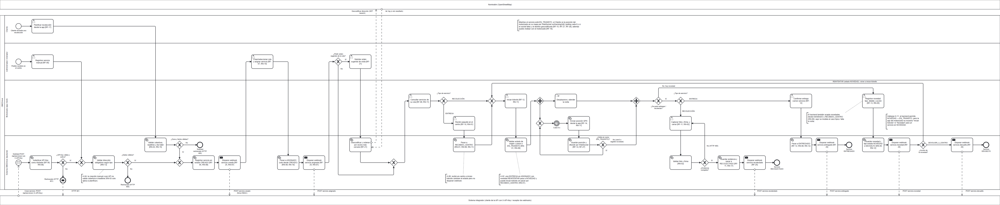

# Fase 4 — Modelo BPMN 2.0: Ciclo de vida de un servicio de mensajería

> **Fuente editable:** [`docs/diagrams/src/bpmn-ciclo-servicio.bpmn`](../diagrams/src/bpmn-ciclo-servicio.bpmn) (BPMN 2.0 XML con `collaboration`, `laneSet` y `BPMNDiagram` completo).
> **Render:** [`docs/diagrams/img/bpmn-ciclo-servicio.png`](../diagrams/img/bpmn-ciclo-servicio.png) y [`.svg`](../diagrams/img/bpmn-ciclo-servicio.svg).
> **Insumos:** [01-requerimientos.md](01-requerimientos.md) (IDs RF/RN/RES y hallazgos H-xx), [04-mer.md](04-mer.md) §4.4.2 (estados del servicio), [06-c4.md](06-c4.md) (componentes), [15-diagrama-flujo.md](../15-diagrama-flujo.md) (flujo previo, no BPMN) y el código: `backend/services/views.py`, `services/serializers.py`, `services/models.py`, `tracking/views.py`, `tracking/consumers.py`, `integrations/services.py`, `integrations/authentication.py`, `optimization/views.py`, `frontend/src/app/features/motorizado/servicio-detail.page.ts`.

---

## 1. Propósito del proceso y por qué es el principal

El proceso **"Ciclo de vida de un servicio de mensajería"** describe cómo un servicio (`Servicio`) nace, se asigna, se ejecuta en campo y se cierra. Es el proceso principal de CMEDriver porque:

- Es la razón de ser del sistema: los problemas del §1 de [01-requerimientos.md](01-requerimientos.md) (asignación informal, cliente sin visibilidad, falta de evidencia) se resuelven aquí.
- Atraviesa los **cuatro roles** (Cliente, Alistador/Administrador, Motorizado) y los **dos sistemas externos reales** (sistema integrador por API Key/webhooks y Nominatim).
- Concentra las reglas de negocio más críticas: RN-01, RN-02, RN-03, RN-05, RN-07 a RN-13, RN-15 y RN-17.
- 13 de los 24 RF vigentes son actividades de este proceso (RF-05, RF-06, RF-07, RF-09 a RF-14, RF-17, RF-21, RF-25, RF-27); RF-15, RF-16 y RF-28 aparecen como anotación de comunicación (§7). Los demás son configuración, autenticación o consulta y quedan fuera del proceso modelado (ver [07-trazabilidad.md](07-trazabilidad.md) §g.1). Los RF-04, RF-18, RF-22, RF-23 y RF-26 están retirados del proyecto (ver §10) y ya no aparecen en el modelo.

**Alcance:** desde que se solicita el servicio —por el Cliente desde la app (planificar una recolección), por el Alistador manualmente o por un sistema integrador vía `X-API-Key`— hasta un estado terminal real del código: **`ENTREGADO`**, **`RECOLECTADO`** o **`DEVUELTO`**, más los rechazos de la solicitud (HTTP 400/401). **No existe un estado `CANCELADO`** en `EstadoServicio`: la única forma de terminar un servicio sin completarlo es la novedad `DEVOLVER_A_CENTRO` (estado `DEVUELTO`).

---

## 2. Diagrama



Lectura por fases (de izquierda a derecha):

1. **Solicitud y validación** (tres eventos de inicio): el Cliente planifica una recolección desde la app; el Alistador registra un servicio manual; el sistema integrador envía `POST /api/servicios/` con `X-API-Key`.
2. **Registro en `CREADO`** y webhook `servicio.creado` (los tres orígenes convergen en `ST_RegistrarCreado`).
3. **Asignación a ruta** (`CREADO → ASIGNADO`), webhook `servicio.asignado` y, opcionalmente, orden sugerido de la ruta con Nominatim.
4. **Ejecución por el Motorizado**: gateway por tipo de servicio (la Entrega pasa por `RECIBIDO_CENTRO`, RN-01), inicio de tránsito y, **en paralelo**, la visita y el reporte de GPS cada 8 s.
5. **Cierre**: entrega confirmada (`ENTREGADO`), recolección con evidencia completa (`RECOLECTADO`) o novedad (`REINTENTAR` vuelve a tránsito; `DEVOLVER_A_CENTRO` termina en `DEVUELTO`).

---

## 3. Participantes y lanes

| Participante / lane | Tipo BPMN | Responsabilidad en el proceso | Implementación |
|---|---|---|---|
| **CMEDriver** | Pool principal (`P_CMEDriver`, proceso `Proc_CicloServicio`) | Contiene todo el flujo interno del servicio. | Frontend Ionic/Angular + API Django REST + Channels |
| ↳ **Cliente** | Lane | Solicita sus recolecciones desde la app (planificar); sigue el tracking en el mapa y chatea con el motorizado (anotación `TA_Tracking`, RF-15, RF-16). | `/cliente` en el frontend; `ServicioViewSet.planificar` |
| ↳ **Administrador / Alistador** | Lane | Registra servicios manuales, crea rutas y asigna servicios; pide el orden sugerido de la ruta. *Nota:* crear y asignar exige `IsAlistador` (un ADMIN recibe 403); optimizar admite ADMIN o ALISTADOR. | `/alistador`; `ServicioViewSet.create`, `asignar_ruta`, `RutaViewSet`, `OptimizarRutaView` |
| ↳ **Motorizado (app móvil)** | Lane | Ejecuta en campo: recibe en centro, inicia tránsito, atiende la visita, captura evidencia, cierra o registra novedad; su app envía GPS. | `/motorizado` (`servicio-detail.page.ts`); acciones `recibir-en-centro`, `iniciar-transito`, `cerrar`, `novedad`; `ReportarPosicionView` |
| ↳ **Sistema CMEDriver (backend)** | Lane | Tareas automáticas: autenticar API Key, validar, cambiar estado, guardar evidencia/novedad/posición, difundir por WebSocket y disparar webhooks. | Componentes `services`, `coverage`, `tracking`, `integrations`, `optimization` ([06-c4.md](06-c4.md) §4) |
| **Sistema integrador** | Pool colapsado (caja negra) | Crea servicios con `X-API-Key` (actúa como el ALISTADOR de `ApiKey.actua_como`) y recibe los webhooks firmados con HMAC-SHA256. | `integrations/authentication.py`, `integrations/services.py` |
| **Nominatim (OpenStreetMap)** | Pool colapsado (caja negra) | Geocodifica las direcciones de los servicios de la ruta (1 solicitud/s, RES-05). | `optimization/geocoding.py` |

---

## 4. Actividades

Tipos: **UT** = `userTask`, **ST** = `serviceTask`, **SND** = `sendTask`, **MT** = `manualTask`.

| ID BPMN | Actividad | Lane | Tipo | RF / RN | Endpoint o código que la implementa |
|---|---|---|---|---|---|
| `UT_Planificar` | Planificar recolección desde la app | Cliente | UT | RF-17 | `POST /api/servicios/planificar/` (`ServicioViewSet.planificar`, `PlanificarRecoleccionSerializer`) |
| `UT_Registrar` | Registrar servicio manual | Adm./Alistador | UT | RF-05 | `POST /api/servicios/` (`ServicioViewSet.create`, `IsAlistador`) |
| `ST_AutenticarKey` | Autenticar API Key como Alistador | Sistema | ST | RF-06, RN-08 | `integrations/authentication.py::ApiKeyAuthentication` |
| `ST_ValidarDatos` | Validar dirección obligatoria según tipo | Sistema | ST | RN-13 | `ServicioCreateSerializer.validate` |
| `ST_ValidarAgenda` | Validar cobertura, leadtime y día hábil | Sistema | ST | RN-03, RN-15 | `ServicioViewSet.planificar` (usa `Cobertura`, `DIAS_ORDEN`) |
| `ST_RegistrarCreado` | Registrar servicio en estado `CREADO` | Sistema | ST | RF-05, RN-09 | `ServicioViewSet.perform_create` (alta manual o API Key) / `Servicio.objects.create(estado=CREADO)` en `planificar` |
| `SND_WebhookCreado` | Disparar webhook `servicio.creado` | Sistema | SND | RF-25, RN-07 | `ServicioViewSet._notificar` → `integrations/services.py::disparar_webhook` |
| `UT_AsignarRuta` | Crear/seleccionar ruta y asignar servicio | Adm./Alistador | UT | RF-07, RN-10 | `POST /api/rutas/`, `POST /api/servicios/{id}/asignar-ruta/` |
| `ST_PasarAsignado` | Pasar a `ASIGNADO` (solo desde `CREADO`) | Sistema | ST | RN-09, RN-10 | `ServicioViewSet.asignar_ruta` |
| `SND_WebhookAsignado` | Disparar webhook `servicio.asignado` | Sistema | SND | RF-25, RN-07 | `_notificar('servicio.asignado')` |
| `UT_PedirOrden` | Solicitar orden sugerido de visita (opcional) | Adm./Alistador | UT | RF-21 | `POST /api/optimizacion/rutas/{ruta_id}/` |
| `ST_Optimizar` | Geocodificar y ordenar por vecino más cercano | Sistema | ST | RF-21, RES-05, RES-13 | `OptimizarRutaView`, `geocoding.geocodificar`, `heuristica.ordenar_nearest_neighbor` (caché `PuntoGeocodificado`) |
| `UT_ConsultarRuta` | Consultar servicios de su ruta | Motorizado | UT | RF-09, RN-11 | `GET /api/servicios/` (filtrado `ruta__motorizado=user`) |
| `UT_RecibirCentro` | Recibir paquete en el centro (solo Entrega) | Motorizado | UT | RF-10, RN-01 | `POST /api/servicios/{id}/recibir-en-centro/` |
| `ST_PasarRecibido` | Pasar a `RECIBIDO_CENTRO` | Sistema | ST | RN-01, RN-09, RN-11 | `ServicioViewSet.recibir_en_centro` (+ `_motorizado_autorizado`) |
| `UT_IniciarTransito` | Iniciar tránsito | Motorizado | UT | RF-12, RN-11 | `POST /api/servicios/{id}/iniciar-transito/` |
| `ST_PasarTransito` | Validar estado de origen y pasar a `EN_TRANSITO` | Sistema | ST | RN-01, RN-09 | `ServicioViewSet.iniciar_transito` (`estados_validos_por_tipo`) |
| `MT_Visita` | Desplazarse y atender la visita | Motorizado | MT | — (actividad física) | — |
| `ST_EnviarGPS` | Enviar posición GPS desde la app (cada 8 s) | Motorizado | ST | RF-14, RN-11 | `servicio-detail.page.ts::startTracking` (`watchPosition` + `setInterval 8000`) → `POST /api/tracking/posicion/` |
| `ST_DifundirGPS` | Guardar posición y difundir por WebSocket | Sistema | ST | RF-14, RF-27 | `ReportarPosicionView` → `group_send('tracking_{id}')` → `TrackingConsumer` |
| `UT_Evidencia` | Capturar foto y firma, y cerrar (Recolección) | Motorizado | UT | RF-11, RN-02 | `POST /api/servicios/{id}/cerrar/` (multipart con `foto` y `firma`) |
| `ST_ValidarEvidencia` | Validar foto y firma | Sistema | ST | RN-02 | `CerrarServicioSerializer.validate` |
| `ST_PasarRecolectado` | Guardar evidencia y pasar a `RECOLECTADO` | Sistema | ST | RF-11, RN-17, RN-09 | `ServicioViewSet.cerrar` (`Evidencia.objects.update_or_create`) |
| `SND_WebhookRecolectado` | Disparar webhook `servicio.recolectado` | Sistema | SND | RF-25, RN-07 | `_notificar('servicio.recolectado')` |
| `UT_ConfirmarEntrega` | Confirmar entrega (cerrar servicio) | Motorizado | UT | RF-12 | `POST /api/servicios/{id}/cerrar/` (sin evidencia) |
| `ST_PasarEntregado` | Pasar a `ENTREGADO` | Sistema | ST | RF-12, RN-09, RN-12 | `ServicioViewSet.cerrar` |
| `SND_WebhookEntregado` | Disparar webhook `servicio.entregado` | Sistema | SND | RF-25, RN-07 | `_notificar('servicio.entregado')` |
| `UT_RegistrarNovedad` | Registrar novedad: tipo, detalle y acción | Motorizado | UT | RF-13, RN-05 | `POST /api/servicios/{id}/novedad/` |
| `ST_GuardarNovedad` | Guardar novedad y fijar estado `NOVEDAD` o `DEVUELTO` | Sistema | ST | RN-05, RN-09, RN-12 | `ServicioViewSet.novedad` (`NovedadCreateSerializer`) |
| `SND_WebhookNovedad` | Disparar webhook `servicio.novedad` | Sistema | SND | RF-25, RN-07 | `_notificar('servicio.novedad')` |
| `SND_WebhookDevuelto` | Disparar webhook `servicio.devuelto` | Sistema | SND | RF-25, RN-07 | `_notificar('servicio.devuelto')` |

Todas las tareas `SND_Webhook*` envían un `POST` firmado (`X-CMEDriver-Signature`, HMAC-SHA256) **solo** a los `WebhookEndpoint` activos suscritos al evento (RN-07); un endpoint caído nunca rompe la respuesta de la API (cada intento queda en `WebhookDelivery`, consultable con RF-29).

---

## 5. Gateways

| ID BPMN | Tipo | Pregunta | Salidas y condición (código) |
|---|---|---|---|
| `GW_KeyValida` | Exclusivo | ¿API Key válida y activa? | **Sí** → validar datos; **No** → fin `EE_Rechazo401` (`AuthenticationFailed`, 401) |
| `GW_MergeCreacion` | Exclusivo (unión) | — | Une Alistador manual y API Key (mismo endpoint `POST /api/servicios/`) |
| `GW_DatosValidos` | Exclusivo | ¿Datos válidos? | **Sí** → registrar `CREADO`; **No** → fin `EE_Rechazo400` (ENTREGA sin `direccion_destino` / RECOLECCION sin `direccion_origen`, RN-13) |
| `GW_AgendaValida` | Exclusivo | ¿Zona y fecha válidas? | **Sí** → registrar `CREADO`; **No** (zona sin cobertura, fecha < hoy + leadtime o día no habilitado) → fin `EE_RechazoAgenda` (400) |
| `GW_MergeValidas` | Exclusivo (unión) | — | Une los caminos de creación válidos: datos válidos (Alistador/API Key) y agenda válida (Cliente) |
| `GW_Optimizar` | Exclusivo | ¿Pedir orden sugerido de la ruta? | **Sí** → `UT_PedirOrden`; **No** → continúa (la optimización es solo asesoría, no persiste nada) |
| `GW_TipoServicio` | Exclusivo | ¿Tipo de servicio? | **ENTREGA** → recibir en centro (RN-01); **RECOLECCIÓN** → directo a iniciar tránsito |
| `GW_MergeTransito` | Exclusivo (unión) | — | Une Recolección, Entrega recibida y el bucle **REINTENTAR** |
| `PG_Inicio` / `PG_Fin` | **Paralelo** (división / unión) | — | En paralelo: la visita física (`MT_Visita`) y el bucle de GPS; se unen cuando el motorizado termina la visita |
| `GW_MergeGPS` | Exclusivo (unión) | — | Entrada del bucle de GPS |
| `GW_SigueTransito` | Exclusivo | ¿Visita en curso (`EN_TRANSITO`)? | **Sí** → esperar 8 s y reportar de nuevo; **No** (se cerró o se registró novedad: la app llama `stopTracking`) → `PG_Fin` |
| `GW_Resultado` | Exclusivo | ¿Se pudo entregar / recolectar? | **Sí** → cierre por tipo; **No: hay novedad** → `UT_RegistrarNovedad` |
| `GW_TipoCierre` | Exclusivo | ¿Tipo de servicio? | **ENTREGA** → confirmar entrega; **RECOLECCIÓN** → capturar foto y firma |
| `GW_EvidenciaOK` | Exclusivo | ¿Evidencia completa? | **Sí** (`foto` y `firma`) → `RECOLECTADO`; **No** (HTTP 400) → volver a capturar |
| `GW_AccionNovedad` | Exclusivo | ¿Acción de la novedad? | **REINTENTAR** (estado `NOVEDAD`) → volver a `UT_IniciarTransito`; **DEVOLVER_A_CENTRO** (estado `DEVUELTO`) → webhook `servicio.devuelto` y fin |

---

## 6. Eventos

| ID BPMN | Tipo | Significado |
|---|---|---|
| `SE_Cliente` | Inicio (ninguno) | El cliente necesita una recolección y la planifica desde la app. |
| `SE_Alistador` | Inicio (ninguno) | Llega un pedido al centro y el Alistador lo registra. |
| `SE_API` | **Inicio de mensaje** | Llega `POST /api/servicios/` con `X-API-Key` desde el sistema integrador. |
| `IE_Cada8s` | **Intermedio de temporizador** (`timeCycle R/PT8S`) | Cadencia del reporte de posición GPS mientras el servicio está `EN_TRANSITO`. |
| `EE_Rechazo401` | **Fin de mensaje** | API Key inválida o inactiva: responde 401 al integrador. |
| `EE_Rechazo400` | Fin | Datos del servicio inválidos (400). |
| `EE_RechazoAgenda` | Fin | Planificación rechazada por cobertura/leadtime/día (400). |
| `EE_Entregado` | Fin | Estado terminal `ENTREGADO`. |
| `EE_Recolectado` | Fin | Estado terminal `RECOLECTADO` (con `Evidencia`). |
| `EE_Devuelto` | Fin | Estado terminal `DEVUELTO`. |

---

## 7. Interacciones entre participantes (flujos de mensaje)

| ID | Origen → Destino | Mensaje | Código |
|---|---|---|---|
| `MF01` | Sistema integrador → `SE_API` | `POST /api/servicios/` con header `X-API-Key` | `ApiKeyAuthentication` + `ServicioViewSet.create` |
| `MF02` | `EE_Rechazo401` → Sistema integrador | HTTP 401 "API key invalida o inactiva" | `ApiKeyAuthentication.authenticate` |
| `MF03` | `SND_WebhookCreado` → Sistema integrador | `POST servicio.creado` firmado HMAC | `disparar_webhook` / `_enviar_a_endpoint` |
| `MF04` | `SND_WebhookAsignado` → Sistema integrador | `POST servicio.asignado` | ídem |
| `MF05` | `ST_Optimizar` → Nominatim | `GET /search?q=<dirección>, <zona>, Colombia` | `optimization/geocoding.py::geocodificar` |
| `MF06` | Nominatim → `ST_Optimizar` | `lat, lng` (o sin resultado → `no_geocodificados`) | ídem |
| `MF07` | `SND_WebhookRecolectado` → Sistema integrador | `POST servicio.recolectado` | `disparar_webhook` |
| `MF08` | `SND_WebhookEntregado` → Sistema integrador | `POST servicio.entregado` | `disparar_webhook` |
| `MF09` | `SND_WebhookNovedad` → Sistema integrador | `POST servicio.novedad` | `disparar_webhook` |
| `MF10` | `SND_WebhookDevuelto` → Sistema integrador | `POST servicio.devuelto` | `disparar_webhook` |

Comunicación **dentro** del pool (no son flujos de mensaje porque Cliente, Motorizado y Sistema son lanes del mismo pool): la posición GPS se difunde al mapa del Cliente por `ws/tracking/{id}/` (RF-27) y el chat usa `ws/chat/{id}/` (RF-16) y solo comunica al Cliente con el Motorizado; ambos se anotan en el diagrama porque no cambian el estado del servicio. Los cambios de estado **no** se notifican por WebSocket: el Cliente los ve al consultar `GET /api/servicios/`.

---

## 8. Diferencias proceso ideal vs. implementado

| Ref. | Proceso ideal (documentación / casos de uso) | Lo que hace el código (y modela el BPMN) | Dónde se ve en el diagrama |
|---|---|---|---|
| **H-02** | Toda Entrega pasa por `RECIBIDO_CENTRO` antes de `EN_TRANSITO` (RN-01). | Una Entrega en `ASIGNADO` puede recibir una novedad `REINTENTAR` → `NOVEDAD` → `iniciar-transito`, saltándose el centro, porque `iniciar_transito` acepta `NOVEDAD` para ambos tipos. | Anotación `TA_H02` en `ST_PasarTransito`; bucle REINTENTAR → `GW_MergeTransito`. |
| **H-04** | "Crear servicio «include» Validar cobertura y leadtime" para todos los orígenes. | Solo `planificar` (el Cliente, para recolecciones) valida cobertura y leadtime; la creación manual y por API Key no. | `ST_ValidarAgenda` solo está en el camino de la recolección del Cliente; anotación `TA_H04`. |
| **H-09** | Cada transición relevante notifica al integrador. | `recibir-en-centro` e `iniciar-tránsito` no disparan ningún evento (no existen en `EVENTOS_WEBHOOK`): el integrador no se entera de esos dos cambios de estado. | `ST_PasarRecibido` y `ST_PasarTransito` sin tarea de envío; anotación `TA_H09b`. |
| H-11 (observación nueva) | Tras una novedad `REINTENTAR` el motorizado vuelve a iniciar tránsito. | El backend lo permite, pero la app del motorizado (`puedeIniciarTransito`, `puedeRegistrarNovedad` en `servicio-detail.page.ts`) no muestra botones para un servicio en `NOVEDAD`: desde la app el servicio queda detenido. | Anotación `TA_Reintentar`. |
| Alcance | Cancelar un servicio. | No existe estado `CANCELADO`; el cierre sin éxito es `DEVOLVER_A_CENTRO` → `DEVUELTO`. (Además, por H-01, `DELETE /api/servicios/{id}/` está abierto a cualquier autenticado; no se modela por ser un defecto, no un paso del proceso.) | Fines `EE_Entregado`, `EE_Recolectado`, `EE_Devuelto`. |
| Simplificación | — | El backend acepta novedades desde `ASIGNADO`, `RECIBIDO_CENTRO`, `EN_TRANSITO` y `NOVEDAD` (RN-09); el diagrama modela el caso típico (falla la visita) y lo indica en la anotación `TA_Novedad`. La "reasignación" de RF-08 no existe (H-08) y no se modela. `Ruta.estado` nunca cambia de `PLANEADA` ([04-mer.md](04-mer.md)). | — |

---

## 9. Cómo abrir y editar el modelo

1. Ir a **https://demo.bpmn.io** (o abrir Camunda Modeler).
2. Arrastrar el archivo `docs/diagrams/src/bpmn-ciclo-servicio.bpmn` sobre la página (o *Open diagram* → seleccionar el archivo).
3. El diagrama se abre con sus pools, lanes y coordenadas; para exportar imagen usar el botón de descarga SVG/PNG de la esquina inferior izquierda.
4. El modelo es muy ancho (≈ 6 480 × 1 330 px en el PNG): para leerlo conviene abrir el SVG o el `.bpmn` y hacer zoom por lane, de izquierda a derecha.

Para regenerar la imagen desde la línea de comandos:

```bash
# Linux / macOS (separador ":")
npx -y bpmn-to-image --no-footer docs/diagrams/src/bpmn-ciclo-servicio.bpmn:docs/diagrams/img/bpmn-ciclo-servicio.png,docs/diagrams/img/bpmn-ciclo-servicio.svg
# Windows (separador ";", entre comillas)
npx -y bpmn-to-image --no-footer "docs/diagrams/src/bpmn-ciclo-servicio.bpmn;docs/diagrams/img/bpmn-ciclo-servicio.png,docs/diagrams/img/bpmn-ciclo-servicio.svg"
```

`bpmn-to-image` usa Puppeteer; si no descarga Chromium, se puede indicar uno instalado con la variable `PUPPETEER_EXECUTABLE_PATH` (por ejemplo, el `chrome.exe` de `~/.cache/puppeteer`). Tras editar el `.bpmn` hay que regenerar **ambas** imágenes (PNG y SVG) y revisar que no queden textos cortados ni flechas colgando.

---

## 10. Cambios de alcance

**2026-10-09 — se retiran del proyecto el inventario, los pagos y el chatbot.** El chat solo sirve para que el Cliente y el Motorizado se comuniquen (RF-16, `ws/chat/{id}/`); en el BPMN sigue como anotación `TA_Tracking`, porque no cambia el estado del servicio.

Efecto en este modelo:

- **Eliminados:** `GW_QueSolicita`, `UT_Comprar`, `ST_CrearCompra`, `GW_MergeCreado`, la anotación `TA_Compra` y los flujos de secuencia `F02`, `F03`, `F04`, `F22` y `F23` (los demás IDs no se renumeraron, por eso hay huecos en la serie `Fxx`).
- **Simplificado:** el Cliente solo planifica una recolección: `SE_Cliente` → `UT_Planificar` → `ST_ValidarAgenda`; y `SND_WebhookCreado` pasa directo a `UT_AsignarRuta`. El lane Cliente se acortó y el diagrama se compactó (sin huecos ni flechas colgando).
- **Requisitos retirados del proceso:** RF-18, RF-22, RF-23, RN-04 y RN-16 (y, fuera de este proceso, RF-04, RF-26 y RN-06). Los hallazgos **H-12** y la parte de **H-09** sobre stock y chatbot quedan resueltos por reducción de alcance; H-09 sigue vigente solo para `recibir-en-centro` e `iniciar-transito` (sin webhook).
- **Se mantiene:** los tres orígenes de solicitud (Cliente, Alistador, sistema integrador), cobertura y agenda, asignación de ruta, optimización con Nominatim, tránsito con GPS cada 8 s, evidencia, novedades, webhooks y los cierres `ENTREGADO`, `RECOLECTADO` y `DEVUELTO`.
