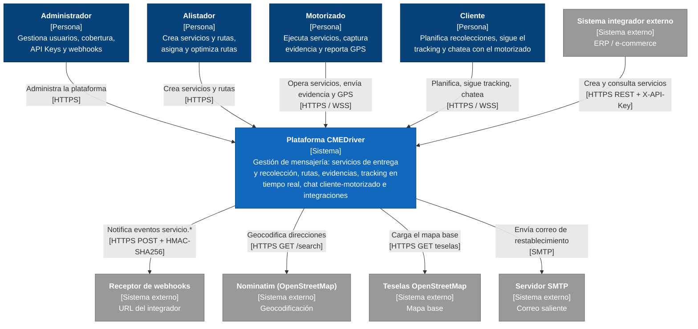
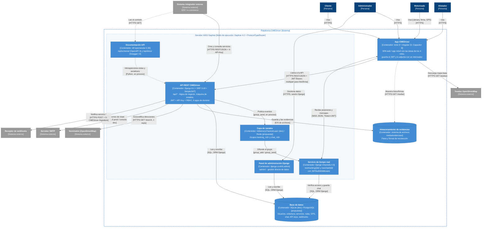

# Fase 5 — Modelo C4

**Proyecto:** CMEDriver — plataforma de gestión de mensajería (entregas y recolecciones).
**Relacionado:** [01-requerimientos.md](01-requerimientos.md) · [02-stack-tecnologico.md](02-stack-tecnologico.md) · [03-arquitectura.md](03-arquitectura.md) · [04-mer.md](04-mer.md) · versión histórica: [../14-diagrama-c4.md](../14-diagrama-c4.md)

---

## 1. Introducción al modelo C4

El **modelo C4** (Simon Brown) describe la arquitectura de un sistema de software con cuatro niveles de abstracción, cada uno de los cuales es un "zoom" sobre un elemento del nivel anterior:

| Nivel | Pregunta que responde | Elementos | Audiencia |
|---|---|---|---|
| **1. Contexto** | ¿Qué es el sistema, quién lo usa y con qué otros sistemas se relaciona? | Personas, el sistema como una caja, sistemas externos | Todos (incluido personal no técnico) |
| **2. Contenedores** | ¿En qué aplicaciones y almacenes de datos ejecutables se divide el sistema y cómo se comunican? | Aplicaciones, servicios, bases de datos, almacenes de archivos | Arquitectos, desarrolladores, operación |
| **3. Componentes** | ¿Qué bloques lógicos forman un contenedor y qué dependencias tienen entre sí? | Módulos / apps / paquetes dentro de un contenedor | Desarrolladores |
| **4. Código** | ¿Cómo se implementa un componente concreto? | Clases, funciones, relaciones | Desarrolladores del componente |

Convenciones usadas en los cuatro diagramas:

- **Nombres canónicos**: personas, sistema, contenedores, nodo de ejecución, sistemas externos y componentes se nombran exactamente como en [03-arquitectura.md §9](03-arquitectura.md#9-nombres-canónicos-de-contenedores-y-componentes).
- **Colores C4 clásicos**: persona `#08427b`; sistema `#1168bd`; contenedor `#438dd5`; componente `#85bbf0` (texto oscuro); sistema externo `#999999`. Los límites (sistema, contenedor, nodo) son recuadros punteados.
- **Cada flecha** lleva una etiqueta "qué hace" y, entre corchetes, el **protocolo o mecanismo** (`[HTTPS REST + JWT]`, `[WSS]`, `[SQL, ORM Django]`, `[E/S de archivos]`, `[en proceso]`…).
- Flecha **punteada** = dependencia opcional o de solo lectura (documentación del contrato OpenAPI, visualización de fotos y firmas, introspección de vistas).
- Los niveles 1–3 están hechos con `flowchart` de Mermaid con estilo C4 (la sintaxis nativa `C4Context` produce solapamientos); el nivel 4 usa `classDiagram`.
- Fuentes editables en [`docs/diagrams/src/`](../diagrams/src/) (`c4-1-contexto.mmd` … `c4-4-codigo.mmd`) e imágenes en [`docs/diagrams/img/`](../diagrams/img/). Comando de render:
  `npx -y @mermaid-js/mermaid-cli -i docs/diagrams/src/<archivo>.mmd -o docs/diagrams/img/<archivo>.png -c docs/diagrams/src/mermaid-theme.json -s 2 -b white`

En desarrollo los protocolos son `http://` y `ws://` sobre `localhost:8000`; las etiquetas HTTPS/WSS corresponden al despliegue propuesto ([03-arquitectura.md §7.2](03-arquitectura.md#72-despliegue-propuesto-producción--propuesta)).

> **Cambios de alcance (2026-10-09).** El autor retiró del proyecto el **inventario, los pagos y el chatbot**; el chat solo sirve para que el cliente y el motorizado se comuniquen. Efecto en el modelo C4: **N1** pasa de siete a **cinco sistemas externos** (desaparecen "Proveedor de pagos (simulado)" y "Proveedor LLM (simulado)"); **N2** conserva sus ocho contenedores, pero la API pasa de 9 a **6 apps de dominio** y la base de datos de 17 a **12 entidades**; **N3** pierde los componentes `inventory`, `payments` y `chatbot` y sus siete dependencias; **N4** pierde `ServicioProducto`, `ServicioProductoItemSerializer`, la acción `productos`, el campo `Servicio.producto` y la dependencia `Producto`. Los IDs retirados (RF-04, RF-18, RF-22, RF-23, RF-26, RN-04, RN-06, RN-16) **no se renumeran** y ya no figuran como vigentes en las tablas de este documento. Además, el código restringió el chat a sus dos participantes: `ServicioViewSet.mensajes` (N4) y `ChatConsumer` (N3 y N4) solo admiten al cliente dueño del servicio y al motorizado asignado, y ADMIN y ALISTADOR reciben 403 (el WebSocket los rechaza con el cierre 4403). Es un cambio de comportamiento, no de estructura: los diagramas no cambian. El diagrama anterior a este cambio queda en el historial de Git.

---

## 2. Nivel 1 — Diagrama de contexto

Fuente: [`c4-1-contexto.mmd`](../diagrams/src/c4-1-contexto.mmd)

La **Plataforma CMEDriver** se ve como una sola caja. La usan cuatro personas (una por rol del sistema, `Usuario.rol`) y un sistema externo sin login humano (el integrador, con API Key). La plataforma depende de cuatro sistemas externos: dos de OpenStreetMap (Nominatim y las teselas del mapa base), un servidor de correo SMTP y el receptor de webhooks del integrador. Ninguno es simulado: tras el cambio de alcance ya no hay proveedores de pagos ni de LLM.

### 2.1 Elementos

| Elemento | Tipo | Tecnología | Responsabilidad | RF que soporta |
|---|---|---|---|---|
| Administrador | Persona | Navegador / app (rol `ADMIN`) | Gestiona usuarios, matriz de cobertura, API Keys y webhooks; consulta el panel de servicios | RF-01, RF-02, RF-03, RF-24, RF-25, RF-29 |
| Alistador | Persona | Navegador / app (rol `ALISTADOR`) | Crea servicios y rutas, asigna servicios a rutas, pide el orden sugerido de la ruta | RF-05, RF-07, RF-08, RF-21 |
| Motorizado | Persona | App web/móvil (rol `MOTORIZADO`) | Ve sus servicios, recibe en centro, inicia tránsito, cierra con evidencia, registra novedades, reporta GPS y chatea con el cliente | RF-09..RF-14, RF-16, RF-27, RF-28 |
| Cliente | Persona | App web/móvil (rol `CLIENTE`) | Planifica recolecciones, sigue el tracking y chatea con el motorizado | RF-15..RF-17, RF-27, RF-28 |
| **Plataforma CMEDriver** | Sistema | Ionic/Angular + Django/DRF/Channels | Gestión integral de servicios de entrega y recolección con tracking en tiempo real, chat cliente-motorizado e integraciones | Todos los vigentes (RF-01..RF-29, sin los retirados) |
| Sistema integrador externo | Sistema externo | Cliente HTTP con `X-API-Key` (ERP / e-commerce) | Crea y consulta servicios sin login humano | RF-06 |
| Receptor de webhooks | Sistema externo | Endpoint HTTP(S) del integrador | Recibe eventos `servicio.*` firmados y verifica `X-CMEDriver-Signature` | RF-25 |
| Nominatim (OpenStreetMap) | Sistema externo | API pública `nominatim.openstreetmap.org/search` | Geocodifica direcciones (orden de ruta y destino en el mapa) | RF-21, RF-28 |
| Teselas OpenStreetMap | Sistema externo | `tile.openstreetmap.org` | Imágenes del mapa base del tracking | RF-15, RF-27, RF-28 |
| Servidor SMTP | Sistema externo | `django.core.mail` (consola en dev) | Entrega el correo de restablecimiento de contraseña | RF-20 |

### 2.2 Relaciones

| Origen | Destino | Descripción | Protocolo |
|---|---|---|---|
| Administrador | Plataforma CMEDriver | Administra la plataforma | HTTPS |
| Alistador | Plataforma CMEDriver | Crea servicios y rutas | HTTPS |
| Motorizado | Plataforma CMEDriver | Opera servicios, envía evidencia y GPS | HTTPS / WSS |
| Cliente | Plataforma CMEDriver | Planifica, sigue el tracking y chatea con el motorizado | HTTPS / WSS |
| Sistema integrador externo | Plataforma CMEDriver | Crea y consulta servicios | HTTPS REST + `X-API-Key` |
| Plataforma CMEDriver | Receptor de webhooks | Notifica eventos `servicio.creado/asignado/entregado/recolectado/novedad/devuelto` | HTTPS POST + HMAC-SHA256 |
| Plataforma CMEDriver | Nominatim | Geocodifica direcciones | HTTPS GET `/search` (≤ 1 req/s) |
| Plataforma CMEDriver | Teselas OpenStreetMap | Carga el mapa base | HTTPS GET teselas |
| Plataforma CMEDriver | Servidor SMTP | Envía el enlace de restablecimiento | SMTP (+TLS en prod) |

---

## 3. Nivel 2 — Diagrama de contenedores

Fuente: [`c4-2-contenedores.mmd`](../diagrams/src/c4-2-contenedores.mmd)

La plataforma se descompone en **ocho contenedores**. Cinco de ellos (API REST CMEDriver, Servicio de tiempo real, Documentación API, Panel de administración Django y, en desarrollo, la Capa de canales en memoria) se ejecutan en el **nodo Servidor ASGI Daphne**: `cmedriver/asgi.py` define un `ProtocolTypeRouter` que envía `http` a Django y `websocket` a `JWTAuthMiddleware(URLRouter(websocket_urlpatterns))`. Se dibujan como contenedores separados porque tienen responsabilidad, protocolo y rutas propias, y porque en producción la Capa de canales pasa a ser un Redis independiente.

### 3.1 Elementos

| Elemento | Tipo | Tecnología | Responsabilidad | RF que soporta |
|---|---|---|---|---|
| App CMEDriver | Contenedor (SPA / app móvil) | Ionic 9 + Angular 22 + TypeScript; Capacitor 8; Leaflet 1.9; signature_pad 5.1; WebSocket nativo | Interfaz de los 4 roles (`features/admin`, `alistador`, `motorizado`, `cliente`, `auth`); `authGuard`/`roleGuard`; `auth.interceptor` adjunta el JWT; servicios HTTP en `core/services` | Todos los RF vigentes (capa de presentación) |
| API REST CMEDriver | Contenedor (API) | Django 6.1 + DRF 3.18 + SimpleJWT 5.5 | `/api/*`: reglas de negocio vigentes (RN-01..RN-19, sin RN-04, RN-06 ni RN-16), máquina de estados del servicio, autenticación JWT/API Key, RBAC, publicación de eventos y webhooks | RF-01..RF-03, RF-05..RF-17, RF-19..RF-21, RF-24, RF-25, RF-28, RF-29 |
| Servicio de tiempo real | Contenedor (WebSocket) | Django Channels 4.3 (`AsyncWebsocketConsumer`) | `/ws/tracking/{id}/` y `/ws/chat/{id}/`: autentica por `?token=`, verifica acceso al servicio (cierra con 4403) y difunde posiciones y mensajes | RF-14, RF-15, RF-16, RF-27 |
| Capa de canales | Contenedor (bus pub/sub) | `InMemoryChannelLayer` (dev) / `channels-redis` + Redis 7 (propuesta) | Grupos `tracking_<id>` y `chat_<id>` entre la API y los consumers | RF-27 |
| Base de datos | Contenedor (almacén) | SQLite (dev) / PostgreSQL 16 (propuesta), ORM Django | Persistencia de las 12 entidades del MER | Todos |
| Almacenamiento de evidencias | Contenedor (archivos) | Sistema de archivos `backend/media/evidencias/{fotos,firmas}/` | Archivos de foto y firma; la BD guarda solo la ruta | RF-11 (RN-02) |
| Documentación API | Contenedor (web) | drf-spectacular 0.30 | `/api/schema/` (OpenAPI 3) y `/api/docs/` (Swagger UI) generados desde las vistas y serializers | RF-06 (contrato para integradores), RNF-03 |
| Panel de administración Django | Contenedor (web) | `django.contrib.admin` | `/admin/`: gestión directa de datos para soporte y demo | Soporte de RF-01..RF-03 |
| *Servidor ASGI Daphne* | *Nodo de ejecución* | Daphne 4.2 + `ProtocolTypeRouter` | Aloja API, tiempo real, documentación, admin (y la capa en memoria); enruta por protocolo | — |

Sistemas externos y personas: los mismos del nivel 1.

### 3.2 Relaciones

| Origen | Destino | Descripción | Protocolo |
|---|---|---|---|
| Administrador / Alistador / Motorizado / Cliente | App CMEDriver | Usan la interfaz (el motorizado usa cámara, firma y GPS) | HTTPS |
| Administrador | Panel de administración Django | Gestiona datos directamente | HTTPS, sesión Django |
| Sistema integrador externo | API REST CMEDriver | Crea y consulta servicios | HTTPS REST/JSON + `X-API-Key` |
| Sistema integrador externo | Documentación API | Lee el contrato OpenAPI | HTTPS GET |
| App CMEDriver | API REST CMEDriver | Todas las operaciones de negocio | HTTPS REST/JSON + `Authorization: Bearer <JWT>`; `multipart/form-data` para foto/firma |
| App CMEDriver | Servicio de tiempo real | Recibe posiciones y mensajes; envía mensajes de chat | WSS JSON, `?token=<JWT>` (`wsUrl()` en `core/utils.ts`) |
| App CMEDriver | Teselas OpenStreetMap | Descarga el mapa base (Leaflet) | HTTPS GET |
| App CMEDriver | Almacenamiento de evidencias | Muestra fotos y firmas | HTTPS GET `/media/...` (servido por Django con `DEBUG=True`; Nginx en la propuesta) |
| API REST CMEDriver | Capa de canales | Publica posición GPS y mensajes de chat | `group_send` (Channels, en proceso) |
| Capa de canales | Servicio de tiempo real | Difunde al grupo | `group_add` / `group_send` |
| Documentación API | API REST CMEDriver | Introspecciona vistas y serializers | Python, en proceso |
| API REST CMEDriver | Base de datos | Lee y escribe | SQL (ORM Django) |
| Servicio de tiempo real | Base de datos | Verifica acceso al servicio y guarda mensajes de chat | SQL (ORM, `database_sync_to_async`) |
| Panel de administración Django | Base de datos | Lee y escribe | SQL (ORM Django) |
| API REST CMEDriver | Almacenamiento de evidencias | Guarda y lee evidencias | E/S de archivos (`ImageField`) |
| API REST CMEDriver | Nominatim | Geocodifica direcciones | HTTPS GET `/search` (1 req/s, caché `PuntoGeocodificado`) |
| API REST CMEDriver | Servidor SMTP | Envía correo de restablecimiento | SMTP+TLS (prod) / consola (dev) |
| API REST CMEDriver | Receptor de webhooks | Notifica eventos `servicio.*` | HTTPS POST + `X-CMEDriver-Signature` (HMAC-SHA256) |

---

## 4. Nivel 3 — Diagrama de componentes (API REST CMEDriver y Servicio de tiempo real)

Fuente: [`c4-3-componentes.mmd`](../diagrams/src/c4-3-componentes.mmd)

```mermaid
%%{init: {"flowchart": {"wrappingWidth": 300, "nodeSpacing": 35, "rankSpacing": 70}}}%%
flowchart TB
    %% C4 - Nivel 3: Componentes de la API REST CMEDriver y del Servicio de tiempo real
    %% (docs/entrega/06-c4.md). Dependencias verificadas con grep de imports del backend.

    APP["<b>App CMEDriver</b><br/>[Contenedor: Ionic 9 + Angular 22]"]
    INT["<b>Sistema integrador externo</b><br/>[Sistema externo]"]

    subgraph API["API REST CMEDriver [Contenedor: Django 6.1 + DRF 3.18]"]
        direction TB
        subgraph SEG["Autenticación y autorización (DEFAULT_AUTHENTICATION_CLASSES / permission_classes)"]
            direction LR
            JWTA["<b>Autenticación JWT</b><br/>[Componente: SimpleJWT JWTAuthentication]<br/>Valida Authorization: Bearer"]
            AKA["<b>Autenticación por API Key</b><br/>[Componente: integrations.authentication.ApiKeyAuthentication]<br/>Valida X-API-Key, actúa como ALISTADOR"]
            RBAC["<b>Permisos RBAC</b><br/>[Componente: accounts/permissions.py]<br/>IsAdmin, IsAlistador, IsMotorizado, IsCliente"]
        end

        subgraph APPS["Apps de dominio (cmedriver/urls.py monta las 6 bajo /api/)"]
            direction TB
            OPT["<b>optimization</b><br/>[Componente: app Django]<br/>OptimizarRutaView, heurística vecino más cercano"]
            TRK["<b>tracking</b><br/>[Componente: app Django]<br/>ReportarPosicionView, UltimaPosicionView, DestinoView"]
            SRV["<b>services</b><br/>[Componente: app Django]<br/>ServicioViewSet, RutaViewSet - ciclo de vida del servicio y chat"]
            COV["<b>coverage</b><br/>[Componente: app Django]<br/>CoberturaViewSet, AgendaDisponibleView"]
            ACC["<b>accounts</b><br/>[Componente: app Django]<br/>Usuario, LoginView, MeView, reset de contraseña"]
            INTG["<b>integrations</b><br/>[Componente: app Django]<br/>ApiKeyViewSet, WebhookEndpointViewSet, entregas"]
        end

        GEO["<b>Cliente de geocodificación</b><br/>[Componente: optimization/geocoding.py]<br/>geocodificar(direccion), urllib, 1 req/s"]
        WHD["<b>Despachador de webhooks</b><br/>[Componente: integrations/services.py]<br/>disparar_webhook(evento, payload), firmar()"]
    end

    subgraph RT["Servicio de tiempo real [Contenedor: Django Channels 4.3]"]
        direction LR
        WSM["<b>Middleware JWT de WebSocket</b><br/>[Componente: cmedriver/ws_auth.py]<br/>JWTAuthMiddleware, ?token= a scope user"]
        TC["<b>TrackingConsumer</b><br/>[Componente: tracking/consumers.py]<br/>/ws/tracking/{id}/ - solo lectura"]
        CC["<b>ChatConsumer</b><br/>[Componente: services/consumers.py]<br/>/ws/chat/{id}/ - chat cliente-motorizado"]
    end

    CL["<b>Capa de canales</b><br/>[Contenedor: InMemoryChannelLayer / Redis]"]
    DB[("<b>Base de datos</b><br/>[Contenedor: SQLite / PostgreSQL]")]
    MEDIA[("<b>Almacenamiento de evidencias</b><br/>[Contenedor: media/evidencias/]")]
    NOM["<b>Nominatim (OpenStreetMap)</b><br/>[Sistema externo]"]
    WH["<b>Receptor de webhooks</b><br/>[Sistema externo]"]
    SMTP["<b>Servidor SMTP</b><br/>[Sistema externo]"]

    %% Entradas
    APP -->|"Peticiones /api/*<br/>[HTTPS REST + JWT Bearer]"| JWTA
    INT -->|"Peticiones /api/servicios/<br/>[HTTPS REST + X-API-Key]"| AKA
    APP -->|"Abre socket<br/>[WSS ?token=JWT]"| WSM
    JWTA -->|"Usuario autenticado"| RBAC
    AKA -->|"Usuario actua_como"| RBAC
    AKA -->|"ApiKey.autenticar()"| INTG
    RBAC -->|"Autoriza por rol<br/>[Python]"| APPS

    %% Dependencias entre apps (imports reales)
    OPT -->|"Ruta, Servicio"| SRV
    OPT -->|"geocodificar()"| GEO
    TRK -->|"Servicio, TipoServicio"| SRV
    TRK -->|"geocodificar() y PuntoGeocodificado<br/>(DestinoView)"| OPT
    SRV -->|"Cobertura, DIAS_ORDEN"| COV
    SRV -->|"UsuarioResumenSerializer"| ACC
    SRV -->|"_notificar(): disparar_webhook()"| WHD
    WHD -->|"WebhookEndpoint, WebhookDelivery"| INTG

    %% Tiempo real
    WSM -->|"Usuario (token a scope user)"| ACC
    WSM -->|"Enruta por URLRouter"| TC
    WSM -->|"Enruta por URLRouter"| CC
    TRK -->|"group_send tracking_id<br/>[Channels, en proceso]"| CL
    SRV -->|"group_send chat_id<br/>[Channels, en proceso]"| CL
    TC -->|"group_add tracking_id,<br/>recibe tracking_update"| CL
    CC -->|"group_add chat_id,<br/>group_send chat_message"| CL
    TC -->|"Servicio (verifica acceso)"| SRV
    CC -->|"MensajeChat, MensajeChatSerializer"| SRV

    %% Salidas
    APPS -->|"Lee y escribe<br/>[SQL, ORM Django]"| DB
    RT -->|"Verifica acceso / guarda chat<br/>[SQL, ORM]"| DB
    SRV -->|"Evidencia foto y firma<br/>[E/S de archivos]"| MEDIA
    GEO -->|"GET /search<br/>[HTTPS]"| NOM
    WHD -->|"POST firmado HMAC-SHA256<br/>[HTTPS]"| WH
    ACC -->|"send_mail reset<br/>[SMTP]"| SMTP

    classDef contenedor fill:#438dd5,stroke:#2e6295,color:#ffffff;
    classDef componente fill:#85bbf0,stroke:#5d82a8,color:#000000;
    classDef externo fill:#999999,stroke:#6b6b6b,color:#ffffff;
    class APP,CL,DB,MEDIA contenedor;
    class JWTA,AKA,RBAC,OPT,TRK,SRV,COV,ACC,INTG,GEO,WHD,WSM,TC,CC componente;
    class INT,NOM,WH,SMTP externo;
    style API fill:#ffffff,stroke:#438dd5,stroke-width:2px,stroke-dasharray:6 4,color:#2e6295
    style RT fill:#ffffff,stroke:#438dd5,stroke-width:2px,stroke-dasharray:6 4,color:#2e6295
    style SEG fill:#f4f8fd,stroke:#85bbf0,stroke-dasharray:3 3,color:#2e6295
    style APPS fill:#f4f8fd,stroke:#85bbf0,stroke-dasharray:3 3,color:#2e6295
```

Se descompone el contenedor **API REST CMEDriver** en sus 6 apps Django (montadas por `cmedriver/urls.py` bajo `/api/`) y en los componentes transversales de seguridad, geocodificación y webhooks. El **Servicio de tiempo real** se muestra como contenedor vecino con sus tres componentes (`JWTAuthMiddleware`, `TrackingConsumer`, `ChatConsumer`), porque comparte modelos con la API y se conecta con ella a través de la Capa de canales.

Las dependencias entre componentes se verificaron con `grep` de los `import` del backend (excluyendo migraciones y pruebas). Para no saturar el diagrama, dos relaciones se dibujan agrupadas: **Permisos RBAC → Apps de dominio** (las seis apps importan clases de `accounts/permissions.py`; `accounts` la define y la usa en sus propias vistas) y **Apps de dominio → Base de datos** (todas persisten por el ORM).

### 4.1 Elementos

| Elemento | Tipo | Tecnología / ubicación | Responsabilidad | RF que soporta |
|---|---|---|---|---|
| Autenticación JWT | Componente transversal | `rest_framework_simplejwt.authentication.JWTAuthentication` (1.ª de `DEFAULT_AUTHENTICATION_CLASSES`) | Valida `Authorization: Bearer` y resuelve el `Usuario` | RF-19, RNF-01 |
| Autenticación por API Key | Componente transversal | `integrations/authentication.py` → `ApiKeyAuthentication` | Lee `X-API-Key`, llama a `ApiKey.autenticar()`, devuelve `actua_como` (ALISTADOR), registra `ultimo_uso`; 401 si es inválida | RF-06, RF-24, RN-08, RNF-12 |
| Permisos RBAC | Componente transversal | `accounts/permissions.py` → `IsAdmin`, `IsAlistador`, `IsMotorizado`, `IsCliente` | Autoriza cada vista por `Usuario.rol` | RNF-02 |
| accounts | Componente (app) | `Usuario`, `LoginView`, `MeView`, `UsuarioViewSet`, `PasswordResetRequestView`, `PasswordResetConfirmView`, `seed_data` | Usuarios y roles, login por usuario o correo, perfil, restablecimiento por correo | RF-01, RF-19, RF-20 |
| coverage | Componente (app) | `Cobertura`, `CoberturaViewSet`, `AgendaDisponibleView`, `DIAS_ORDEN` | Matriz de cobertura y cálculo de fechas de agenda válidas | RF-02, RF-17 (RN-03) |
| services | Componente (app) — **núcleo** | `Servicio`, `Ruta`, `Evidencia`, `Novedad`, `MensajeChat`; `ServicioViewSet`, `RutaViewSet` | Ciclo de vida del servicio (máquina de estados), rutas, evidencias, novedades, planificación, chat cliente-motorizado (REST) | RF-03, RF-05..RF-13, RF-16, RF-17 |
| tracking | Componente (app) | `PosicionGPS`, `ReportarPosicionView`, `UltimaPosicionView`, `DestinoView` | Recibe y publica posiciones GPS; última posición; destino geocodificado | RF-14, RF-15, RF-27, RF-28 |
| optimization | Componente (app) | `PuntoGeocodificado`, `OptimizarRutaView`, `heuristica.ordenar_nearest_neighbor`, `haversine_km` | Orden sugerido de ruta por vecino más cercano | RF-21 |
| integrations | Componente (app) | `ApiKey`, `WebhookEndpoint`, `WebhookDelivery`; `ApiKeyViewSet`, `WebhookEndpointViewSet`, `WebhookEntregasView` | Administración de API Keys y webhooks; bitácora de entregas | RF-24, RF-25, RF-29 |
| Cliente de geocodificación | Componente transversal | `optimization/geocoding.py` → `geocodificar(direccion)` (urllib, `RATE_LIMIT_SEGUNDOS = 1.1`) | Consulta Nominatim; usado por `optimization` y por `tracking.DestinoView` | RF-21, RF-28 |
| Despachador de webhooks | Componente transversal | `integrations/services.py` → `disparar_webhook(evento, payload)`, `firmar()`, `_enviar_a_endpoint()` | Envía a cada `WebhookEndpoint` activo suscrito un POST firmado; nunca propaga errores; registra `WebhookDelivery` | RF-25, RF-29 (RN-07, RNF-11) |
| Middleware JWT de WebSocket | Componente (tiempo real) | `cmedriver/ws_auth.py` → `JWTAuthMiddleware` | Valida `?token=` con `AccessToken` y pone el usuario en `scope['user']` | RF-27, RNF-01 |
| TrackingConsumer | Componente (tiempo real) | `tracking/consumers.py` | `/ws/tracking/{id}/`; solo lectura; se une a `tracking_<id>` y reenvía `tracking_update` | RF-14, RF-15, RF-27 |
| ChatConsumer | Componente (tiempo real) | `services/consumers.py` | `/ws/chat/{id}/`; bidireccional; solo admite al cliente dueño y al motorizado asignado (cierre 4403 para los demás, incluidos ADMIN y ALISTADOR); guarda `MensajeChat` y difunde `chat_message` | RF-16, RF-27 |

### 4.2 Relaciones (dependencias reales)

| Origen | Destino | Qué usa (import / llamada) | Mecanismo |
|---|---|---|---|
| App CMEDriver | Autenticación JWT | Peticiones `/api/*` | HTTPS REST + JWT Bearer |
| Sistema integrador externo | Autenticación por API Key | Peticiones `/api/servicios/` | HTTPS REST + `X-API-Key` |
| App CMEDriver | Middleware JWT de WebSocket | Abre el socket | WSS `?token=JWT` |
| Autenticación JWT / por API Key | Permisos RBAC | Entregan `request.user` | DRF, en proceso |
| Autenticación por API Key | integrations | `ApiKey.autenticar(raw_key)` | Python |
| Permisos RBAC | Apps de dominio | `permission_classes` / `get_permissions()` | Python |
| services | accounts | `UsuarioResumenSerializer` (y `accounts.permissions`) | import |
| services | coverage | `Cobertura`, `DIAS_ORDEN` (validación de `planificar`, RN-03) | import |
| services | Despachador de webhooks | `disparar_webhook()` desde `_notificar()` | import + llamada síncrona |
| services | Capa de canales | `group_send('chat_<id>', chat_message)` en `mensajes` | Channels, en proceso |
| services | Almacenamiento de evidencias | `Evidencia.foto`/`firma` en `cerrar` | E/S de archivos |
| tracking | services | `Servicio`, `TipoServicio` | import |
| tracking | optimization | `geocodificar()` y `PuntoGeocodificado` (`DestinoView`) | import |
| tracking | Capa de canales | `group_send('tracking_<id>', tracking_update)` | Channels, en proceso |
| optimization | services | `Ruta`, `Servicio`, `TipoServicio` | import |
| optimization | Cliente de geocodificación | `geocodificar()` | import |
| accounts | Servidor SMTP | `send_mail()` del enlace de reset | SMTP |
| Despachador de webhooks | integrations | `WebhookEndpoint`, `WebhookDelivery` | import |
| Despachador de webhooks | Receptor de webhooks | POST con `X-CMEDriver-Signature` (timeout 3 s) | HTTPS |
| Cliente de geocodificación | Nominatim | `GET /search?format=json` | HTTPS |
| Middleware JWT de WebSocket | TrackingConsumer / ChatConsumer | `URLRouter(websocket_urlpatterns)` (`cmedriver/routing.py`) | ASGI |
| TrackingConsumer / ChatConsumer | Capa de canales | `group_add` / `group_discard`; ChatConsumer además `group_send` | Channels |
| TrackingConsumer | services | `Servicio` (verifica acceso al servicio) | import |
| ChatConsumer | services | `MensajeChat`, `MensajeChatSerializer` | import |
| Middleware JWT de WebSocket | accounts | `Usuario` (import dentro de `_usuario_desde_token`) | import |
| Apps de dominio / Servicio de tiempo real | Base de datos | Modelos | SQL (ORM Django) |
| coverage, integrations, optimization, tracking | Permisos RBAC (accounts) | `IsAdmin`, `IsAlistador`, `IsMotorizado`, `IsCliente` | import |

Dependencias por clave foránea sin `import` del modelo (vía `settings.AUTH_USER_MODEL`): `services` (`Ruta.motorizado`, `Servicio.cliente`, `Servicio.creado_por`, `MensajeChat.autor`), `tracking` (`PosicionGPS.motorizado`) e `integrations` (`ApiKey.actua_como`) → `accounts.Usuario`. Las claves foráneas `tracking` → `services.Servicio` y `optimization` → `services.Servicio` sí importan el modelo (`from services.models import Servicio`) y ya aparecen arriba como dependencias de import.

---

## 5. Nivel 4 — Diagrama de código (componente `services`)

Fuente: [`c4-4-codigo.mmd`](../diagrams/src/c4-4-codigo.mmd) · Base: [`clases.mmd`](../diagrams/src/clases.mmd) y [../08-diagrama-clases.md](../08-diagrama-clases.md)

```mermaid
classDiagram
    direction LR
    %% C4 - Nivel 4: Codigo del componente "services" (ciclo de vida del servicio y chat)
    %% Fuente: backend/services/{models,serializers,views,consumers}.py

    namespace services_views {
        class ServicioViewSet {
            <<ModelViewSet>>
            +queryset Servicio.objects.all()
            +get_serializer_class()
            +get_permissions()
            +get_queryset()
            +perform_create(serializer)
            +create(request) POST /servicios/
            -_motorizado_autorizado(servicio, user)
            -_notificar(evento, servicio)
            +asignar_ruta(request, pk) POST asignar-ruta
            +recibir_en_centro(request, pk) POST recibir-en-centro
            +iniciar_transito(request, pk) POST iniciar-transito
            +cerrar(request, pk) POST cerrar
            +novedad(request, pk) POST novedad
            +planificar(request) POST planificar
            +mensajes(request, pk) GET|POST mensajes
        }
        class RutaViewSet {
            <<ModelViewSet>>
            +serializer_class RutaSerializer
            +get_permissions()
            +get_queryset()
        }
        class ChatConsumer {
            <<AsyncWebsocketConsumer>>
            +servicio_id
            +group_name chat_id
            +connect()
            +disconnect(close_code)
            +receive(text_data)
            +chat_message(event)
            -_usuario_autorizado() bool
            -_guardar_mensaje(texto) dict
        }
    }

    namespace services_serializers {
        class ServicioSerializer {
            <<ModelSerializer>>
            +cliente_detalle
            +evidencia
            +novedades
            +read_only_fields estado, creado_en
        }
        class ServicioCreateSerializer {
            <<ModelSerializer>>
            +validate(attrs) RN-13
        }
        class AsignarRutaSerializer {
            <<Serializer>>
            +ruta_id PrimaryKeyRelatedField
        }
        class CerrarServicioSerializer {
            <<Serializer>>
            +foto ImageField
            +firma ImageField
            +validate(attrs) RN-02
        }
        class NovedadCreateSerializer {
            <<ModelSerializer>>
            +tipo
            +detalle
            +accion
        }
        class PlanificarRecoleccionSerializer {
            <<ModelSerializer>>
            +zona
            +direccion_origen
            +fecha_agenda
        }
        class EvidenciaSerializer {
            <<ModelSerializer>>
            +foto
            +firma
            +capturado_en
        }
        class NovedadSerializer {
            <<ModelSerializer>>
            +tipo
            +detalle
            +accion
            +creado_en
        }
        class MensajeChatSerializer {
            <<ModelSerializer>>
            +autor_detalle
        }
        class RutaSerializer {
            <<ModelSerializer>>
            +motorizado_detalle
        }
    }

    namespace services_models {
        class Servicio {
            <<Model>>
            +tipo TipoServicio
            +cliente FK Usuario
            +zona
            +direccion_origen
            +direccion_destino
            +fecha_agenda date
            +estado EstadoServicio
            +ruta FK Ruta
            +creado_en datetime
            +creado_por FK Usuario
        }
        class Ruta {
            <<Model>>
            +motorizado FK Usuario
            +fecha date
            +estado EstadoRuta
        }
        class Evidencia {
            <<Model>>
            +servicio OneToOne
            +foto ImageField
            +firma ImageField
            +capturado_en datetime
        }
        class Novedad {
            <<Model>>
            +servicio FK
            +tipo
            +detalle
            +accion Accion
            +creado_en datetime
        }
        class MensajeChat {
            <<Model>>
            +servicio FK
            +autor FK Usuario
            +texto max 1000
            +enviado_en datetime
        }
        class EstadoServicio {
            <<enumeration>>
            CREADO
            ASIGNADO
            RECIBIDO_CENTRO
            EN_TRANSITO
            ENTREGADO
            RECOLECTADO
            NOVEDAD
            DEVUELTO
        }
        class TipoServicio {
            <<enumeration>>
            ENTREGA
            RECOLECCION
        }
        class EstadoRuta {
            <<enumeration>>
            PLANEADA
            EN_CURSO
            FINALIZADA
        }
    }

    namespace dependencias_externas {
        class Usuario {
            <<accounts.models>>
            +rol ADMIN|ALISTADOR|MOTORIZADO|CLIENTE
            +email unico
        }
        class UsuarioResumenSerializer {
            <<accounts.serializers>>
        }
        class PermisosRBAC {
            <<accounts.permissions>>
            IsAlistador
            IsMotorizado
            IsCliente
            +has_permission(request, view)
        }
        class Cobertura {
            <<coverage.models>>
            +leadtime_dias
            +dias_codigos()
        }
        class DespachadorWebhooks {
            <<integrations.services>>
            +disparar_webhook(evento, payload)
            +firmar(payload_bytes, secret)
        }
        class CapaDeCanales {
            <<channels.layers>>
            +get_channel_layer()
            +group_send(grupo, mensaje)
        }
    }

    ServicioViewSet ..> ServicioSerializer : serializa respuesta
    ServicioViewSet ..> ServicioCreateSerializer : create
    ServicioViewSet ..> AsignarRutaSerializer : asignar_ruta
    ServicioViewSet ..> CerrarServicioSerializer : cerrar
    ServicioViewSet ..> NovedadCreateSerializer : novedad
    ServicioViewSet ..> PlanificarRecoleccionSerializer : planificar
    ServicioViewSet ..> MensajeChatSerializer : mensajes
    RutaViewSet ..> RutaSerializer
    ServicioSerializer ..> EvidenciaSerializer : evidencia
    ServicioSerializer ..> NovedadSerializer : novedades
    ChatConsumer ..> MensajeChatSerializer
    ChatConsumer ..> MensajeChat : crea

    ServicioSerializer ..> UsuarioResumenSerializer : cliente_detalle
    MensajeChatSerializer ..> UsuarioResumenSerializer : autor_detalle
    RutaSerializer ..> UsuarioResumenSerializer : motorizado_detalle
    ServicioViewSet ..> PermisosRBAC : get_permissions()
    RutaViewSet ..> PermisosRBAC : IsAlistador
    ServicioViewSet ..> DespachadorWebhooks : _notificar()
    ServicioViewSet ..> CapaDeCanales : group_send chat_id
    ChatConsumer ..> CapaDeCanales : group_add / group_send
    ServicioViewSet ..> Cobertura : planificar() RN-03

    Ruta "0..1" <-- "*" Servicio : ruta
    Servicio "1" *-- "0..1" Evidencia : evidencia
    Servicio "1" *-- "*" Novedad : novedades
    Servicio "1" *-- "*" MensajeChat : mensajes
    Servicio --> EstadoServicio
    Servicio --> TipoServicio
    Ruta --> EstadoRuta
    Servicio "*" --> "1" Usuario : cliente
    Ruta "*" --> "1" Usuario : motorizado
    MensajeChat "*" --> "1" Usuario : autor
```

Se elige el componente **services** porque concentra el ciclo de vida del servicio (RN-09) y es del que dependen `tracking`, `optimization` y el `TrackingConsumer`. El diagrama agrupa las clases reales de `backend/services/` en tres paquetes (vistas y consumer, serializers, modelos) y muestra sus dependencias externas; tras el cambio de alcance ya no incluye `ServicioProducto`, `ServicioProductoItemSerializer`, la acción `productos` ni la dependencia `Producto`.

### 5.1 Elementos

| Elemento | Tipo | Ubicación | Responsabilidad | RF / RN |
|---|---|---|---|---|
| `ServicioViewSet` | Clase (DRF `ModelViewSet`) | `services/views.py` | CRUD de servicios filtrado por rol (`get_queryset`) y acciones de transición; `_notificar()` dispara webhooks | RF-03, RF-05..RF-13, RF-16, RF-17; RN-09..RN-14 |
| ↳ `create` | Método | `POST /api/servicios/` | Crea en `CREADO`, `creado_por = request.user`; evento `servicio.creado` | RF-05, RF-06 |
| ↳ `asignar_ruta` | Acción | `POST /api/servicios/{id}/asignar-ruta/` | `CREADO → ASIGNADO`; evento `servicio.asignado` | RF-07 (RN-10) |
| ↳ `recibir_en_centro` | Acción | `POST .../recibir-en-centro/` | Solo ENTREGA: `ASIGNADO → RECIBIDO_CENTRO` | RF-10 (RN-01) |
| ↳ `iniciar_transito` | Acción | `POST .../iniciar-transito/` | `RECIBIDO_CENTRO`/`ASIGNADO`/`NOVEDAD → EN_TRANSITO` según tipo | RF-12 (RN-09) |
| ↳ `cerrar` | Acción | `POST .../cerrar/` (multipart) | `EN_TRANSITO → ENTREGADO`/`RECOLECTADO`; crea `Evidencia`; evento `servicio.entregado`/`servicio.recolectado` | RF-11, RF-12 (RN-02, RN-17) |
| ↳ `novedad` | Acción | `POST .../novedad/` | Crea `Novedad`; estado `NOVEDAD` o `DEVUELTO`; eventos `servicio.novedad` y `servicio.devuelto` | RF-13 (RN-05, RN-12) |
| ↳ `planificar` | Acción | `POST /api/servicios/planificar/` | El cliente crea su RECOLECCION validando cobertura, leadtime y días (no valida `direccion_origen`: H-13) | RF-17 (RN-03, RN-15) |
| ↳ `mensajes` | Acción | `GET/POST .../mensajes/` | Chat REST; solo el cliente dueño y el motorizado asignado (ADMIN y ALISTADOR: 403; otro cliente u otro motorizado: 404); publica en `chat_<id>` | RF-16, RF-27 |
| ↳ `_motorizado_autorizado` | Método privado | — | 403 si el servicio no es de la ruta del motorizado | RN-11 |
| `RutaViewSet` | Clase (`ModelViewSet`) | `services/views.py` | CRUD de rutas; escritura solo ALISTADOR; el motorizado solo ve las suyas | RF-07, RF-09 |
| `ChatConsumer` | Clase (`AsyncWebsocketConsumer`) | `services/consumers.py` | `connect` (solo cliente dueño y motorizado asignado; 4403 para los demás), `receive` (guarda y difunde, sin validar la longitud del texto), `chat_message` | RF-16, RF-27 |
| `ServicioSerializer` | Serializer | `services/serializers.py` | Representación completa (`cliente_detalle`, `evidencia` y `novedades` anidados); `estado` de solo lectura | RF-08, RN-09 |
| `ServicioCreateSerializer` | Serializer | idem | `validate()`: dirección obligatoria según tipo | RN-13 |
| `AsignarRutaSerializer` | Serializer | idem | `ruta_id` | RF-07 |
| `CerrarServicioSerializer` | Serializer | idem | `validate()`: RECOLECCION exige `foto` y `firma` | RN-02 |
| `NovedadCreateSerializer` | Serializer | idem | `tipo`, `detalle`, `accion` | RF-13 |
| `PlanificarRecoleccionSerializer` | Serializer | idem | `zona`, `direccion_origen` (opcional: no se exige, H-13), `fecha_agenda` | RF-17 |
| `EvidenciaSerializer` / `NovedadSerializer` | Serializers | idem | Representación anidada de `Evidencia` y `Novedad` dentro de `ServicioSerializer` | RF-08, RF-11, RF-13 |
| `MensajeChatSerializer` / `RutaSerializer` | Serializers | idem | Chat con `autor_detalle`; ruta con `motorizado_detalle` | RF-16, RF-07 |
| `Servicio` | Modelo | `services/models.py` | Entidad central (tipo, cliente, zona, direcciones, agenda, estado, ruta, auditoría) | Todos los de services |
| `Ruta` | Modelo | idem | Motorizado + fecha + `EstadoRuta` | RF-07, RF-09 |
| `Evidencia` | Modelo | idem | Foto y firma (`OneToOne` con Servicio) | RF-11 |
| `Novedad` | Modelo | idem | Tipo, detalle, `Accion` (`DEVOLVER_A_CENTRO` / `REINTENTAR`) | RF-13 |
| `MensajeChat` | Modelo | idem | Texto ≤ 1000 caracteres, autor, fecha | RF-16 |
| `EstadoServicio`, `TipoServicio`, `EstadoRuta` | Enumeraciones (`TextChoices`) | idem | Estados y tipos válidos del servicio; estados de la ruta (`PLANEADA`, `EN_CURSO`, `FINALIZADA`) | RN-09 |
| `Usuario` | Dependencia | `accounts/models.py` | Cliente, motorizado, autor, creador | RF-01 |
| `UsuarioResumenSerializer` | Dependencia | `accounts/serializers.py` | Datos resumidos del usuario en `cliente_detalle`, `autor_detalle` y `motorizado_detalle` | RF-01 |
| `PermisosRBAC` | Dependencia | `accounts/permissions.py` | `IsAlistador` (create, asignar_ruta, rutas), `IsMotorizado` (recibir, tránsito, cerrar, novedad), `IsCliente` (planificar), `IsAuthenticated` (resto; `mensajes` añade una verificación manual de participante) | RNF-02 |
| `Cobertura` | Dependencia | `coverage/models.py` | `leadtime_dias`, `dias_codigos()` en `planificar` | RN-03 |
| `DespachadorWebhooks` | Dependencia | `integrations/services.py` | `disparar_webhook(evento, payload)` | RF-25 |
| `CapaDeCanales` | Dependencia | `channels.layers.get_channel_layer()` | `group_send` del chat | RF-27 |

### 5.2 Relaciones

| Origen | Destino | Tipo | Detalle |
|---|---|---|---|
| `ServicioViewSet` | 7 serializers | Dependencia | Cada acción usa su serializer de entrada (`ServicioCreateSerializer`, `AsignarRutaSerializer`, `CerrarServicioSerializer`, `NovedadCreateSerializer`, `PlanificarRecoleccionSerializer`, `MensajeChatSerializer`) y responde con `ServicioSerializer` |
| `ServicioSerializer` | `EvidenciaSerializer`, `NovedadSerializer` | Dependencia | Serializers anidados de solo lectura (`evidencia`, `novedades`) |
| `ServicioSerializer` / `MensajeChatSerializer` / `RutaSerializer` | `UsuarioResumenSerializer` | Dependencia | `cliente_detalle`, `autor_detalle`, `motorizado_detalle` (`accounts.serializers`) |
| `ServicioViewSet` | `PermisosRBAC` | Dependencia | `get_permissions()` por acción |
| `ServicioViewSet` | `DespachadorWebhooks` | Dependencia | `_notificar()` en create, asignar_ruta, cerrar, novedad, planificar |
| `ServicioViewSet` / `ChatConsumer` | `CapaDeCanales` | Dependencia | `group_send('chat_<id>')`; el consumer además `group_add` |
| `ServicioViewSet` | `Cobertura` | Dependencia | Validación de agenda en `planificar` |
| `ChatConsumer` | `MensajeChat`, `MensajeChatSerializer` | Dependencia | Crea y serializa el mensaje |
| `Servicio` | `Ruta` | Asociación N:0..1 | `Servicio.ruta` (`SET_NULL`) |
| `Servicio` | `Novedad`, `MensajeChat` | Composición 1:N | `CASCADE` (`novedades`, `mensajes`) |
| `Servicio` | `Evidencia` | Composición 1:0..1 | `OneToOneField` (`evidencia`) |
| `Servicio` / `Ruta` / `MensajeChat` | `Usuario` | Asociación N:1 | `cliente`, `creado_por` / `motorizado` / `autor` |
| `Ruta` | `EstadoRuta` | Asociación | `Ruta.estado` |

---

## 6. Coherencia entre niveles

### 6.1 Descomposición Sistema → contenedores → componentes → clases

| Nivel 1 (Sistema) | Nivel 2 (Contenedor) | Nivel 3 (Componente) | Nivel 4 (Clases / código) | Entidades del MER ([04-mer.md](04-mer.md)) |
|---|---|---|---|---|
| Plataforma CMEDriver | App CMEDriver | *(no se descompone en C3; módulos Angular: `core/services`, `core/guards`, `core/interceptors`, `features/{admin,alistador,motorizado,cliente,auth}`, `shared/chat.page`)* | — | — |
| Plataforma CMEDriver | API REST CMEDriver | Autenticación JWT | `JWTAuthentication` (SimpleJWT) | USUARIO |
| | | Autenticación por API Key | `ApiKeyAuthentication`, `ApiKey.autenticar()` | API_KEY → USUARIO |
| | | Permisos RBAC | `IsAdmin`, `IsAlistador`, `IsMotorizado`, `IsCliente` | USUARIO.rol |
| | | accounts | `Usuario`, `LoginView`, `UsuarioViewSet`, `PasswordReset*View` | USUARIO |
| | | coverage | `Cobertura`, `CoberturaViewSet`, `AgendaDisponibleView` | COBERTURA |
| | | **services** | **Ver nivel 4**: `ServicioViewSet`, `RutaViewSet`, serializers, `Servicio`, `Ruta`, `Evidencia`, `Novedad`, `MensajeChat` | SERVICIO, RUTA, EVIDENCIA, NOVEDAD, MENSAJE_CHAT |
| | | tracking | `PosicionGPS`, `ReportarPosicionView`, `UltimaPosicionView`, `DestinoView` | POSICION_GPS |
| | | optimization | `PuntoGeocodificado`, `OptimizarRutaView`, `ordenar_nearest_neighbor` | PUNTO_GEOCODIFICADO |
| | | Cliente de geocodificación | `geocodificar()` | (caché en PUNTO_GEOCODIFICADO) |
| | | integrations | `ApiKey`, `WebhookEndpoint`, `WebhookDelivery`, viewsets | API_KEY, WEBHOOK_ENDPOINT, WEBHOOK_DELIVERY |
| | | Despachador de webhooks | `disparar_webhook()`, `firmar()` | WEBHOOK_ENDPOINT, WEBHOOK_DELIVERY |
| Plataforma CMEDriver | Servicio de tiempo real | Middleware JWT de WebSocket | `JWTAuthMiddleware` | USUARIO |
| | | TrackingConsumer | `TrackingConsumer` | SERVICIO (verificación de acceso) |
| | | ChatConsumer | `ChatConsumer` (en nivel 4) | MENSAJE_CHAT, SERVICIO |
| Plataforma CMEDriver | Capa de canales | — (infraestructura) | `InMemoryChannelLayer` / `channels-redis` | — |
| Plataforma CMEDriver | Base de datos | — | Tablas `accounts_*`, `services_*`, … | Las 12 entidades (USUARIO, COBERTURA, SERVICIO, RUTA, EVIDENCIA, NOVEDAD, MENSAJE_CHAT, POSICION_GPS, PUNTO_GEOCODIFICADO, API_KEY, WEBHOOK_ENDPOINT, WEBHOOK_DELIVERY) |
| Plataforma CMEDriver | Almacenamiento de evidencias | — | `Evidencia.foto` / `Evidencia.firma` (`upload_to='evidencias/...'`) | EVIDENCIA (rutas de archivo) |
| Plataforma CMEDriver | Documentación API | — | `SpectacularAPIView`, `SpectacularSwaggerView` | — |
| Plataforma CMEDriver | Panel de administración Django | — | `admin.py` de cada app | Todas (vía `ModelAdmin`) |

### 6.2 Correspondencia con la arquitectura (03-arquitectura.md)

| Concepto en 03-arquitectura.md | Dónde aparece en el C4 |
|---|---|
| Cliente-servidor / SPA + API REST (§1) | N2: App CMEDriver → API REST CMEDriver (HTTPS REST + JWT) |
| Monolito modular, 6 apps (§1, §4) | N3: las 6 apps como componentes dentro de un solo contenedor |
| Comunicación en tiempo real pub/sub (§1) | N2: Servicio de tiempo real + Capa de canales; N3: TrackingConsumer, ChatConsumer, `group_send`; N4: `ChatConsumer` (chat cliente-motorizado) |
| Máquina de estados del servicio | N4: acciones de `ServicioViewSet` y `EstadoServicio` |
| RBAC (§1.1, §5) | N3: Permisos RBAC; N4: `PermisosRBAC` en `get_permissions()` |
| Webhooks firmados (§5) | N1/N2: Receptor de webhooks; N3: Despachador de webhooks; N4: `_notificar()` |
| Autenticación del WebSocket (§5) | N3: Middleware JWT de WebSocket |
| Nodo Servidor ASGI Daphne (§7, §9) | N2: límite "Servidor ASGI Daphne [Nodo de ejecución]" |
| Despliegue propuesto: Redis, PostgreSQL, volumen (§7.2) | N2: tecnologías "(propuesta)" de Capa de canales, Base de datos y Almacenamiento de evidencias |
| Flujos representativos 1–4 (§6) | 1: N3 tracking → Capa de canales → TrackingConsumer; 2: N4 `cerrar` → `Evidencia` → `_notificar`; 3: N3 Autenticación por API Key → services; 4: N3 ChatConsumer → Capa de canales y N4 `mensajes` / `ChatConsumer` (chat cliente-motorizado) |

### 6.3 Trazabilidad de requisitos por nivel

| RF | N1 | N2 | N3 | N4 |
|---|---|---|---|---|
| RF-01, RF-19, RF-20 | Personas, Servidor SMTP | App, API | accounts, Autenticación JWT | `Usuario` |
| RF-02 | Administrador | App, API | coverage | `Cobertura` (dependencia) |
| RF-05, RF-07, RF-08 | Alistador | App, API | services | `create`, `asignar_ruta`, `ServicioSerializer` |
| RF-06 | Sistema integrador externo | API, Documentación API | Autenticación por API Key, services | `create` |
| RF-09..RF-13 | Motorizado | App, API, Almacenamiento de evidencias | services | `recibir_en_centro`, `iniciar_transito`, `cerrar`, `novedad`, `Evidencia`, `Novedad` |
| RF-14, RF-15, RF-27 | Motorizado, Cliente, Teselas OSM | API, Servicio de tiempo real, Capa de canales | tracking, TrackingConsumer, Middleware JWT de WebSocket | — (fuera del componente detallado) |
| RF-16 | Cliente, Motorizado | API, Servicio de tiempo real | services, ChatConsumer | `mensajes`, `ChatConsumer`, `MensajeChat` |
| RF-17 | Cliente | App, API | services, coverage | `planificar`, `PlanificarRecoleccionSerializer` |
| RF-21 | Alistador, Nominatim | API | optimization, Cliente de geocodificación | — |
| RF-24, RF-25, RF-29 | Administrador, Receptor de webhooks | API | integrations, Despachador de webhooks | `_notificar()` |
| RF-28 | Cliente, Motorizado, Nominatim | API | tracking (`DestinoView`), Cliente de geocodificación | — |

RF-04, RF-18, RF-22, RF-23 y RF-26 están retirados del alcance y no tienen representación en el C4 (ver *Cambios de alcance* en la introducción).

---

## 7. Observaciones e inconsistencias detectadas al construir el modelo

1. **`tracking` también depende de `optimization`.** `tracking/views.py` (`DestinoView`) importa `geocodificar` y `PuntoGeocodificado`, así que Nominatim no se usa solo desde `optimization`, como indicaba la tabla de componentes de 03-arquitectura.md §3 (el comportamiento sí está en RF-28). El C3 muestra la dependencia `tracking → optimization`. *Corregido en 03-arquitectura.md §3 durante la Fase 7.*
2. **`services` no publica posiciones**; solo publica el chat (`group_send('chat_<id>')`). Las posiciones las publica `tracking.ReportarPosicionView`. 03-arquitectura.md §4 decía que services "dispara webhooks y eventos de tiempo real", lo cual es cierto solo para el chat. *Corregido en 03-arquitectura.md §3 y §4 durante la Fase 7.*
3. **No todas las transiciones disparan webhook.** `recibir_en_centro` e `iniciar_transito` no llaman a `_notificar()`; los eventos son los seis de `EVENTOS_WEBHOOK` (`creado`, `asignado`, `entregado`, `recolectado`, `novedad`, `devuelto`).
4. **El despacho de webhooks es síncrono** dentro de la petición (timeout de 3 s por endpoint en `integrations/services.py`); un endpoint lento alarga la respuesta de la transición aunque nunca la hace fallar.
5. **El C3 anterior omitía dos dependencias reales**: `TrackingConsumer → services` (`tracking/consumers.py` importa `Servicio` para verificar el acceso) y `Middleware JWT de WebSocket → accounts` (`cmedriver/ws_auth.py` importa `Usuario` dentro de `_usuario_desde_token`). Se añadieron al C3 al revisar los imports tras el cambio de alcance.
6. **Dependencia inversa solo en un comando**: `accounts/management/commands/seed_data.py` importa `coverage` y `services`. Es código de carga de datos de demo, no de ejecución, por eso no se dibuja en el C3.
7. **`UltimaPosicionView` no restringe al motorizado**: solo comprueba la propiedad para el rol CLIENTE, a diferencia de `DestinoView`, que también restringe al MOTORIZADO a sus rutas (posible brecha frente a RN-14).
8. **El N4 anterior era incompleto** respecto de `backend/services/`: no incluía `EvidenciaSerializer`, `NovedadSerializer` (anidados en `ServicioSerializer`), la enumeración `EstadoRuta` ni la dependencia `UsuarioResumenSerializer` (`accounts.serializers`). Se añadieron. Además, `tracking` y `optimization` importan `services.models.Servicio` (no es una dependencia «sin import», como decía la nota de claves foráneas del §4.2); la nota se corrigió.
9. **El C4 anterior** ([../14-diagrama-c4.md](../14-diagrama-c4.md)) tenía 4 contenedores, 5 apps y solo OpenStreetMap y un sistema externo genérico; queda como histórico.
10. **Cambio de alcance (2026-10-09).** Las observaciones sobre el chatbot (reutilización de vistas en proceso) y sobre `payments` (sin RBAC de `accounts.permissions`) dejaron de aplicar al retirarse esas apps; sus números (5 y 8) se reutilizaron para no alterar la referencia «§7.7» que usa 07-trazabilidad.md.
11. **Los dos consumers tienen políticas de acceso distintas.** `ChatConsumer` solo admite al cliente dueño y al motorizado asignado (desde el 2026-10-09 rechaza a ADMIN y ALISTADOR), mientras que `TrackingConsumer` sigue admitiendo además a ADMIN y ALISTADOR (solo lectura de posiciones). Es una diferencia presente en el código que no se registra como limitación, pero conviene tenerla presente al leer RN-14.
12. **`planificar` no valida `direccion_origen`** (`PlanificarRecoleccionSerializer` no la exige y `ServicioViewSet.planificar` lee `data['direccion_origen']`): sin el campo responde 500 y con `""` crea la recolección sin origen (H-13, LIM-39).
