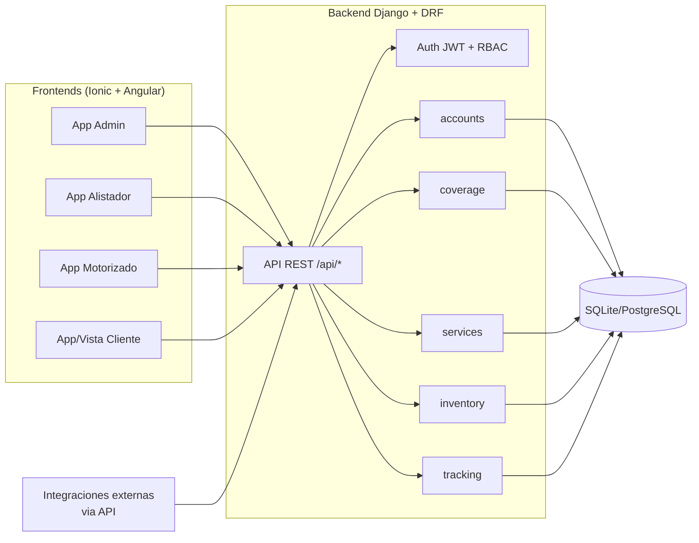

# Arquitectura — CMEDriver

## 1. Vista general

## 2. Stack técnico (MVP)

| Capa | Tecnología | Motivo |
|---|---|---|
| Backend | Python 3.12 + Django + Django REST Framework | Velocidad de desarrollo, ORM + admin gratis para demo, auth robusta |
| Auth | djangorestframework-simplejwt | JWT estándar, fácil de consumir desde Angular |
| Base de datos | SQLite (MVP) → PostgreSQL (producción) | SQLite no requiere instalación para correr el demo en horas |
| Frontend | Angular + Ionic (modo web, sin compilar a nativo) | Un solo código, componentes UI listos, corre en cualquier navegador/celular |
| Mapas/GPS | Leaflet + OpenStreetMap | Sin API key ni costo, suficiente para el MVP |
| Firma digital | librería signature_pad (canvas) | Ligera, sin dependencias nativas |
| Foto evidencia | `<input type="file" capture="environment">` | Funciona en navegador móvil sin plugin nativo |
| Chat cliente-motorizado | Endpoint REST + polling | Evita la complejidad de WebSockets en el MVP |
| Tracking GPS | Endpoint REST + polling (Geolocation API del navegador) | Suficiente para "tiempo real" percibido (cada 5-10s) sin infraestructura de sockets |
| Chatbot | Flujo guiado por menús, en el frontend, consumiendo endpoints de inventario/servicios | Sin LLM en el MVP; queda documentado como evolución en Fase 3 |

## 3. Organización del backend (apps Django)

- **accounts**: usuario custom con rol (ADMIN, ALISTADOR, MOTORIZADO, CLIENTE), autenticación JWT.
- **coverage**: matriz de cobertura (zona, leadtime, agenda disponible) y cálculo de fechas válidas.
- **inventory**: catálogo de productos, stock por centro de mensajería, flag de disponibilidad en chatbot.
- **services**: núcleo del dominio — Servicio, Ruta, Novedad, Mensaje (chat), transiciones de estado.
- **tracking**: posiciones GPS reportadas por el motorizado y consulta de última posición por servicio.

Cada app expone sus propios `serializers.py`, `views.py` (ViewSets DRF) y `permissions.py` — separación pensada para poder extraerlas como microservicios más adelante sin rediseñar el dominio.

## 4. Seguridad y permisos (RBAC)
- Cada endpoint declara qué rol(es) pueden usarlo mediante clases de permisos DRF (`IsAdmin`, `IsAlistador`, `IsMotorizado`, `IsCliente`, o combinaciones).
- El JWT incluye el rol del usuario en el payload para que el frontend enrute a la vista correcta tras el login.
- El cliente final se autentica igual que los demás roles (usuario con rol CLIENTE), pero solo ve sus propios servicios (filtrado por `cliente = request.user`).

## 5. Decisiones de diseño (ADR resumido)
| Decisión | Alternativa considerada | Por qué se eligió así |
|---|---|---|
| Polling en vez de WebSockets para GPS/chat | Django Channels + WebSockets | Reduce complejidad de infraestructura para un MVP de pocas horas; se documenta como mejora en Fase 2 |
| SQLite en vez de PostgreSQL | PostgreSQL desde el inicio | Cero configuración, corre con `manage.py runserver` de inmediato |
| Chatbot por menús en frontend en vez de servicio backend dedicado | Backend de chatbot con máquina de estados | El chatbot del MVP es determinístico (opciones fijas); no justifica un servicio aparte todavía |
| Leaflet/OSM en vez de Google Maps | Google Maps Platform | Evita API keys, cuentas de facturación y límites de cuota durante el desarrollo/sustentación |
