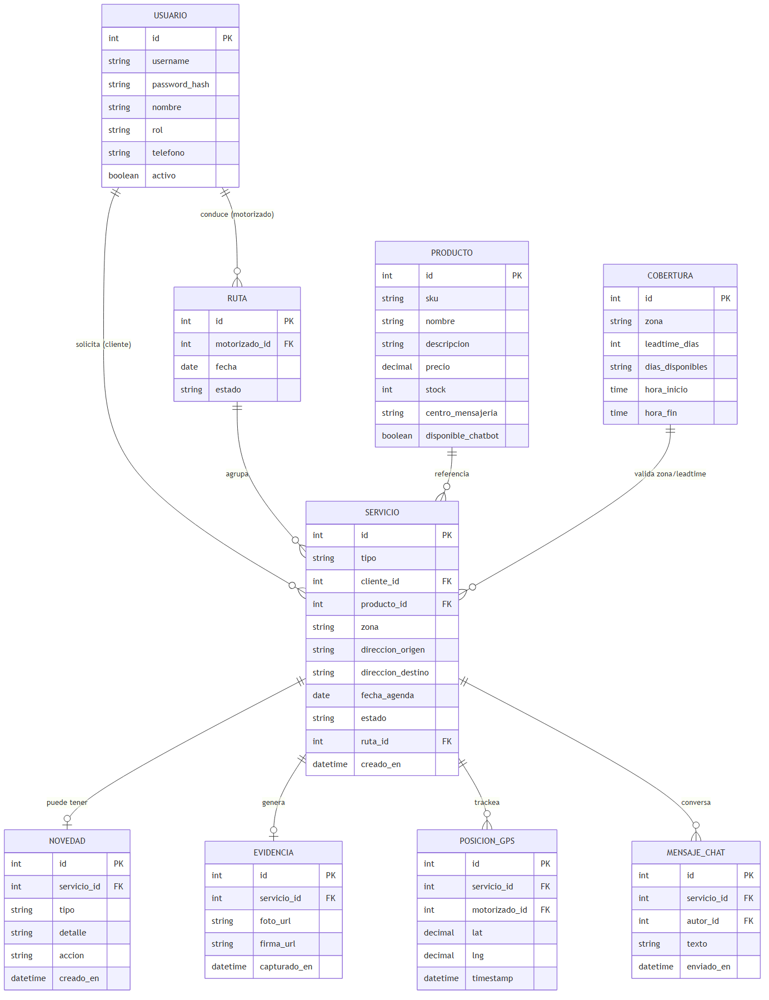
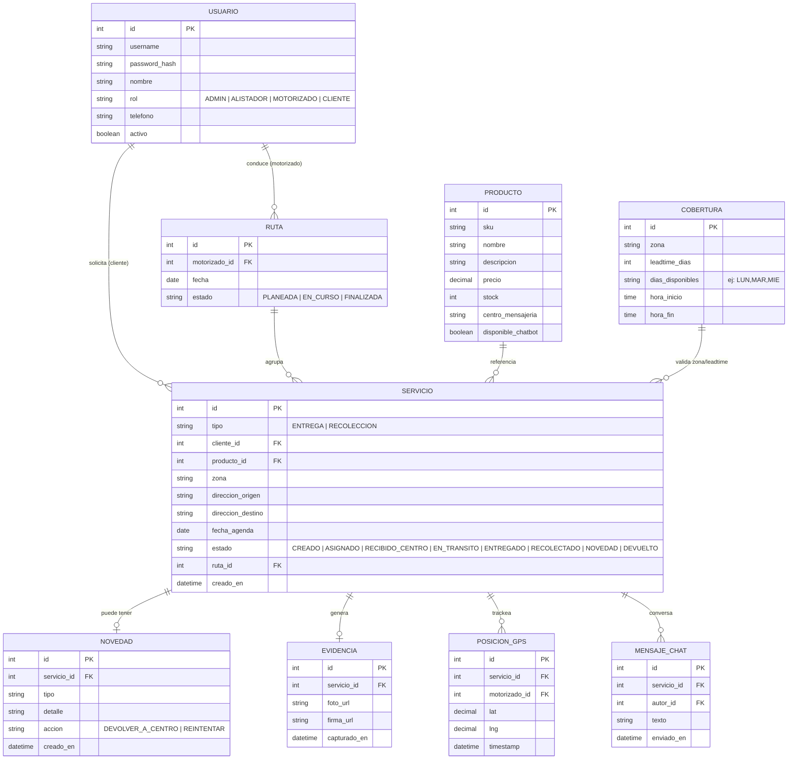

# Modelo de datos — CMEDriver

Fuente editable (Mermaid): [diagrams/src/er.mmd](diagrams/src/er.mmd)

Ver código Mermaid

## Notas
- `SERVICIO.producto_id` se modela 1-a-1 simplificado para el MVP; una evolución natural es una tabla intermedia `SERVICIO_PRODUCTO` para soportar múltiples productos por servicio (documentado en el roadmap).
- `EVIDENCIA` solo es obligatoria cuando `SERVICIO.tipo = RECOLECCION`.
- `COBERTURA` se usa tanto para validar la fecha de agenda que asigna el administrador como para calcular las fechas disponibles que ve el cliente al planificar su propia recolección.
