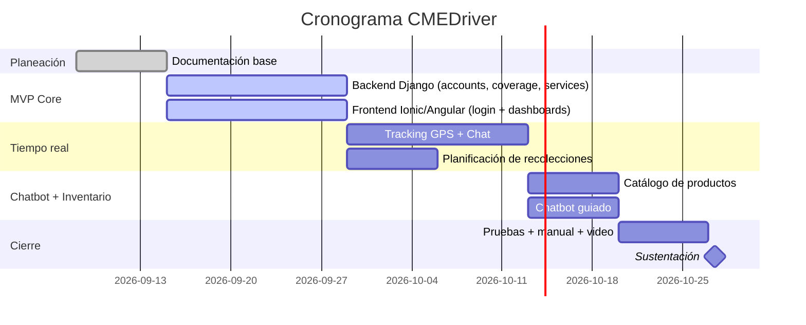

# Cronograma — CMEDriver

> Cronograma propuesto para el desarrollo académico del proyecto (curso/trabajo de grado). El scaffold inicial de código (backend + frontend + esta documentación) se generó como punto de partida acelerado; este plan es el que se sustenta ante el docente/jurado como plan de trabajo formal.

## Fases y semanas

| Fase | Semanas | Entregables | Estado |
|---|---|---|---|
| **Fase 0 — Planeación** | 1-2 | Project charter, requisitos, arquitectura, modelo de datos, diseño de API, cronograma | ✅ Completado (este `docs/`) |
| **Fase 1 — MVP core** | 3-6 | Login 3 roles, CRUD usuarios, matriz de cobertura, creación/asignación de servicios, flujo motorizado (entrega/recolección), evidencia foto+firma, novedades | 🔶 Scaffold inicial generado, pendiente completar y probar |
| **Fase 2 — Tiempo real y autogestión** | 7-9 | Tracking GPS por polling, chat cliente-motorizado, planificación de recolecciones por el cliente | 🔶 Scaffold inicial generado |
| **Fase 3 — Chatbot e inventario** | 10-11 | Chatbot guiado por menús conectado a inventario, catálogo parametrizable | 🔶 Scaffold inicial generado |
| **Fase 4 — Pruebas y documentación final** | 12-13 | Pruebas funcionales por rol, manual de usuario, video demo, informe final | ⬜ Pendiente |
| **Fase 5 — Sustentación** | 14 | Presentación, defensa ante jurado | ⬜ Pendiente |

## Diagrama (Gantt simplificado)

## Hitos de entrega sugeridos (ajustar a las fechas reales del curso)
1. **Hito 1:** Documentación de planeación aprobada por el docente.
2. **Hito 2:** Demo del flujo core (crear servicio → asignar → ejecutar → cerrar) funcionando de punta a punta.
3. **Hito 3:** Demo de tracking + chat + planificación de recolección por el cliente.
4. **Hito 4:** Demo del chatbot + inventario integrados.
5. **Hito 5:** Entrega final con manual de usuario, informe y sustentación.
