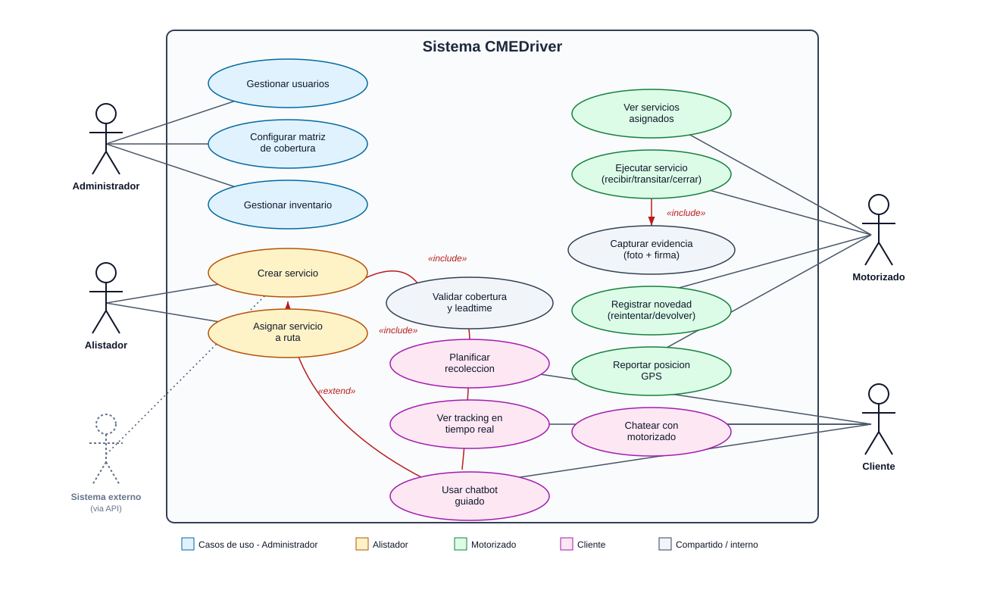

# Diagrama de casos de uso — CMEDriver

Ver imagen: [diagrams/casos-uso.svg](diagrams/casos-uso.svg)

## Actores
| Actor | Tipo | Descripción |
|---|---|---|
| Administrador | Principal | Configura el sistema: usuarios, cobertura, inventario |
| Alistador | Principal | Crea y asigna servicios de mensajería |
| Motorizado | Principal | Ejecuta los servicios en campo |
| Cliente | Principal | Solicita/recibe servicios, hace seguimiento |
| Sistema externo | Secundario | Crea servicios vía API (integraciones de terceros) |

## Casos de uso y relaciones clave
| Caso de uso | Actor(es) | Relación |
|---|---|---|
| Gestionar usuarios | Administrador | — |
| Configurar matriz de cobertura | Administrador | — |
| Gestionar inventario | Administrador | — |
| Crear servicio | Alistador, Sistema externo | «include» Validar cobertura y leadtime |
| Asignar servicio a ruta | Alistador | — |
| Validar cobertura y leadtime | (interno) | Incluido por "Crear servicio" y "Planificar recolección" |
| Ver servicios asignados | Motorizado | — |
| Ejecutar servicio (recibir/transitar/cerrar) | Motorizado | «include» Capturar evidencia (solo si tipo=Recolección) |
| Capturar evidencia (foto + firma) | (interno) | Incluido por "Ejecutar servicio" |
| Registrar novedad | Motorizado | Resultado: Reintentar o Devolver a centro |
| Reportar posición GPS | Motorizado | — |
| Planificar recolección | Cliente | «include» Validar cobertura y leadtime |
| Ver tracking en tiempo real | Cliente | — |
| Chatear con motorizado | Cliente | — |
| Usar chatbot guiado | Cliente | «extend» Crear servicio (compra) / «extend» Planificar recolección |

## Notas
- El chatbot no es un caso de uso independiente en el backend: extiende los flujos ya existentes de compra (crear servicio) y recolección (planificar recolección), presentados como conversación guiada — ver decisión de diseño en [03-arquitectura.md](03-arquitectura.md).
- "Sistema externo" es un actor secundario que representa integraciones (ej. un e-commerce) creando servicios vía la API pública, sin pasar por la interfaz del alistador.
